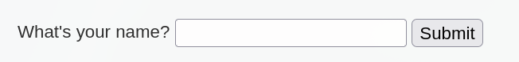
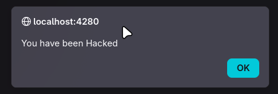

<!--TODO add metadata-->
# Security Level - Low
We see a form that asks for our name



And updates the page with it

```html
<pre>Hello Theo</pre>
```

After trying an XSS payload we get the alert
```html
<script>alert("You have been Hacked")</script>
```


