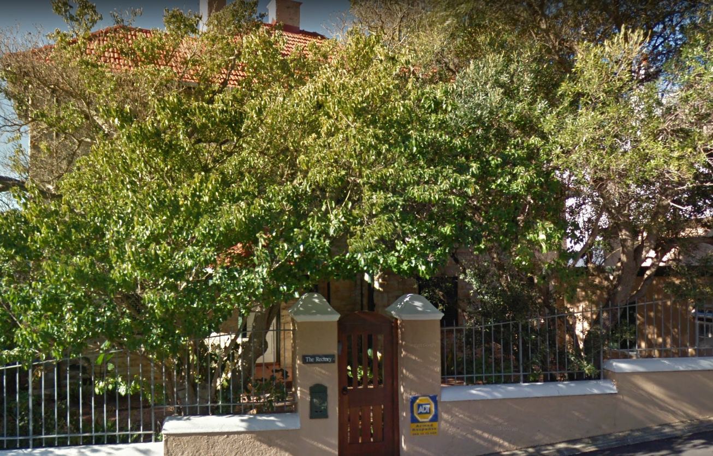
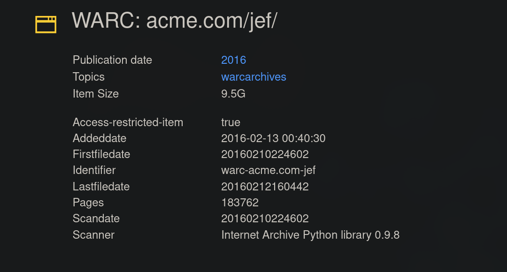
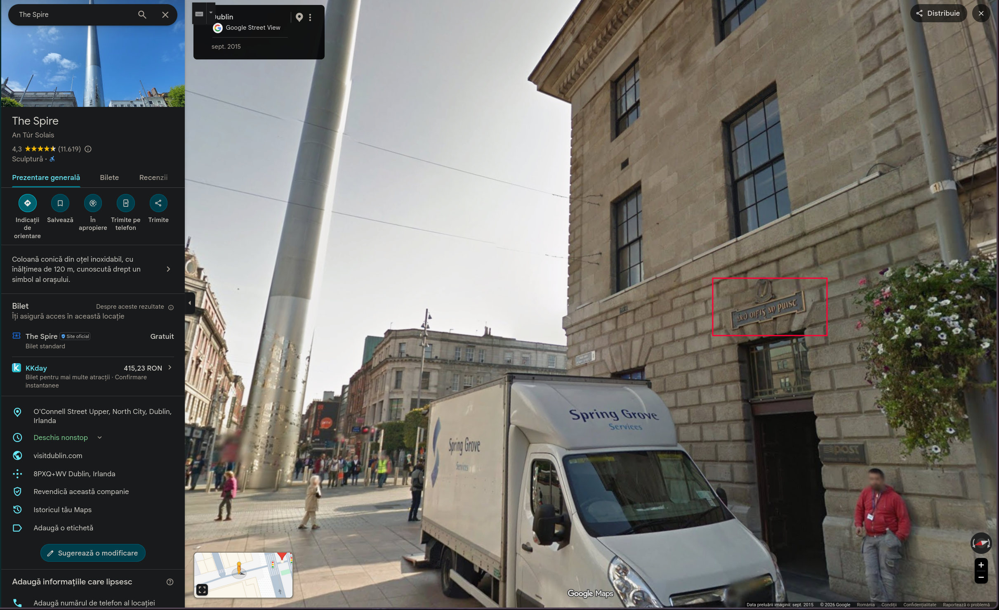
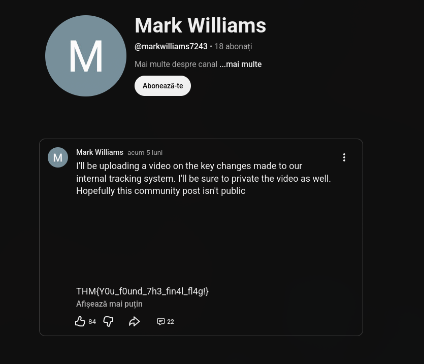

---

Name: Digital Footprint
Difficulty: Easy
URL: https://tryhackme.com/room/osintchallengeiv
Description: Beginner friendly OSINT Challenge
Category: THM
---

# The Leaked Photo
## Description
```txt
An ACME Jet Solutions employee uploaded a photo of a residential property believed to be linked to ACME Jet's early operations. Can you figure out where the picture was taken to confirm or debunk the rumour?
```

## In which city was the photo taken?
We have an image with a house, let's see what we can find from it



Using exitool we find the coordinates of where the photo was taken

```bash
$ exiftool edited-house-1763031553617.jpg
ExifTool Version Number         : 13.50
File Name                       : edited-house-1763031553617.jpg
Directory                       : .
File Size                       : 793 kB
File Modification Date/Time     : 2026:07:23 17:35:38+03:00
File Access Date/Time           : 2026:07:23 17:38:18+03:00
File Inode Change Date/Time     : 2026:07:23 17:37:52+03:00
File Permissions                : -rw-r--r--
File Type                       : JPEG
File Type Extension             : jpg
MIME Type                       : image/jpeg
Exif Byte Order                 : Big-endian (Motorola, MM)
GPS Latitude                    : 26 deg 12' 14.76"
GPS Longitude                   : 28 deg 2' 50.28"
JFIF Version                    : 1.01
Resolution Unit                 : None
X Resolution                    : 1
Y Resolution                    : 1
Image Width                     : 1306
Image Height                    : 837
Encoding Process                : Baseline DCT, Huffman coding
Bits Per Sample                 : 8
Color Components                : 3
Y Cb Cr Sub Sampling            : YCbCr4:4:4 (1 1)
Image Size                      : 1306x837
Megapixels                      : 1.1
GPS Position                    : 26 deg 12' 14.76", 28 deg 2' 50.28"
```

Looks like it was Johannesburg

# Archived Company Website
## Description
```txt
ACME Jet Solutions (warc-acme.com/jef/), is all over social meda claiming they were founded in 2025 and that they're the fastest-growing data company in Africa.
But something doesn't add up, one of their ex-employees ensures you that the company existed long before that.

Your job as an OSINT investigator is to verify their founding date using only public information.
```

## When was the website first published on the internet?
Searching for warc-acme.com/jef/ online reveals this web archive, https://archive.org/details/warc-acme.com-jef, which has Firstfiledate: 20160210224602



# Mysterious Landmark
## Description
```txt
Further Investigation uncovers another image believed to be connected to the company's international expansion.

Research reveals that to the right of the iconic landmark is a building that played a big role in the fight for independence of a particular country. Signs on the external wall provides the name of the building.

Submit the name of building translated into English as the flag.
```

## What is the landmark?
Using google image search, we find that this is the spire of dublin


The image was taken from the red square, so the building has to be An Post General, on it we find the sign



The answer is THM{General Post Office}

# Internal Documents
## Description
```txt
After uncovering ACME Jet Solutions origins and tracing their online presence through archived websites and international landmarks, investigators believe that an internal document was accidentally leaked by one of the company's developers. 

The document may contain crucial information about the individual responsible for maintaining their systems. 
```

## What is the final flag?
Using exiftool we find his username
```bash
$ exiftool internal-docs-1769695301727.odt
ExifTool Version Number         : 13.50
File Name                       : internal-docs-1769695301727.odt
Directory                       : .
File Size                       : 15 kB
File Modification Date/Time     : 2026:07:23 19:52:03+03:00
File Access Date/Time           : 2026:07:23 20:00:11+03:00
File Inode Change Date/Time     : 2026:07:23 19:52:32+03:00
File Permissions                : -rw-r--r--
File Type                       : ODT
File Type Extension             : odt
MIME Type                       : application/vnd.oasis.opendocument.text
Creation-date                   : 2026:01:29 14:59:44
Description                     : Just remember Robin, don't publish this externally!
Language                        : en-US
Date                            : 2026:01:29 15:50:57.170215644
Editing-cycles                  : 4
Subject                         : Key Updates
Title                           : Internal Document
Editing-duration                : PT29M54S
Generator                       : LibreOffice/25.8.4.2$Linux_X86_64 LibreOffice_project/580$Build-2
Document-statistic Table-count  : 0
Document-statistic Image-count  : 0
Document-statistic Object-count : 0
Document-statistic Page-count   : 1
Document-statistic Paragraph-count: 7
Document-statistic Word-count   : 73
Document-statistic Character-count: 449
Document-statistic Non-whitespace-character-count: 380
User-defined Name               : Internal username
User-defined                    : markwilliams7243
Preview PNG                     : (Binary data 6403 bytes, use -b option to extract)

```

Searching it online we find an youtube channel, with one post, there we find the flag


